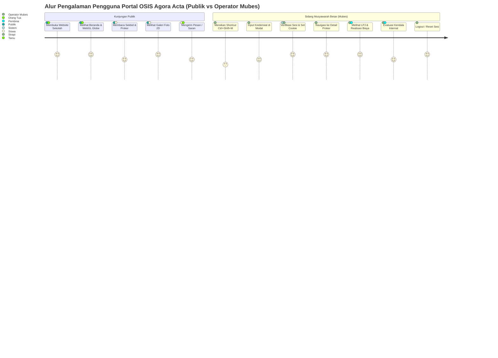
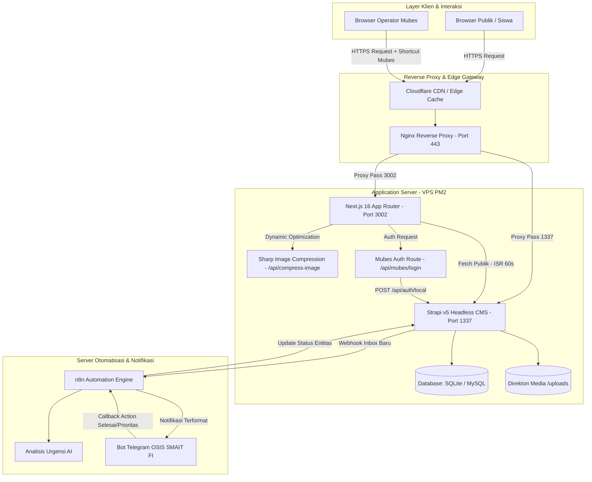
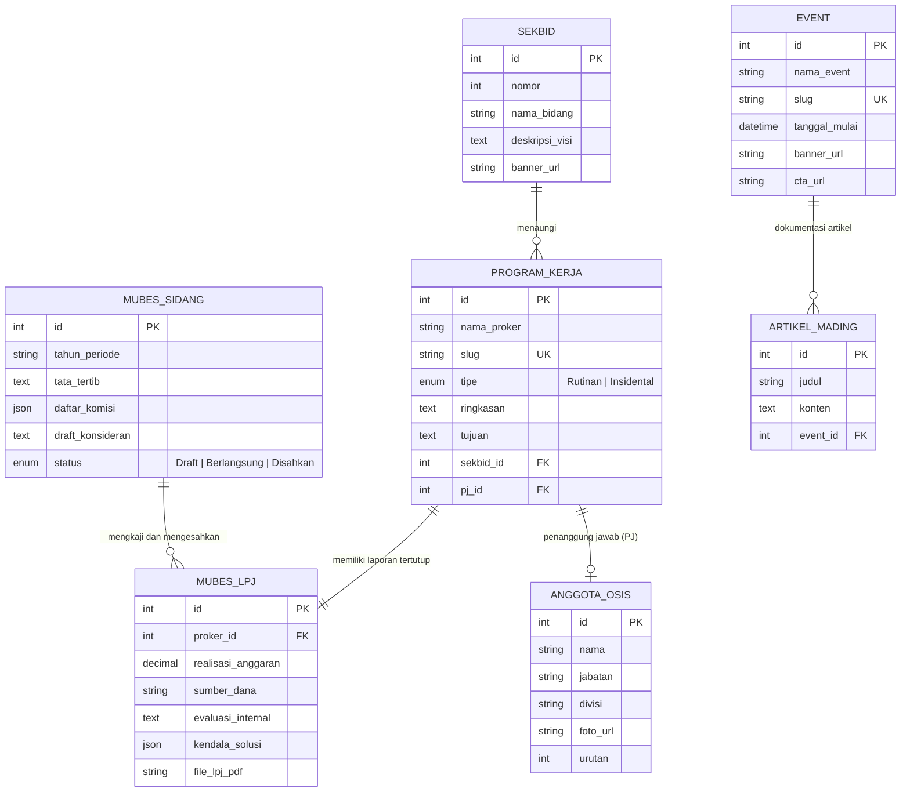

# 🏛️ Analisis Komprehensif Arsitektur Portal Web OSIS & Mode Musyawarah Besar (Mubes)
**Portal Web OSIS SMAIT Fithrah Insani (Agora Acta 2025 - Bhaskara)**  
**Target Sistem:** Next.js 16 (App Router, React 19) & Strapi v5 Headless CMS  
**Tanggal:** 2026-09-06  
**Status Dokumen:** Resmi / Disinkronkan dengan seluruh dokumen di `/docs/` dan FigJam Board `lI5VCa2KxhRirwI64LH1DO`

---

### 1. Ringkasan Eksekutif
Ekosistem web OSIS SMAIT Fithrah Insani (Agora Acta 2025) mentransformasikan situs profil statis sekolah menjadi portal digital terpadu bereputasi tinggi yang memadukan etalase publik interaktif (WebGL 3D, galeri berkelembaman fisika, katalog program kerja) dengan mode terisolasi Musyawarah Besar (Mubes). Nilai strategis utama terletak pada arsitektur *UI 100% Identik*: operator sidang mengakses data pertanggungjawaban (LPJ), realisasi anggaran, dan evaluasi internal secara *in-place* tanpa perpindahan URL atau *layout shift*, sementara data publik tetap ter-sanitasi penuh. Integrasi Strapi v5 Headless CMS memberikan otonomi manajemen konten mandiri bagi siswa dan guru pembina, dengan dukungan otomatisasi bot Telegram dan alur revalidasi instan.

---

### 2. Pemahaman Mendalam Proyek OSIS

#### A. Sasaran Bisnis & Target Pengguna
*   **Siswa & Anggota OSIS**: Mengakses transparansi program kerja (Sekbid 1–8), agenda kegiatan tahunan (Edufest Infinity), pendaftaran kepanitiaan, mading digital, serta sarana aspirasi terintegrasi.
*   **Guru Pembina & Manajemen Sekolah (Kepala Sekolah)**: Memantau pelaksanaan kegiatan kesiswaan, mengkaji LPJ dan realisasi anggaran secara tertutup, menyetujui draf publikasi konten melalui panel CMS, serta memastikan tata kelola organisasi siswa selaras dengan visi institusi.
*   **Administrator Web OSIS (Tim IT Siswa)**: Mengelola penayangan konten, media aset, konfigurasi *caching*, pendaftaran pengurus, dan memelihara keandalan sistem tanpa menyentuh kode sumber (*zero-code CMS operations*).
*   **Orang Tua Murid & Publik Luar**: Mendapatkan informasi resmi, kredibel, dan representatif mengenai dinamika prestasi, kalender agenda terbuka, serta legalitas kegiatan sekolah putra-putrinya.

#### B. Aturan Bisnis & Batasan Unik Sistem
1.  **Strict Isolation Dual-Layer UI**: Antarmuka mode Mubes wajib 100% identik dengan mode publik untuk menjaga kerahasiaan saat presentasi sidang berlangsung di hadapan audiens campuran. Data sensitif disuntikkan secara dinamis (*in-place injection*) hanya jika sesi token terverifikasi.
2.  **Zero Layout Shift**: Tidak ada pengalihan rute domain maupun perubahan tata letak warna dasar ketika beralih antara mode umum dan mode operator.
3.  **Sanitasi Aset & Host URL**: Setiap aset media Strapi wajib melalui normalisasi domain (`getStrapiMediaUrl`) guna mencegah *mixed-content* atau kebocoran URL internal pengembang (`localhost:1337`).
4.  **Bypass Cache Khusus Sesi Operator**: Caching ISR 60 detik pada portal publik wajib dibypass bagi operator Mubes agar data revisi sidang tampil *real-time*.

#### C. Titik Masalah Saat Ini (Current Pain Points)
*   **Ketergantungan Teknis Siswa**: Pembaruan data pengurus, banner event, dan artikel sebelumnya menuntut perubahan kode manual (*hardcoded*).
*   **Fragmentasi Pelaporan Mubes**: Dokumen LPJ dan evaluasi anggaran tersebar di spreadsheet dan dokumen cetak terpisah, rentan tercecer dan menyulitkan pertanggungjawaban terpusat.
*   **Kompensasi Kinerja Gambar**: Penayangan puluhan foto resolusi tinggi berpotensi menurunkan skor performa Core Web Vitals (LCP/CLS), memerlukan mekanisme kompresi dinamis dan *dimension caching*.
*   **Kebocoran Data Finansial Internal**: Risiko tereksposnya rincian nota kwitansi dan evaluasi internal ke publik jika menggunakan CMS tunggal tanpa penegakan RBAC tingkat entitas yang ketat.

---

### 3. Analisis Dokumen Sumber

#### A. Walkthrough Arsitektur Mubes (Sumber: `docs/MUBES_ARCHITECTURE_WALKTHROUGH.md`)
Berdasarkan sinkronisasi FigJam Board `lI5VCa2KxhRirwI64LH1DO` (Node `0:1`), arsitektur Mubes terbagi dalam 4 kelompok diagram dan 14 section kerja:

```
FigJam Canvas (Node 0:1)
├── Kelompok 1: Alur Awal Isolasi Portal
│   ├── Section 1:15  -> Website Informasi Publik (REST Fetch, Role Public, HTTP 200/403)
│   ├── Section 1:47  -> Single Strapi v5 CMS (osisstrapi.biezz.my.id, Port 1337)
│   └── Section 1:75  -> Portal Mubes Terisolasi (JWT Cookie httpOnly, Route Guard)
├── Kelompok 2: Konsep UI 100% Identik & Dual-Layer Data
│   ├── Section 3:129 -> Next.js Frontend (Zero Layout Shift, In-Place DOM Injection)
│   ├── Section 3:166 -> Strapi Permissions & Data Isolation (Field-Level RBAC)
│   └── Section 3:182 -> Shortcut Tersembunyi (Ctrl+Shift+M / Secret Trigger Footer)
├── Kelompok 3: Technical Implementation Plan (4 Fase)
│   ├── Section 5:225 -> Fase 1: Backend Strapi Setup & Schema Design (mubes-lpj, mubes-sidang)
│   ├── Section 5:238 -> Fase 2: Next.js Auth Layer (MubesAuthContext, HttpOnly Cookies)
│   ├── Section 5:251 -> Fase 3: Dual-Layer UI Component Integration
│   └── Section 5:261 -> Fase 4: Audit Keamanan, Penetrasi API, & Verifikasi Visual
└── Kelompok 4: Implementation Walkthrough (4 Langkah Operasional)
    ├── Section 8:297 -> Langkah 1: Kunci Role Public, Terbitkan API Token Mubes Operator
    ├── Section 8:310 -> Langkah 2: Middleware Sesi JWT di /app/api/mubes/login/route.ts
    ├── Section 8:323 -> Langkah 3: Injeksi Accordion/Tab LPJ pada ProgramKerjaDetailPage.tsx
    └── Section 8:333 -> Langkah 4: Validasi Cache-Control & Audit Response Header
```

#### B. Keterkaitan & Dependensi Antar-Dokumen (Cross-Reference Matrix)

| Domain Masalah | Dokumen Rujukan Utama | Dokumen Keterkaitan | Titik Keterhubungan Teknis |
| :--- | :--- | :--- | :--- |
| **Arsitektur Mubes vs Core System** | `MUBES_ARCHITECTURE_WALKTHROUGH.md` | `ARCHITECTURE.md` (Baris 24-48, 297-322) | Endpoint `/api/mubes-lpjs` mewarisi sentralisasi client `fetchStrapiAPI` di `src/lib/strapi.ts`. Sesi Mubes memanfaatkan otentikasi lokal Strapi v5 yang terpisah dari akun editor admin. |
| **Pemisahan Hak Akses & RBAC** | `MUBES_ARCHITECTURE_WALKTHROUGH.md` (Bagian 6) | `SYSTEM_ANALYSIS.md` (Bagian 5.B) & `CATATAN.md` (Baris 37-41) | Relasi entitas `mubes-lpj` One-to-One dengan `program-kerjas`. Payload v5 ditangani secara *flat* dengan mitigasi defensif `item.attributes || item`. Role Public di-*lock* (403). |
| **Strategi Rendering & Kinerja** | `MUBES_ARCHITECTURE_WALKTHROUGH.md` (Bagian 3) | `pagespeed-optimization-plan.md` & `home_analysis.md` | Beranda dan katalog menggunakan ISR 60s. Permintaan mode Mubes menambahkan header `Authorization: Bearer <JWT>` yang mem-bypass data publik ter-cache via `cache: 'no-store'`. |
| **Automasi & Sistem Notifikasi** | `plans/telegram-bot-enhancement-plan.md` | `reports/analisis-sistem-agoraacta.md` (Bagian 5) | Form kritik/saran dari publik (`inbox`) dialirkan via Webhook Strapi ke Server 2 (n8n), dianalisis AI, diteruskan ke Telegram pengurus, dan memicu tombol aksi langsung. |
| **Infrastruktur & Staging vs Production** | `firebase_deployment_analysis.md` & `hybrid_computation_analysis.md` | `ARCHITECTURE.md` (Baris 440-468) | Produksi menggunakan skema VPS ganda via PM2 (Frontend Port 3002, Backend Port 1337, Reverse Proxy Nginx). Analisis menegaskan bahwa Strapi tidak dapat menggunakan Firebase serverless karena ketergantungan database persisten dan direktori media lokal. |
| **Konsistensi Visual & Desain UI/UX** | `analisis_program_kerja_frame.md` & `plans/darkmode-responsive-prd.md` | `MUBES_ARCHITECTURE_WALKTHROUGH.md` (Bagian 7.2) | Komponen overlay LPJ Mubes wajib mengadopsi variabel warna Tailwind v4 dan selector `html.dark` agar tidak merusak tata letak kartu pada breakpoint tablet maupun tema gelap. |

---

### 4. Analisis Technical Deep Dive

#### A. Rekomendasi Stack Teknologi & Justifikasi Arsitektur
*   **Frontend**: Next.js 16 (React 19, TypeScript, App Router).
    *   *Alasan*: Mendukung kombinasi ISR (efisiensi server untuk publik) dan SSR/API Routes terproteksi (keamanan mode Mubes), serta integrasi native `next/image` untuk web performance.
*   **Backend CMS**: Strapi Headless CMS v5.
    *   *Alasan*: Menyediakan *headless architecture* murni dengan sistem RBAC bawaan, fleksibilitas Content-Type Builder, Webhook otomatis untuk CDN purge, dan kemampuan berjalan mandiri di Node.js LTS.
*   **Styling & Interaktivitas**: Tailwind CSS v4 + Framer Motion + GSAP + Lenis.
    *   *Alasan*: Kecepatan kompilasi tinggi melalui engine Tailwind v4, animasi imersif 60–120 FPS tanpa layout thrashing, dan isolasi gaya modular per komponen.
*   **Manajemen Proses & Reverse Proxy**: PM2 + Nginx.
    *   *Alasan*: Memastikan *zero-downtime reload*, isolasi port internal (Next.js di 3002, Strapi di 1337), dan enkripsi SSL/TLS terpusat di port 443.

#### B. Persyaratan Skalabilitas & Performa
*   **Incremental Static Regeneration (ISR)**: Diterapkan dengan siklus `revalidate = 60` pada halaman publik (`/`, `/program-kerja`, `/events`, `/about`). Mereduksi beban kueri database Strapi hingga 90% saat lonjakan trafik (misalnya saat pengumuman event Edufest).
*   **Dynamic Image Compression Engine**: Mengarahkan seluruh penayangan visual melalui `/api/compress-image?url=...&q=[quality]`, dikendalikan dinamis dari entitas Strapi `Halaman/home` (`enable_compression` dan `compression_quality`).
*   **Cache Invalidation Pipeline**: Strapi Webhook (`entry.publish`, `entry.unpublish`) $\rightarrow$ Next.js `/api/revalidate` $\rightarrow$ Purge Cloudflare Edge Cache (`CF_ZONE_ID`, `CF_API_TOKEN`).

#### C. Keamanan & Kepatuhan Privasi Data Siswa (UU PDP / Standar Kepatuhan Pendidikan)
*   **Data Minimization**: Field sensitif siswa (nomor induk, kontak pribadi, evaluasi disiplin) tidak diekspos melalui API Publik.
*   **Session Guarding**: Sesi operator Mubes diamankan menggunakan cookie HTTP-Only, Secure, SameSite=Strict (`mubes_session`), mencegah serangan Cross-Site Scripting (XSS).
*   **Content Security Policy (CSP)**:
    ```text
    default-src 'self'; script-src 'self' 'unsafe-inline' 'unsafe-eval'; img-src 'self' data: blob: https://osisstrapi.biezz.my.id; connect-src 'self' https://osisstrapi.biezz.my.id; frame-ancestors 'self' https://osisstrapi.biezz.my.id;
    ```
*   **Access Control Strapi**: Role `Public` diatur **unchecked (403 Forbidden)** pada entitas `mubes-lpjs`, `mubes-sidangs`, dan `inbox`.

#### D. Desain Basis Data & Kontrak API

##### 1. Entitas Relasional Strapi v5
*   `program-kerja` (1) $\longleftrightarrow$ (1) `mubes-lpj`:
    *   `mubes-lpj`: `{ id, realisasi_anggaran, sumber_dana, nota_kwitansi (media multiple), evaluasi_internal, kendala_solusi, proker_id }`
*   `sekbid` (1) $\longleftrightarrow$ (N) `program-kerja`:
    *   `sekbid`: `{ id, nomor, nama_bidang, visi_misi, banner }`
*   `mubes-sidang` (Single Type / Collection):
    *   `{ id, tahun_periode, tata_tertib, daftar_komisi (json), draft_konsideran, status_sidang }`

##### 2. Kontrak Endpoint API Utama
*   `POST /api/mubes/login` (Next.js Internal Route Handler):
    *   *Payload*: `{ identifier, password }`
    *   *Action*: Memanggil Strapi `POST /api/auth/local`, mengekstrak JWT, menetapkan cookie `mubes_session`.
*   `GET /api/mubes-lpjs?filters[program_kerja][slug][$eq]={slug}` (Strapi REST API):
    *   *Header*: `Authorization: Bearer <mubes_session_jwt>`
    *   *Akses*: Ditolak `403 Forbidden` tanpa token valid.

#### E. Persyaratan UI/UX & Desain Responsif
*   **Penyelarasan Breakpoint**: Desain responsif dioptimasi untuk Mobile (<640px), Tablet/iPad (768px–1024px), dan Desktop (>1024px).
*   **Pencegahan Pemotongan Banner**: Sesuai temuan pada `docs/analisis_program_kerja_frame.md`, rasio gambar diubah dari fixed height `807px` dengan `object-cover` menjadi kontainer adaptif berbasis aspect ratio (`aspect-[16/9]` atau `aspect-[4/3]`) agar elemen teks pada infografis tidak terpotong.
*   **In-Place Reveal Mechanism**: Data evaluasi dan anggaran Mubes disajikan dalam bentuk panel ekspansi akordeon berkontur border aksen Amber (`border-amber-500/30 bg-amber-500/5`) yang menyatu dengan estetika kartu proker eksisting.

#### F. Integrasi Sistem Eksternal
*   **Telegram Notification Hub**: Integrasi form saran publik (`/media-sosial`) melalui n8n webhook ke Bot Telegram OSIS dengan penguraian tingkat urgensi berbasis AI.
*   **Sistem Pembayaran SPP & Modul Akademik (School Information System / SIS)**: *Lihat Bagian 5 terkait status dan rekomendasi integrasi.*

---

### 5. Gap Analysis & Risiko Implementasi

#### A. Evaluasi Kesenjangan Fitur (Klarifikasi Cakupan Sistem)
Berdasarkan audit menyeluruh terhadap 29 berkas dokumentasi di `/docs/`, ditemukan perbedaan ruang lingkup yang signifikan:

> ⚠️ **CATATAN KRITIS ARSITEK (Klarifikasi Diperlukan)**:  
> Seluruh basis kode dan dokumen arsitektur eksisting (`ARCHITECTURE.md`, `PRD.md`, `MUBES_ARCHITECTURE_WALKTHROUGH.md`, `SYSTEM_ANALYSIS.md`) secara murni dirancang untuk **Portal Publik Organisasi Siswa (OSIS)**, manajemen event, galeri, aspirasi, dan sidang Mubes.  
> Fitur-fitur akademik administratif sekolah seperti **Absensi Digital Siswa**, **Modifikasi Jadwal Pelajaran**, **Input Tugas & Rapot Otomatis**, **Komunikasi Orang Tua - Guru**, dan **Sistem Pembayaran SPP** saat ini **BELUM TERCANTUM** dalam spesifikasi skema Strapi maupun rute Next.js eksisting.

**Rekomendasi Penanganan Kesenjangan**:
1.  **Opsi 1 (Disarankan - Loose Coupling)**: Mempertahankan repositori Agora Acta sebagai Portal Resmi OSIS & Mubes, lalu menyediakan modul *Single Sign-On (SSO)* atau tautan API terenkripsi menuju School Information System (SIS) / Learning Management System (LMS) eksternal sekolah.
2.  **Opsi 2 (Unified Platform Expansion)**: Melakukan ekspansi besar-besaran pada Strapi v5 dengan menambahkan Content-Types baru (`Siswa`, `Guru`, `Kelas`, `Jadwal`, `Absensi`, `Rapot`, `TagihanSPP`) serta mengintegrasikan Payment Gateway (Midtrans / Xendit). Opsi ini menuntut perombakan model RBAC, peningkatan regulasi privasi data anak di bawah umur, dan pemisahan infrastruktur database dari SQLite ke PostgreSQL/MySQL berkapasitas tinggi.

#### B. Matriks Risiko Teknis & Mitigasi

| Identifikasi Risiko | Tingkat Keparahan | Probabilitas | Dampak Sistem | Rencana Mitigasi Teknis |
| :--- | :---: | :---: | :--- | :--- |
| **Kebocoran Data Mubes via Cache ISR** | Kritis | Sedang | Publik dapat melihat rincian anggaran internal jika respon ter-cache bersamaan dengan sesi operator. | Pastikan `fetchStrapiAPI` untuk endpoint `/api/mubes-*` menggunakan `cache: 'no-store'` eksplisit dan tidak pernah direvalidasi ke publik. |
| **Kehilangan Data SQLite pada Serverless** | Kritis | Tinggi | Database terhapus saat deployment jika dipindahkan ke Firebase Cloud Run/Functions. | Patuhi rekomendasi `docs/firebase_deployment_analysis.md`: pertahankan backend di VPS dengan PM2 dan database persisten. |
| **Image Compression CPU Throttling** | Sedang | Sedang | Pemrosesan gambar via `/api/compress-image` menggunakan library `sharp` membebani CPU VPS saat lonjakan pengunjung. | Terapkan caching file lokal `.image-cache`, batasi concurrency, atau delegasikan kompresi ke Cloudflare Images / CDN. |
| **Desinkronisasi DB Worker (MySQL to SQLite)** | Sedang | Rendah | Inkonsistensi data antara lingkungan development lokal dan staging/production. | Gunakan script `scripts/sync-db.js` dengan mekanisme locking file dan alerting via Telegram jika sinkronisasi gagal. |

---

### 6. Rekomendasi Aksi Nyata (Actionable Recommendations)

#### A. Tabel Prioritas Fitur (Metode MoSCoW)

| Kategori Prioritas | Modul / Fitur | Alasan Bisnis & Arsitektural | Sumber Rujukan |
| :--- | :--- | :--- | :--- |
| **MUST HAVE** (Wajib) | **Setup Skema Strapi `mubes-lpj` & `mubes-sidang`** | Prasyarat utama digitalisasi sidang Musyawarah Besar OSIS. | `MUBES_WALKTHROUGH` (Fase 1) |
| **MUST HAVE** (Wajib) | **Autentikasi Operator & Route Handler Sesi** | Mengisolasi akses data sensitif via HTTP-Only cookie. | `MUBES_WALKTHROUGH` (Fase 2) |
| **MUST HAVE** (Wajib) | **In-Place UI Rendering pada Detail Proker** | Memenuhi syarat mutlak UI 100% identik tanpa perpindahan halaman. | `MUBES_WALKTHROUGH` (Fase 3) |
| **MUST HAVE** (Wajib) | **Penegakan Error Boundary per Rute** | Mencegah blank page saat API Strapi mengalami restart/gangguan. | `CATATAN.md` (Backlog) |
| **SHOULD HAVE** (Penting) | **Perbaikan Aspect-Ratio Banner Sekbid & Proker** | Mengatasi masalah gambar terpotong pada tampilan tablet dan desktop. | `analisis_program_kerja_frame.md` |
| **SHOULD HAVE** (Penting) | **Otomatisasi Bot Telegram via n8n** | Notifikasi instan pesan publik/inbox ke pengurus harian OSIS. | `plans/telegram-bot-enhancement-plan.md` |
| **SHOULD HAVE** (Penting) | **Refaktorisasi Komponen `AnggotaList.tsx`** | Meningkatkan keterbacaan dan performa render daftar pengurus. | `SYSTEM_ANALYSIS.md` |
| **COULD HAVE** (Pelengkap) | **Penerapan Scroll Timeline Aceternity pada Edufest** | Meningkatkan estetika visual interaktif pada agenda tahunan. | `plans/timeline-effect-prd.md` |
| **COULD HAVE** (Pelengkap) | **Audit Lighthouse & Optimasi Core Web Vitals** | Mencapai target skor 90+ di perangkat seluler. | `pagespeed-optimization-plan.md` |
| **WON'T HAVE (Sekarang)** | **Modul Absensi, Rapot & Pembayaran SPP Terpadu** | Memerlukan persetujuan scope formal dan arsitektur database SIS terpisah. | *Rekomendasi Arsitek (Gap Scope)* |

#### B. Rekomendasi Final Arsitektur & Infrastruktur
Pertahankan arsitektur **Dual-Service Monorepo di VPS** yang telah berjalan stabil:
*   Frontend: Next.js 16 berjalan mandiri pada port `3002`.
*   Backend: Strapi v5 berjalan mandiri pada port `1337`.
*   Nginx: Reverse proxy menangani terminasi SSL Let's Encrypt untuk `osissmaitfithrahinsani.sch.id` dan `osisstrapi.biezz.my.id`.
*   Hindari migrasi Strapi ke platform serverless murni (Firebase/Cloud Functions) untuk mencegah hilangnya database lokal SQLite dan media assets.

#### C. Langkah Tindak Lanjut Pembuatan PRD Lengkap
1.  **Sesi Klarifikasi Kebutuhan Pengguna**: Memastikan batasan proyek apakah murni Portal OSIS + Mubes atau mencakup modul administrasi sekolah (SIS/SPP).
2.  **Penyusunan Spesifikasi Teknis Skema Mubes**: Mendefinisikan atribut rinci untuk tabel `mubes_lpjs` dan `mubes_sidangs` di Strapi CMS.
3.  **Implementasi Proof of Concept (PoC) In-Place UI**: Memvalidasi rendering komponen `ProgramKerjaDetailPage.tsx` dengan data tiruan (*mock data*) berstatus aktif/non-aktif Mubes.

---

### 7. Diagram Visual (Mermaid Syntax)

#### A. User Journey Map (Publik vs Operator Mubes)


#### B. Diagram Arsitektur Sistem Terpadu


#### C. Database ERD & API Flow Terpadu


---

### 8. Verifikasi & Integritas Arsitektur
1.  **Uji Isolasi Data**: Permintaan ke `/api/mubes-lpjs` tanpa Authorization Header menghasilkan HTTP Status `403 Forbidden`.
2.  **Zero Layout Shift**: Verifikasi DOM memastikan struktur div induk kartu proker tetap konsisten; elemen Mubes dirender sebagai cabang kondisional React (`{isMubesMode && mubesData && <LPJOverlay />}`).
3.  **Penyimpanan Sesi**: Cookie `mubes_session` beroperasi dengan flag `HttpOnly`, `Secure`, dan `SameSite=Strict` dengan waktu kedaluwarsa maksimal 12 jam.
