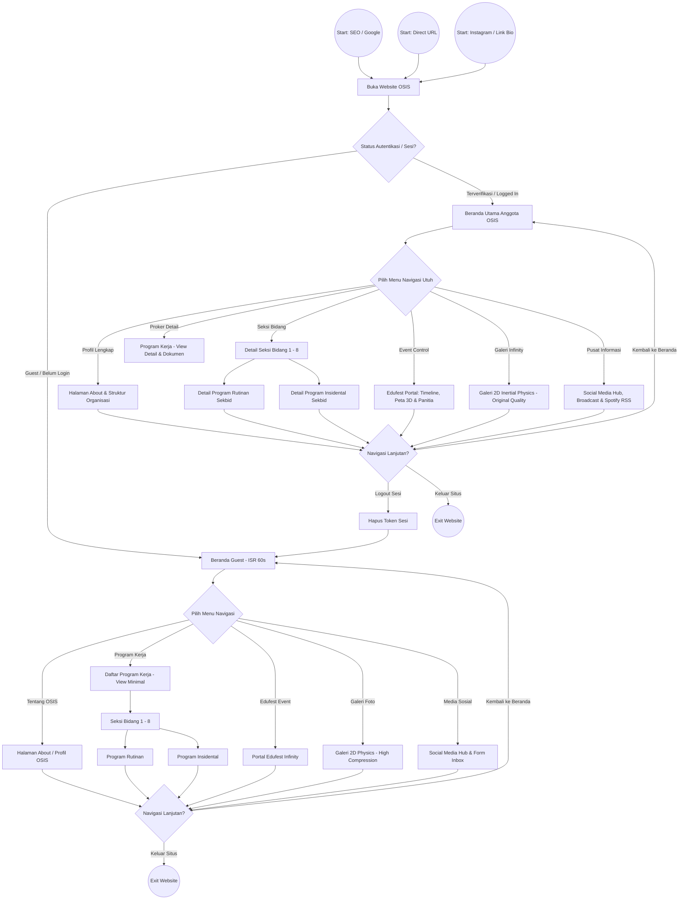
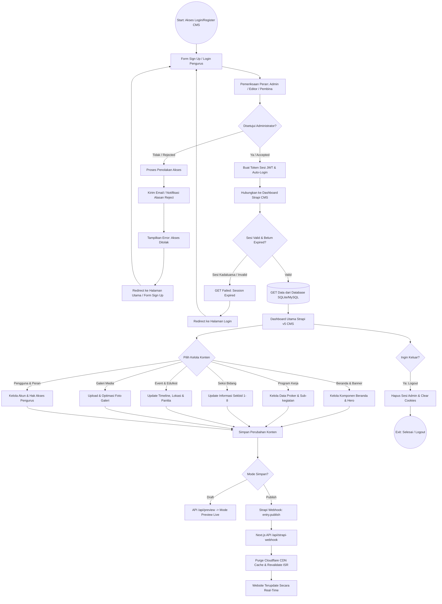

# 🏛️ Arsitektur Sistem & Panduan Teknis
## Portal Web OSIS SMAIT Fithrah Insani (Agora Acta 2025)

> **Versi Dokumen**: 3.0.0
> **Terakhir Diperbarui**: 06 September 2026

Dokumen ini mendokumentasikan keputusan arsitektural, tata letak kode, sistem styling, integrasi **Strapi Headless CMS v5 (PostgreSQL 16)**, **Sistem MUBES Dual-Layer (Clerk + BFF)**, arsitektur rendering 3D, serta mekanisme *caching* untuk portal web **OSIS SMAIT Fithrah Insani (Agora Acta 2025)**.

---

## 📌 Daftar Isi
- [Ikhtisar Arsitektur](#-ikhtisar-arsitektur)
- [Arsitektur MUBES Dual-Layer](#-arsitektur-mubes-dual-layer-v2---clerk--postgresql)
- [Struktur Direktori Lengkap](#-struktur-direktori-lengkap)
- [Arsitektur Integrasi Strapi v5 CMS & PostgreSQL](#-arsitektur-integrasi-strapi-v5-cms)
- [Sistem Caching Galeri Infinity 2D](#-sistem-caching-galeri-infinity-2d)
- [Sistem Kompresi Gambar Dinamis](#-sistem-kompresi-gambar-dinamis)
- [Arsitektur Immersive 3D & Animasi](#-arsitektur-immersive-3d--animasi)
- [Arsitektur Keamanan](#-arsitektur-keamanan)
- [Arsitektur Deployment (PM2)](#-arsitektur-deployment-pm2)
- [Struktur Dokumentasi](#-struktur-dokumentasi)

---

## 🌐 Ikhtisar Arsitektur & Alur Pengguna (User Flow)

### 1. Arsitektur Sistem High-Level

```mermaid
graph TD
    User[Pengguna / Browser] -->|HTTP Request| Nginx[Nginx Reverse Proxy]
    Nginx -->|Port 3002| NextJS[Next.js 16 App Router]
    Nginx -->|Port 1337| Strapi[Strapi v5 Headless CMS]
    
    NextJS -->|Rute /| Landing[Beranda - ISR 60s]
    NextJS -->|Rute /anggota| Anggota[Daftar Pengurus - SSR]
    NextJS -->|Rute /sekbid/[id]| SekbidDetail[Detail Sekbid - SSR]
    NextJS -->|Rute /program-kerja/[slug]| ProkerDetail[Detail Proker - SSR]
    NextJS -->|Rute /edufest-infinity| Edufest[Portal Edufest - SSR]
    NextJS -->|Rute /galeri/...| Gal[Galeri Infinity - CSR]
    NextJS -->|BFF /api/mubes/lpj/[slug]| BFF[BFF Route Handler]
    
    NextJS -->|REST API Fetch| Strapi
    BFF -->|Elevated Bearer Token| Strapi
    NextJS -->|API Route /api/compress-image| CompressAPI[Image Compression API]
    Strapi -->|PostgreSQL 16 :5433| DB[(Database mubes-postgres)]
    Strapi -->|Public Uploads /uploads| MediaStore[(Media Store)]
    Admin[Admin OSIS / Pembina] -->|Dashboard Management| Strapi
    PM2[PM2 Process Manager] -->|Process Monitoring| NextJS
    PM2 -->|Process Monitoring| Strapi
```

---

## 🛡️ Arsitektur MUBES Dual-Layer (v2 - Clerk + PostgreSQL)

```mermaid
flowchart TB
    subgraph Client [Browser Client - Zero Layout Shift]
        PublicViewer[Publik: Program Kerja Biasa]
        OperatorViewer[Operator Sidang: Ctrl+Shift+M]
    end

    subgraph NextServer [Next.js 16 BFF Server - Port 3002]
        ClerkAuth[Clerk Auth & Session Claim]
        SvixHook[/api/webhooks/clerk - Webhook Handler]
        BFFRoute[/api/mubes/lpj/[slug] - BFF Handler]
    end

    subgraph StrapiPostgres [Strapi v5 CMS & PostgreSQL 16]
        RosterCol[(api::anggota-osis)]
        AksesCol[(api::akses-user)]
        LPJCol[(api::mubes-lpj - 403 Public)]
        AuditMW[Document Service Middleware]
        AuditCol[(api::audit-log)]
    end

    OperatorViewer -->|Login Modal| ClerkAuth
    ClerkAuth -.->|user.created/updated| SvixHook
    SvixHook -->|Fuzzy Match Nama| RosterCol
    SvixHook -->|Update Status & Role| AksesCol
    
    OperatorViewer -->|Fetch LPJ In-Place| BFFRoute
    BFFRoute -->|Validate Clerk Claim| ClerkAuth
    BFFRoute -->|STRAPI_ELEVATED_TOKEN| LPJCol
    StrapiPostgres -->|Setiap Operasi CUD| AuditMW --> AuditCol
```

---

## 🔄 Flowchart Alur Pengguna & Sistem OSIS SMAIT Fithrah Insani

Flowchart komprehensif ini disempurnakan berdasarkan 2 node Figma (`node-id=1255-2000` & `node-id=1255-2022`) serta kebutuhan arsitektur nyata portal web **OSIS SMAIT Fithrah Insani (Agora Acta - Bhaskara)** dan Strapi v5 CMS.

### 📊 Legend Diagram Flowchart

| Bentuk Shape | Tipe Node | Fungsi |
| :--- | :--- | :--- |
| `((Start / Exit))` | **Terminal Node** | Titik Awal (Start) atau Titik Akhir (Exit) alur |
| `[Proses / Halaman]` | **Process Node** | Eksekusi langkah, pemanggilan API, atau perpindahan halaman |
| `{Kondisi?}` | **Decision Node** | Cabang keputusan berdasarkan validasi/status |
| `[(Database)]` | **Data Node** | Penyimpanan / Fetch data dari Strapi CMS & SQLite/DB |

---

### 1. Alur Akses Pengunjung & Pengguna Terverifikasi (Guest vs Verified User Journey)

Diagram ini menggabungkan dan menyempurnakan **Flow 1 (Guest View)** dan **Flow 2 (Verified User View)** dengan titik Start/Exit yang eksplisit serta *decision node* yang jelas.



---

### 2. Alur Pendaftaran Pengurus, Autentikasi & Akses CMS (Admin & Editor Flow)

Flowchart ini merapikan bagian **"bagian sign up"** dan **"CMS"** dengan menghubungkan alur verifikasi peran, penanganan sesi invalid, serta integrasi manajemen konten Strapi v5.



---

## 📁 Struktur Direktori Lengkap

```text
AGORAACTA_WEBSITE/
├── ecosystem.config.js             → Konfigurasi PM2 process manager
├── package.json                    → Package root workspace
├── osis-smait-fi/                  → Aplikasi Frontend Next.js
│   ├── next.config.ts              → Konfigurasi: images, CSP headers, ISR
│   ├── tsconfig.json               → Konfigurasi TypeScript
│   ├── src/
│   │   ├── app/
│   │   │   ├── layout.tsx          → Root layout (fonts, metadata, providers)
│   │   │   ├── page.tsx            → Beranda (ISR 60s)
│   │   │   ├── sitemap.ts          → Generator Sitemap XML
│   │   │   ├── robots.ts           → Generator Robots.txt
│   │   │   ├── globals.css         → Base styles Tailwind
│   │   │   ├── about/              → Halaman /about
│   │   │   ├── anggota/            → Halaman /anggota (SSR, force-dynamic)
│   │   │   ├── program-kerja/
│   │   │   │   ├── page.tsx        → Halaman /program-kerja
│   │   │   │   └── [slug]/         → Halaman /program-kerja/[slug]
│   │   │   ├── sekbid/
│   │   │   │   ├── [sekbidId]/     → Halaman /sekbid/[id] (generik)
│   │   │   │   └── sekbid-[1-8]/   → Halaman /sekbid/sekbid-1 s/d sekbid-8
│   │   │   ├── galeri/
│   │   │   │   └── galeri-preview-infinity/ → Galeri 2D Physics
│   │   │   ├── edufest-infinity/
│   │   │   │   ├── page.tsx
│   │   │   │   ├── location/
│   │   │   │   ├── panitia/
│   │   │   │   └── timeline/
│   │   │   ├── media-sosial/       → Halaman /media-sosial
│   │   │   └── api/
│   │   │       ├── compress-image/ → API Route kompresi gambar
│   │   │       ├── preview/        → Mode preview Strapi
│   │   │       └── exit-preview/   → Keluar mode preview
│   │   ├── components/
│   │   │   ├── Navbar.tsx          → Navigasi utama
│   │   │   ├── Footer.tsx          → Footer situs
│   │   │   ├── Slider.tsx          → Slider generik
│   │   │   ├── TickerGallery.tsx   → Ticker otomatis
│   │   │   ├── AudioManager.tsx    → Pemutar audio latar
│   │   │   ├── CursorParticles.tsx → Partikel kursor
│   │   │   ├── LivePreviewListener.tsx → Listener draft preview Strapi
│   │   │   ├── about/              → Komponen halaman About
│   │   │   ├── anggota/
│   │   │   │   └── AnggotaList.tsx → Daftar anggota (BPH + Sekbid)
│   │   │   ├── globe/              → WebGL 3D Globe (D3 + Topojson)
│   │   │   ├── home/
│   │   │   │   ├── Hero.tsx
│   │   │   │   ├── Introduction.tsx
│   │   │   │   └── LatestEvent.tsx
│   │   │   ├── intro/              → Sekuens loading intro
│   │   │   ├── program-kerja/      → Komponen program kerja
│   │   │   ├── scenes/             → Komponen scene GSAP
│   │   │   ├── sosmed/             → Komponen media sosial
│   │   │   ├── timeline/           → Komponen timeline Edufest
│   │   │   └── ui/                 → Komponen UI bersama
│   │   ├── context/
│   │   │   └── ImageQualityContext.tsx → Konteks kompresi gambar global
│   │   ├── lib/
│   │   │   ├── strapi.ts           → Client API Strapi pusat (305 baris)
│   │   │   ├── strapi-server.ts    → Helper Strapi sisi server
│   │   │   ├── gsap.ts             → Helper inisialisasi GSAP
│   │   │   ├── lenis.ts            → Setup smooth scroll Lenis
│   │   │   ├── poisson-disk.ts     → Algoritma Poisson Disk Sampling
│   │   │   └── utils.ts            → Fungsi utilitas umum
│   │   ├── styles/                 → CSS level komponen
│   │   └── data/                   → Data fallback statis
│   └── docs/                       → Dokumentasi proyek
└── strapi-cms/                     → Backend Strapi v5
    ├── src/
    │   ├── api/                    → 8 API Content Type
    │   │   ├── anggota-osis/
    │   │   ├── artikel-mading/
    │   │   ├── event/
    │   │   ├── galeri-foto/
    │   │   ├── halaman/
    │   │   ├── media-asset/
    │   │   ├── program-kerja/
    │   │   └── sekbid/
    │   ├── components/             → Komponen bersama Strapi
    │   ├── extensions/             → Kustomisasi plugin
    │   └── index.ts                → Bootstrap & lifecycle hooks
    ├── config/
    │   ├── admin.ts                → Konfigurasi panel admin
    │   ├── api.ts                  → Konfigurasi REST API
    │   ├── database.ts             → Koneksi DB (SQLite/MySQL/PG)
    │   ├── middlewares.ts          → Middleware CORS & keamanan
    │   ├── plugins.ts              → Registrasi plugin
    │   └── server.ts               → Konfigurasi host/port server
    └── scripts/
        ├── seed.ts                 → Script seeding database (npx tsx)
        └── sync-db.js              → Script sinkronisasi DB
```

---

## ⚡ Arsitektur Integrasi Strapi v5 CMS

Data dari Strapi CMS diambil menggunakan helper Client API di `src/lib/strapi.ts`.

### Endpoint & Kontrak Data

| Endpoint | Populate | Digunakan Oleh |
| :--- | :--- | :--- |
| `GET /api/halamans?filters[slug][$eq]={slug}` | `*` | Beranda, Anggota, About (SEO + konten hero) |
| `GET /api/anggota-oses?filters[divisi][$eq]=BPH` | `*` | BPH/Pengurus Inti |
| `GET /api/anggota-oses?filters[status_aktif][$eq]=aktif&pagination[limit]=200` | `*` | Halaman Anggota lengkap |
| `GET /api/sekbids?sort=nomor:asc` | `program_kerjas` | Daftar Seksi Bidang |
| `GET /api/sekbids?filters[nomor atau slug]` | `program_kerjas.populate` | Detail 1 Sekbid |
| `GET /api/program-kerjas?filters[slug][$eq]={slug}` | Deep populate | Detail 1 Proker |
| `GET /api/events?sort=tanggal_mulai:desc` | `*` | LatestEvent di Beranda |
| `GET /api/media-assets?filters[key][$eq]={key}` | `*` | Aset media keyed (audio, banner) |
| `GET /api/media-assets?filters[kategori][$eq]={cat}` | `*` | Aset media per kategori |

### Sanitasi URL
`getStrapiMediaUrl()` secara otomatis:
1. Mengganti `http://localhost:1337` $\rightarrow$ `https://osisstrapi.biezz.my.id`
2. Mengganti `http://osisstrapi...` $\rightarrow$ `https://osisstrapi...`
3. Menangani format Strapi v4 (`data.attributes`) dan v5 (flat)
4. Mendukung `url_external` (Tautan YouTube/Drive)

---

## 🖼️ Sistem Caching Galeri Infinity 2D

Halaman `/galeri/galeri-preview-infinity` menggunakan kisi gambar interaktif berbasis physics 2D.

**Alur Caching:**
1. **Pre-calculation**: Setiap gambar yang berhasil dimuat disimpan aspek rasionya `(width / height)` di `localStorage['gallery_dimensions_cache']`.
2. **Instant Rendering**: Saat pengguna membuka kembali halaman galeri, grid langsung diposisikan menggunakan nilai dari cache tanpa menunggu gambar terunduh ulang sepenuhnya.
3. **Physics Engine**: Manipulasi langsung ke `translate3d` dan `scale` via DOM Ref dalam `requestAnimationFrame` untuk rendering smooth 120fps — menghindari overhead update state React.

---

## 🖼️ Sistem Kompresi Gambar Dinamis

**ImageQualityContext** (`src/context/ImageQualityContext.tsx`) menyediakan kompresi gambar terpusat:

```text
Permintaan Gambar User
       ↓
getOptimizedImageUrl(originalUrl)
       ↓
/api/compress-image?url={encodedUrl}&q={quality}&compress=true
       ↓
API Route Next.js fetch → kompres → mengembalikan gambar teroptimasi
```

**Konfigurasi dari CMS** (`halaman` slug: `home`):
- `enable_compression` (boolean): Aktifkan/nonaktifkan kompresi global.
- `compression_quality` (number: 20-100): Kualitas kompresi (default: 75).

---

## 🌌 Arsitektur Immersive 3D & Animasi

Modul `/edufest-infinity` merupakan pengalaman halaman interaktif premium yang ditenagai oleh WebGL dan physics-based rendering:

### 1. 3D WebGL Globe & Mapping (`src/components/globe/`)
- **Teknologi**: D3.js v7 + Topojson-client v3.
- **Fungsi**: Menggambar bumi 3D interaktif yang bertransisi secara dinamis menjadi peta 2D datar saat diposisikan di atas koordinat lokasi sekolah SMAIT Fithrah Insani.

### 2. Smooth Scrolling & Momentum Physics
- **Lenis** (`src/lib/lenis.ts`): Smooth scroll dengan inersia yang konsisten di Chrome/Safari/Firefox.
- **GSAP** (`src/lib/gsap.ts`): Mengelola transisi timeline sequence loading (`LoaderStage → WireframeStage → RevealStage`) dan pergerakan kamera.

### 3. Mouse Cursor Interactive Particles (`src/components/CursorParticles.tsx`)
- Menggunakan algoritma **Poisson Disk Sampling** (`src/lib/poisson-disk.ts`) untuk menghasilkan sebaran partikel interaktif yang natural dan tidak menumpuk kasar.

### 4. Background Audio Player (`src/components/AudioManager.tsx`)
- Menyediakan musik pengiring situs (`bg-soundtrack`) dengan slider volume interaktif.
- Secara otomatis memutar audio setelah interaksi pengguna pertama (mematuhi kebijakan browser modern).

---

## 📱 Progressive Web App (PWA) & Offline Caching

Aplikasi dilengkapi dukungan PWA dasar untuk memberikan pengalaman pengguna yang cepat dan stabil pada perangkat mobile:
1. **Service Worker (`public/sw.js`)**:
   - Menggunakan mekanisme caching **stale-while-revalidate** untuk berkas statis lokal (HTML, JS, CSS, gambar lokal, dan manifest).
   - Melewati (*bypass*) permintaan API Strapi (`/api/`) agar data CMS tetap *real-time*.
2. **Pendaftaran Asinkron**:
   - Didaftarkan dalam browser saat halaman selesai dimuat (`window.onload`) via `RootLayout` (`layout.tsx`).
3. **Web App Manifest (`manifest.json`)**:
   - Menyediakan metadata nama aplikasi (`Agora Acta`), skema warna, ikon responsif, dan mode tampilan `standalone` (tanpa frame browser).

---

## 🔍 Mesin Pencari Global & Routing PJ Proker

Mesin pencari terintegrasi di `src/lib/search.ts` menggunakan API paralel untuk mencari konten di berbagai koleksi Strapi CMS:
1. **Parallel Fetching**:
   - Mengambil data dari `/api/program-kerjas`, `/api/sekbids`, dan `/api/anggota-oses` secara paralel menggunakan `Promise.all` demi mereduksi latensi jaringan.
2. **Routing PJ (Penanggung Jawab) Proker**:
   - Menghubungkan setiap program kerja dengan data ID/Nama anggota yang mengampunya.
   - Jika pengguna mencari dan mengeklik profil anggota yang merupakan PJ dari suatu program kerja, sistem secara pintar mengalihkan rute (*redirect*) ke detail program kerja tersebut (`/sekbid/sekbid-[nomor]/[kategori]/[slug]`), bukan ke rute anggota generik.

---

## ⚙️ Strapi Core Bootstrap & Sinkronisasi Database

Backend Strapi CMS dilengkapi dengan otomatisasi inisialisasi (*bootstrap*) di `strapi-cms/src/index.ts`:
1. **RBAC Auto Setup**:
   - Otomatis membuat role *Chief Editor* dan *Content Contributor* jika belum ada dalam sistem.
   - Mendaftarkan hak akses API secara otomatis untuk role publik (read-only) dan role editor (full CRUD/draft-access).
2. **Sinkronisasi Database MySQL**:
   - Menggunakan subprocess mandiri (`child_process.fork()`) untuk menjalankan `scripts/sync-db.js` secara periodik setiap 10 menit guna mensinkronkan basis data MySQL utama dengan database lokal.

---

## 🔒 Arsitektur Keamanan

Konfigurasi keamanan diterapkan via `next.config.ts`:

```typescript
// Content Security Policy
"default-src 'self'"
"script-src 'self' 'unsafe-inline' 'unsafe-eval'"
"style-src 'self' 'unsafe-inline'"
"img-src 'self' data: blob: https://osisstrapi.biezz.my.id https:"
"font-src 'self'"
"connect-src 'self' https://osisstrapi.biezz.my.id"
"frame-ancestors 'self' https://osisstrapi.biezz.my.id http://localhost:1337"

// Caching aset statis (immutable 1 tahun)
"Cache-Control: public, max-age=31536000, immutable"
// Untuk /_next/static/* dan /images/*

// Transport Security
"Strict-Transport-Security: max-age=31536000; includeSubDomains; preload"
```

### Mode Preview Strapi
- Endpoint: `/api/preview` $\rightarrow$ set cookie `__prerender_bypass`
- Endpoint: `/api/exit-preview` $\rightarrow$ hapus preview cookie
- `fetchStrapiAPI()` otomatis mendeteksi preview cookie dan menambahkan `?status=draft`

---

## 🚀 Arsitektur Deployment (PM2)

```text
Server (VPS/Cloud)
├── Nginx
│   ├── osissmaitfithrahinsani.sch.id → localhost:3002 (Next.js)
│   └── osisstrapi.biezz.my.id        → localhost:1337 (Strapi)
└── PM2 (Process Manager)
    ├── osis-next-frontend  (port 3002, cwd: ./osis-smait-fi)
    └── osis-strapi-backend (port 1337, cwd: ./strapi-cms)
```

**Perintah PM2:**
```bash
pm2 start ecosystem.config.js  # Menjalankan semua aplikasi
pm2 restart osis-next-frontend  # Restart frontend saja
pm2 restart osis-strapi-backend # Restart backend saja
pm2 logs                        # Melihat log real-time
pm2 status                      # Mengecek status proses
```

**Build & Deploy Frontend:**
```bash
cd osis-smait-fi
npm run build && pm2 restart osis-next-frontend
```

---

## 📁 Struktur Dokumentasi

Seluruh dokumentasi teknis dan riwayat pengembang disimpan secara rapi di direktori `docs/`:

| File | Deskripsi |
| :--- | :--- |
| `docs/ARCHITECTURE.md` | **[Dokumen Ini]** Spesifikasi teknis arsitektur lengkap |
| `docs/SYSTEM_ANALYSIS.md` | Analisis komprehensif sistem (UI/UX, API, komponen) |
| `docs/PRD.md` | Product Requirement Document & Roadmap |
| `docs/CONTRIBUTING.md` | Panduan kontribusi pengembang, eksekusi double-server, dan sinkronisasi skema |
| `docs/CATATAN.md` | Catatan singkat developer |
| `docs/CHANGELOG/CHANGELOG.md` | Log rilis dan riwayat fitur per versi |
| `docs/UPDATE/LATEST_UPDATES.md` | Catatan pembaruan teknis terbaru |
| `docs/pagespeed-optimization-plan.md` | Rencana optimasi PageSpeed |
| `docs/pagespeed-optimization-report.md` | Laporan hasil optimasi PageSpeed |
