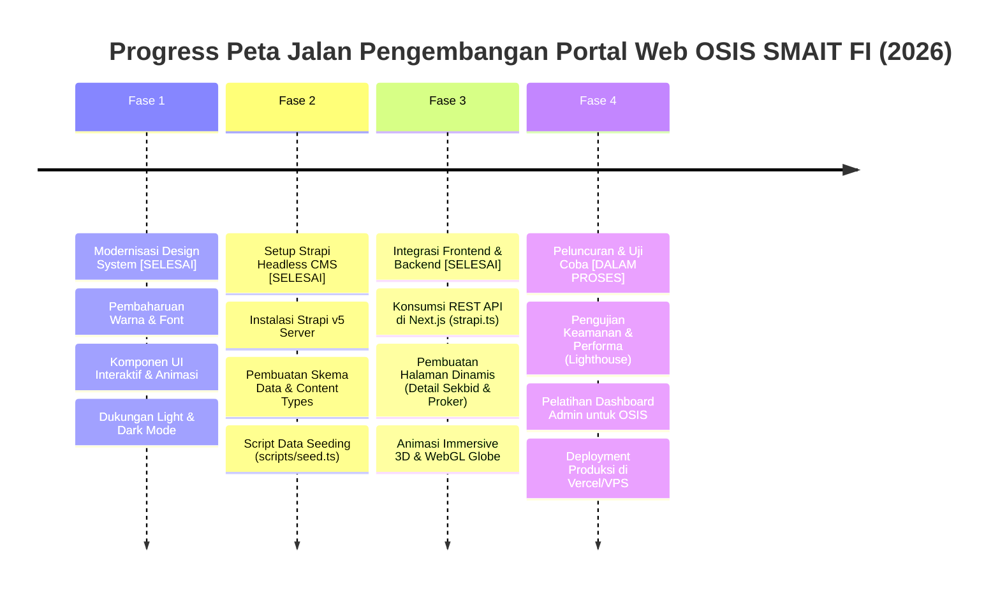

# 📜 Dokumen Kebutuhan Produk (PRD) & Roadmap
## Portal Web OSIS SMAIT Fithrah Insani — Agora Acta 2025

---

## 📌 1. Pendahuluan & Ringkasan Eksekutif

Portal Web **OSIS SMAIT Fithrah Insani (Agora Acta 2025 - Bhaskara)** dirancang untuk bertransformasi dari sekadar situs informasi statis menjadi platform digital terintegrasi yang **elegan, minimalis, modern, dan interaktif**.

Dokumen kebutuhan produk ini (PRD) mendefinisikan visi evolusi portal web sekolah, spesifikasi antarmuka pengguna (UI/UX), arsitektur integrasi **Strapi Headless CMS v5**, serta perancangan **Dashboard Admin Strapi** untuk pengelolaan konten mandiri oleh pengurus OSIS.

---

## 🎯 2. Tujuan & Indikator Keberhasilan (OKRs)

### Tujuan Utama (Objectives):
1. **Modernisasi UI/UX**: Mengadopsi bahasa desain modern berestetika tinggi (minimalis, mikro-animasi fluid, efek glassmorphism, dan alur interaktif).
2. **WebGL 3D & Animasi Imersif**: Menyajikan pengalaman multimedia premium berupa WebGL 3D Globe, smooth scroll Lenis, timeline GSAP, dan efek partikel mengikuti kursor.
3. **Pengelolaan Konten Mandiri (Headless CMS)**: Mengintegrasikan **Strapi Headless CMS v5** agar pengurus OSIS dapat memperbarui program kerja, event, profil pengurus, serta media logo & video tanpa menyentuh kode program (*zero-code content management*).
4. **Pemberdayaan Admin OSIS**: Menyediakan Dashboard Admin Strapi yang intuitif dengan manajemen hak akses berbasis peran (*Role-Based Access Control / RBAC*).
5. **Optimasi Performa & Caching**: Memastikan pengalaman akses yang cepat melalui *client-side caching* pada galeri 2D.

---

## 🛠️ 3. Arsitektur Integrasi: Strapi Headless CMS v5

Aplikasi memisahkan layer tampilan (*Frontend*) Next.js 16 dengan layer manajemen konten (*Backend Content*) menggunakan **Strapi v5**.

### A. Content Types yang Diimplementasikan:
- `Member` (Data Pengurus OSIS, BPH, Sekbid 1-8, Jabatan, Foto, Media Sosial)
- `Event` (Dokumentasi Kegiatan Utama seperti EDUFEST INFINITY, Deskripsi, Banner, Video, Tanggal Pelaksanaan)
- `ProgramKerja` (Nama Proker, Tipe Rutinan/Insidental, Status Pelaksanaan, Target, Tautan Evaluasi)
- `SeksiBidang` (Sekbid 1-8, Deskripsi Visi, Ikon/Logo Sekbid)
- `GaleriFoto` (Koleksi foto kegiatan, judul, tautan gambar, resolusi tinggi)
- `MediaAsset` (Konfigurasi dinamis aset media, audio soundtrack, background banner)

---

## 🗺️ 4. Peta Jalan Pengembangan (Development Roadmap)

---

## 📁 5. Struktur Dokumentasi & Catatan Perubahan

Dokumentasi proyek diatur secara rapi dan modular:
- **`docs/CHANGELOG/CHANGELOG.md`**: Catatan riwayat versi sistem (Versi 1.0.0 s/d 1.2.0).
- **`docs/UPDATE/LATEST_UPDATES.md`**: Rincian pembaruan fitur terkini (Sinkronisasi Strapi CMS, penanganan media, caching galeri, refaktorisasi layout).
- **`docs/ARCHITECTURE.md`**: Spesifikasi teknis arsitektur frontend-backend, 3D WebGL Globe, smooth scroll, dan layer caching.
- **`docs/CONTRIBUTING.md`**: Panduan kontribusi pengembang, eksekusi double-server, dan sinkronisasi skema.
