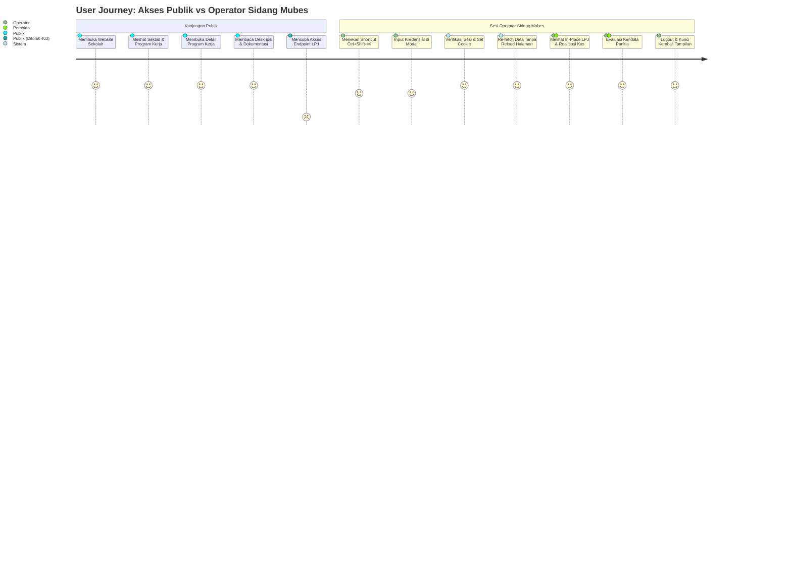
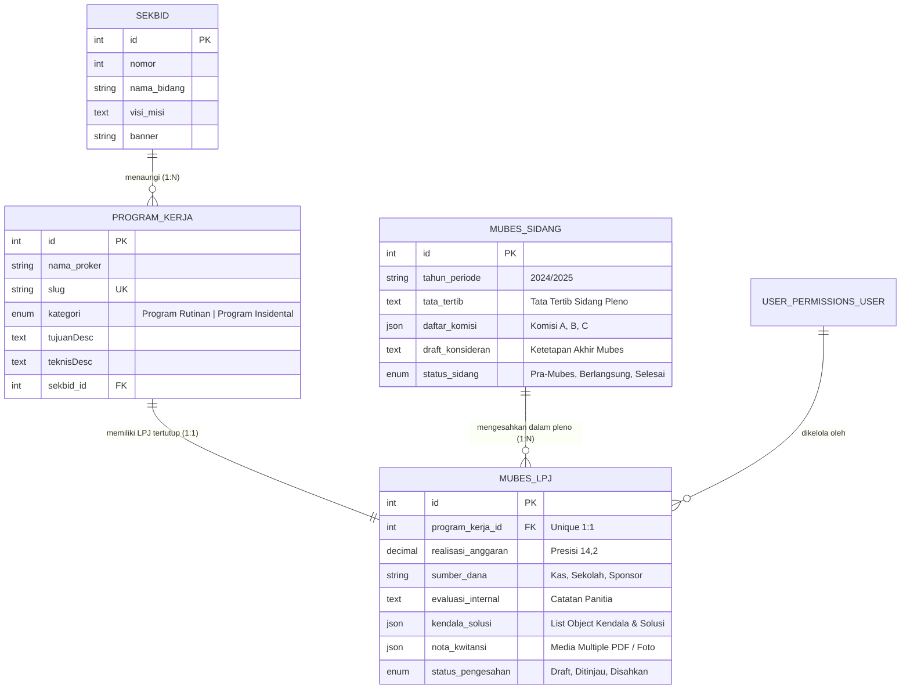
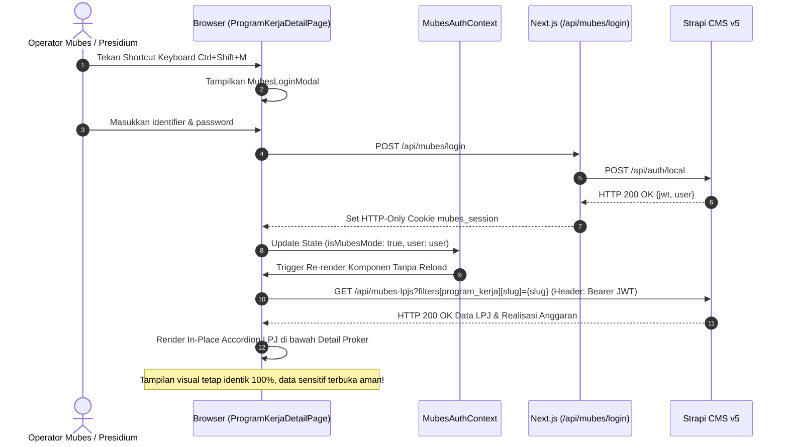

# PRD LENGKAP: MUSYAWARAH BESAR OSIS – Dual-Layer Access System
**Project:** osis-smait-fi (Next.js 16 App Router + Strapi v5 CMS)  
**Status:** Disinkronkan 0:1 dengan FigJam Board `lI5VCa2KxhRirwI64LH1DO` & Dokumen Arsitektur  
**Tanggal:** 2026-09-06  

---

## 1. Ringkasan Eksekutif
Sistem Musyawarah Besar (Mubes) OSIS SMAIT Fithrah Insani (Agora Acta 2025 - Bhaskara) adalah subsistem tata kelola dan akuntabilitas organisasi. Fitur ini menyelesaikan pertentangan antara transparansi publik dan audit internal.

Nilai strategis utama:
1. **Zero Layout Shift & UI 100% Identik**: Pengunjung publik dan operator sidang mengakses rute URL yang sama (`/program-kerja/[slug]`, `/sekbid/[sekbidId]`). Tidak ada perbedaan struktur layout, warna dasar, atau rute dashboard admin yang mencolok saat presentasi sidang berlangsung di hadapan audiens campuran.
2. **In-Place Sensitive Overlay**: Data sensitif (realisasi anggaran kas, nota kuitansi, evaluasi kendala internal panitia, draft konsideran sidang) disuntikkan langsung (*in-place injection*) ke dalam kartu komponen eksisting hanya ketika sesi token operator tervalidasi.
3. **Isolasi Keamanan Berlapis (Strict RBAC)**: Pengunjung publik menerima respon HTTP `403 Forbidden` untuk entitas privat Mubes di tingkat Strapi CMS v5 dan lapisan middleware Next.js 16. Data privat diproteksi dengan header `cache: no-store` untuk mencegah kebocoran pada cache publik (ISR).

---

## 2. Pemahaman Mendalam Proyek

### 2.1 Business Objectives & Constraints
* **Objektif**:
  - Digitalisasi pertanggungjawaban program kerja tahunan OSIS SMAIT Fithrah Insani tanpa ketergantungan dokumen cetak atau lembar kerja terpisah.
  - Memfasilitasi presidium sidang mempresentasikan LPJ langsung dari situs web resmi saat sidang pleno.
  - Mengamankan data finansial internal dan evaluasi personal organisasi agar tidak terekspos ke publik umum.
* **Batasan (Constraints)**:
  - **Single CMS Backend**: Strapi v5 (`https://osisstrapi.biezz.my.id`) digunakan bersama untuk konten publik dan data privat Mubes.
  - **Identical Visual Design**: Desain visual tidak boleh beralih ke layout dashboard yang berbeda saat presentasi proyektor.
  - **Infrastruktur VPS Persisten**: Next.js 16 berjalan pada port 3002 via PM2, Strapi v5 berjalan pada port 1337 via PM2, di balik reverse proxy Nginx. Database SQLite/MySQL dan aset `/uploads` bersifat persisten lokal.

### 2.2 Target User Matrix
| Tipe Pengguna | Peran & Kebutuhan | Hak Akses Sistem |
| :--- | :--- | :--- |
| **Publik (Guest / Siswa / Tamu)** | Membaca profil sekbid, katalog program kerja, agenda kegiatan, dokumentasi galeri. | Role `Public` (Akses entitas Mubes ditolak HTTP 403). |
| **Operator Mubes (BPH / Presidium Sidang)** | Mempresentasikan laporan pertanggungjawaban proker, membuka lampiran kuitansi, menampilkan evaluasi kendala, memimpin sidang komisi. | Role `Mubes Operator` (Read-only ke `mubes-lpj` & `mubes-sidang` via Bearer JWT). |
| **Admin OSIS / Pembina (Guru & BPH Inti)** | Menginput data anggaran, mengunggah bukti kuitansi PDF, menyusun draf konsideran, mengelola akun operator. | Role `Admin OSIS / Pembina` (Full CRUD via Strapi Admin Dashboard `/admin`). |

### 2.3 Pain Points yang Diselesaikan
1. **Fragmentasi Data LPJ**: Mengintegrasikan nota kuitansi dan evaluasi yang sebelumnya tersebar di Google Drive dan dokumen fisik ke dalam relasi entitas Strapi v5.
2. **Dual-Maintenance Codebase**: Mencegah pembuatan dua repositori terpisah dengan memanfaatkan pola arsitektur *Dual-Layer Access* dalam satu basis kode Next.js 16.
3. **Risiko Kebocoran Presentasi**: Mengeliminasi tampilan menu admin visual di layar proyektor melalui mekanisme aktivasi shortcut keyboard tersembunyi (`Ctrl + Shift + M`).

---

## 3. Analisis Arsitektur Utuh (Cross-Document)

### 3.1 Struktur Canvas FigJam (Sinkronisasi Node 0:1)
Sesuai rujukan langsung dari FigJam Board Canvas `0:1` (`https://www.figma.com/board/lI5VCa2KxhRirwI64LH1DO`) dan dokumen `docs/MUBES_ARCHITECTURE_WALKTHROUGH.md` Bagian 1:

```
FigJam Canvas (Node 0:1)
├── Kelompok 1: Alur Awal Isolasi Portal
│   ├── Section 1:15  - WEBSITE INFORMASI PUBLIK (Node 1:3, 1:6, 1:9, 1:12)
│   ├── Section 1:47  - SINGLE STRAPI v5 CMS (Node 1:16, 1:19, 1:24, 1:29, 1:32, 1:35, 1:38, 1:41, 1:44)
│   └── Section 1:75  - PORTAL MUSYAWARAH BESAR ISOLATED MODE (Node 1:48, 1:51, 1:54, 1:57, 1:60, 1:63, 1:66, 1:69, 1:72)
│
├── Kelompok 2: Konsep UI 100% Identik & Dual-Layer Data
│   ├── Section 3:129 - NEXT.JS FRONTEND 100% IDENTICAL UI (Node 3:111, 3:114, 3:117, 3:120, 3:123, 3:126)
│   ├── Section 3:166 - SINGLE STRAPI v5 CMS PERMISSIONS & DATA ISOLATION (Node 3:130, 3:133, 3:136, 3:139, 3:144, 3:149, 3:152, 3:157, 3:160, 3:163)
│   └── Section 3:182 - AUTHENTICATION & LOGIN FLOW (Node 3:167, 3:170, 3:173, 3:176, 3:179)
│
├── Kelompok 3: Technical Implementation Plan (4 Fase)
│   ├── Section 5:225 - Phase 1: Backend Strapi v5 Setup & Schema Design (Node 5:213, 5:216, 5:219, 5:222)
│   ├── Section 5:238 - Phase 2: Next.js Authentication & Security Layer (Node 5:226, 5:229, 5:232, 5:235)
│   ├── Section 5:251 - Phase 3: UI Component Dual-Layer Integration (Node 5:239, 5:242, 5:245, 5:248)
│   └── Section 5:261 - Phase 4: Testing, Audit Security & Verification (Node 5:252, 5:255, 5:258)
│
└── Kelompok 4: Implementation Walkthrough (4 Langkah Operasional)
    ├── Section 8:297 - Langkah 1: Setup Backend & RBAC Strapi v5 (Node 8:285, 8:288, 8:291, 8:294)
    ├── Section 8:310 - Langkah 2: Integrasi Sesi Auth JWT di Next.js (Node 8:298, 8:301, 8:304, 8:307)
    ├── Section 8:323 - Langkah 3: Inject In-Place Dual Data Rendering pada UI (Node 8:311, 8:314, 8:317, 8:320)
    └── Section 8:333 - Langkah 4: End-To-End Security & Quality Audit (Node 8:324, 8:327, 8:330)
```

### 3.2 Integrasi dengan MUBES_ARCHITECTURE_WALKTHROUGH.md
* **Alur Isolasi Data Publik vs Portal Mubes (Detail Diagram 1)**:
  - **Sisi Publik**: Pengunjung umum (Node 1:6) mengakses rute `/`, `/sekbid`, `/program-kerja`, `/galeri` (Node 1:3). Next.js merender halaman dengan ISR revalidate 60 detik (Node 1:9). REST API Fetch menggunakan Role `Public` (Node 1:12). Strapi RBAC memeriksa izin (Node 1:16 di Section 1:47); data publik diizinkan (Node 1:19), sedangkan endpoint privat Mubes ditolak HTTP `403 Forbidden` (Node 1:24).
  - **Sisi Portal Mubes**: Operator (Node 1:51) mengakses rute `/mubes/login` (Node 1:48) dan mengirim kredensial (Node 1:54). Endpoint Strapi `POST /api/auth/local` memverifikasi identitas (Node 1:57) dan mengembalikan JWT token yang disimpan ke dalam `HTTP-Only Secure Cookie` `mubes_session` (Node 1:60). Next.js Middleware Protection (Node 1:66) mencegat rute terproteksi `/mubes/*`: jika tanpa cookie diarahkan ke `/mubes/login` (Node 1:69), jika valid diizinkan ke menu presentasi `/mubes/lpj`, `/mubes/sidang` (Node 1:72). Data privat di-fetch dengan `Authorization: Bearer <JWT>` (Node 1:32) menuju Strapi RBAC Role `Mubes Operator` (Node 1:29) yang membuka data LPJ dan anggaran (Node 1:24). Jika token tidak valid, Strapi merespons `401 Unauthorized` (Node 1:35). Admin OSIS / Pembina mengelola pengguna via dashboard `/admin` (Node 1:38, 1:41, 1:44).

* **Arsitektur UI 100% Identik & Dual-Layer Access (Detail Diagram 2)**:
  - Sesuai FigJam Section 3:129, pengguna mengakses website OSIS (Node 3:114). Lapisan deteksi sesi autentikasi (Node 3:111) memeriksa cookie/token:
    - **Guest / Publik**: Menampilkan View 1 (Mode Publik) dengan data ter-sanitasi (Node 3:117) dan merender komponen standar (Node 3:123). Fetch data ke Strapi berjalan dengan Role Public (Node 3:130 di Section 3:166) $\rightarrow$ RBAC Public (Node 3:136) mengizinkan data publik (Node 3:139) dan memblokir data privat (Node 3:144).
    - **Operator Authenticated**: Menampilkan View 2 (Mode Mubes) dengan tampilan 100% identik ditambah overlay privat (Node 3:120) dan merender komponen identik beserta LPJ detail, anggaran, dan catatan sidang (Node 3:126). Fetch data menyertakan Bearer JWT (Node 3:133) $\rightarrow$ RBAC Authenticated (Node 3:149) mengizinkan data gabungan publik dan privat Mubes (Node 3:152).
  - Alur Autentikasi Tersembunyi (Section 3:182): Tombol rahasia/shortcut memicu modal login (Node 3:170, 3:167) $\rightarrow$ `POST /api/auth/local` (Node 3:173) $\rightarrow$ Set HTTP-Only Cookie (Node 3:176) $\rightarrow$ Re-fetch data dan toggle UI ke mode presentasi Mubes secara dinamis (Node 3:179).

* **Technical Implementation Plan (4 Fase) – Diagram 3 (Section 5:225–5:261)**:
  - **Fase 1 (Backend)**: Buat skema `mubes-lpj` (Node 5:216), buat skema `mubes-sidang` (Node 5:213), kunci RBAC Public ke 403 Forbidden (Node 5:219), berikan izin read ke role Mubes Operator (Node 5:222).
  - **Fase 2 (Auth Layer)**: Perluas `fetchStrapiAPI` dengan header Authorization (Node 5:229), buat `MubesAuthContext.tsx` (Node 5:226), buat komponen `MubesLoginModal.tsx` dengan trigger shortcut (Node 5:232), buat route handler login dengan penyimpanan cookie httpOnly (Node 5:235).
  - **Fase 3 (UI Integration)**: Bungkus layout root dengan provider (Node 5:242), modifikasi `ProgramKerjaDetailPage.tsx` untuk render kondisional in-place (Node 5:239), integrasikan overlay pada `SekbidDetail.tsx` dan `EventCard.tsx` (Node 5:245), pasang trigger rahasia pada footer/navbar (Node 5:248).
  - **Fase 4 (Testing & Audit)**: Verifikasi isolasi data publik (Node 5:255), uji login dan validitas cookie operator (Node 5:252), audit konsistensi layout 100% identik (Node 5:258).

* **Walkthrough Operasional – Diagram 4 (Section 8:297–8:333)**:
  - **Langkah 1**: Setup Content-Types dan RBAC Strapi (Node 8:288, 8:285, 8:291, 8:294).
  - **Langkah 2**: Integrasi state provider, handler route login, dan cookie `mubes_session` (Node 8:301, 8:298, 8:304, 8:307).
  - **Langkah 3**: Penambahan shortcut `Ctrl+Shift+M`, pembungkusan layout, injeksi in-place data privat proker (Node 8:314, 8:311, 8:317, 8:320).
  - **Langkah 4**: Verifikasi isolasi 403 publik, verifikasi render data privat operator tanpa layout shift, verifikasi pembersihan token saat logout (Node 8:327, 8:324, 8:330).

* **Klarifikasi Transparan Perbedaan Antar-Dokumen**:
  - FigJam Section 1:75 menampilkan rute terpisah `/mubes/dashboard` dan `/mubes/lpj`, sedangkan FigJam Section 3:129 dan dokumen walkthrough Bagian 3 menuntut UI 100% identik tanpa perpindahan rute URL publik.
  - Rekomendasi penyatuan (Unified Approach):
    1. **Presentasi LPJ Program Kerja**: Berjalan secara in-place di rute publik (`/program-kerja/[slug]`) menggunakan conditional rendering.
    2. **Sidang Pleno & Komisi**: Menggunakan rute khusus `/mubes/sidang` yang diproteksi oleh `middleware.ts` untuk dokumen tata tertib dan konsideran yang tidak memiliki padanan di halaman publik.

---

## 4. Analisis Technical Deep Dive

### 4.1 Teknologi Stack & Alasan Pemilihan
* **Next.js 16 (App Router, React 19, TypeScript)**:
  - Arsitektur React Server Components (RSC) memungkinkan pemisahan fetch publik dan proteksi data server-side.
  - Route Handlers memfasilitasi pembuatan API gateway lokal untuk manipulasi cookie `httpOnly`.
  - Dukungan ISR 60 detik menghemat beban komputasi server saat diakses ribuan siswa/tamu.
* **Strapi Headless CMS v5**:
  - Content-Type Builder modular memudahkan relasi 1:1 antara `program-kerja` dan `mubes-lpj`.
  - Plugin bawaan Users & Permissions menyediakan pemisahan hak akses berbasis role (RBAC) tanpa library tambahan.
  - Struktur respons REST API v5 datar (*flat payload*) mempermudah normalisasi data di Next.js.
* **Styling & Motion**:
  - Tailwind CSS v4 untuk performa build instan dan variabel tema gelap/terang native.
  - Aksen visual Mubes: Palette Amber (`border-amber-500/30`, `bg-amber-500/5`, `text-amber-500`) yang menyatu dengan estetika dark mode OSIS SMAIT FI.

### 4.2 Database Schema & Model Relasi Strapi v5

#### A. Content Type: `mubes-lpj` (`api::mubes-lpj.mubes-lpj`)
* Tipe: Collection Type
* Atribut:
  - `realisasi_anggaran`: Decimal (presisi 14, skala 2, required: true).
  - `sumber_dana`: Enumeration (`['Iuran Kas', 'BOS / Sekolah', 'Sponsor / Donatur', 'Dana Usaha', 'Lainnya']`).
  - `evaluasi_internal`: Rich Text / Blocks.
  - `kendala_solusi`: Component (Repeatable) $\rightarrow$ `{ kendala: String, solusi: String, tingkat_dampak: Enum['Rendah', 'Sedang', 'Tinggi'] }`.
  - `nota_kwitansi`: Media Asset (multiple files, allowedTypes: `['images', 'files']` -> PDF/JPG/PNG).
  - `program_kerja`: Relation One-to-One dengan `api::program-kerja.program-kerja`.
  - `status_pengesahan`: Enumeration (`['Draft', 'Ditinjau Pembina', 'Disahkan Sidang Pleno']`, default: `'Draft'`).

#### B. Content Type: `mubes-sidang` (`api::mubes-sidang.mubes-sidang`)
* Tipe: Single Type / Collection Type
* Atribut:
  - `tahun_periode`: String (contoh: "2024/2025").
  - `tata_tertib`: Rich Text / Blocks.
  - `daftar_komisi`: JSON.
  - `draft_konsideran`: Rich Text / Blocks.
  - `status_sidang`: Enumeration (`['Pra-Mubes', 'Sidang Berlangsung', 'Mubes Selesai / Ketetapan Final']`).

#### C. Relasi & Normalisasi Respons
Model data diakses melalui Strapi v5 REST API:
```
GET /api/mubes-lpjs?populate=*&filters[program_kerja][slug][$eq]={slug}
```
Respons dinormalisasi melalui utilitas `getStrapiMediaUrl` untuk menjamin seluruh URL nota kuitansi mengarah ke domain produksi `https://osisstrapi.biezz.my.id/uploads/...` dan bukan `localhost:1337`.

### 4.3 Authentication & Security Layer
* **Manajemen Token**: JWT didapatkan via `POST /api/auth/local` Strapi, disimpan di cookie bernama `mubes_session`.
* **Atribut Cookie**:
  - `httpOnly: true` (mencegah pembacaan token via JavaScript `document.cookie` / XSS).
  - `secure: process.env.NODE_ENV === 'production'` (hanya melalui HTTPS).
  - `sameSite: 'strict'` (mencegah CSRF).
  - `path: '/'`, `maxAge: 43200` (kedaluwarsa otomatis dalam 12 jam).
* **Next.js Route Guard Middleware (`src/middleware.ts`)**: Mencegat request `/mubes/:path*` dan memvalidasi keberadaan cookie `mubes_session`.

### 4.4 UI Component Dual-Layer (In-Place Injection)
* Komponen `ProgramKerjaDetailPage.tsx` menerima properti data program kerja publik dan data privat Mubes opsional (`mubesData`).
* Hook `useMubesAuth()` membaca status `isMubesMode`.
* Jika `isMubesMode === true` dan `mubesData` tersedia, komponen merender akordeon panel beraksen amber di bawah dokumentasi proker. Jika false, elemen DOM data privat tidak dirender sama sekali.

### 4.5 Performance, Caching, dan Data Isolation
* **Pencegahan Kebocoran Cache**:
  - Request data publik di Next.js: `{ next: { revalidate: 60, tags: ['strapi'] } }`.
  - Request data Mubes: `{ cache: 'no-store' }` dan header `Authorization: Bearer <token>`.
  - Route handler `/api/mubes/*` menambahkan header respon `Cache-Control: private, no-cache, no-store, must-revalidate`.

---

## 5. Gap Analysis & Risks

### 5.1 Evaluasi Kesenjangan Fitur (Scope Clarification)
* **Pemisahan Domain OSIS vs Domain Akademik Sekolah (SIS/SPP)**:
  - Sesuai audit pada `docs/ANALISIS_ARSITEKTUR_MUBES_DAN_SISTEM_OSIS.md` Bagian 5.A, repositori ini ditujukan untuk portal organisasi kesiswaan dan sidang Mubes.
  - Modul absensi siswa harian, modifikasi jadwal pelajaran, input rapot, dan pembayaran SPP sekolah berada di luar domain sistem ini dan tidak dimasukkan ke dalam skema Strapi OSIS.

### 5.2 Matriks Risiko Teknis & Mitigasi
| No | Risiko Keamanan & Operasional | Severity | Likelihood | Dampak | Rencana Mitigasi |
| :- | :--- | :---: | :---: | :--- | :--- |
| 1 | **Kebocoran Data Mubes via Cache ISR** | Critical | Medium | Publik dapat melihat rincian anggaran jika respon server ter-cache secara publik. | Tetapkan `cache: 'no-store'` eksplisit pada seluruh pemanggilan endpoint `/api/mubes-*`. |
| 2 | **Serangan Pencurian Token via XSS** | High | Low | Token otentikasi disalahgunakan jika tersimpan di `localStorage`. | Gunakan cookie `httpOnly; Secure; SameSite=Strict` secara eksklusif. |
| 3 | **Percobaan Brute Force Login Mubes** | Medium | Medium | Upaya penebakan kredensial operator pada rute login. | Terapkan rate limiting (maksimal 5 percobaan per menit per IP) pada handler `/api/mubes/login`. |
| 4 | **Inkonsistensi Media URL (Mixed Content)** | Medium | Medium | File kuitansi PDF gagal dibuka karena URL mengarah ke `http://127.0.0.1:1337`. | Lewatkan semua URL media melalui fungsi normalisasi `getStrapiMediaUrl()` di `src/lib/strapi.ts`. |

---

## 6. Actionable Recommendations & Prioritas

### 6.1 Prioritas Fitur (Metode MoSCoW)
* **Must Have (Milestone 1 & 2 - Wajib)**:
  1. Content-Type Builder Strapi v5: skema `mubes-lpj` dan `mubes-sidang`.
  2. Konfigurasi RBAC Strapi: Role Public = 403 Forbidden.
  3. Route Handlers Next.js: `/api/mubes/login`, `/api/mubes/logout`, `/api/mubes/me`.
  4. Context Provider: `src/context/MubesAuthContext.tsx` dengan listener shortcut `Ctrl + Shift + M`.
  5. Route Guard: `src/middleware.ts` untuk isolasi `/mubes/*`.
  6. Modifikasi In-Place Rendering: `src/components/program-kerja/ProgramKerjaDetailPage.tsx`.
* **Should Have (Milestone 3 - Penting)**:
  1. Integrasi badge status evaluasi anggaran pada `SekbidDetail.tsx` dan `EventCard.tsx`.
  2. Trigger tersembunyi login Mubes pada `Footer.tsx`.
  3. Halaman konsideran dan tata tertib sidang pleno pada `/mubes/sidang`.
* **Could Have (Milestone 4 - Pelengkap)**:
  1. Fitur ekspor rekapitulasi LPJ ke format PDF dari browser.
  2. Logging audit aktivitas login operator Mubes di database Strapi.

### 6.2 Konfigurasi Environment Variables
```env
# osis-smait-fi/.env.local
NEXT_PUBLIC_STRAPI_URL=https://osisstrapi.biezz.my.id
STRAPI_INTERNAL_URL=http://127.0.0.1:1337
MUBES_SESSION_SECRET=c8f18b329a174092b7ef78921da8c4e09f28a6411516
NODE_ENV=production
```

### 6.3 Tahapan Milestone Pengembangan
* **Milestone 1: Backend Strapi v5 Setup & RBAC Lockdown**
  - Pembuatan Content-Types `mubes-lpj` dan `mubes-sidang`.
  - Penguncian role Public (403) dan pengaktifan role Authenticated (Read).
* **Milestone 2: Security & Authentication Layer di Next.js 16**
  - Implementasi route handler login/logout dan manajemen cookie httpOnly.
  - Implementasi `MubesAuthContext` dan modal login dengan shortcut `Ctrl+Shift+M`.
  - Pembuatan `middleware.ts` untuk pengamanan rute portal.
* **Milestone 3: UI Component Dual-Layer Integration**
  - Perluasan `fetchStrapiAPI` untuk mendukung Bearer token.
  - Pemasangan conditional overlay LPJ pada `ProgramKerjaDetailPage.tsx`.
  - Penambahan trigger rahasia pada footer website.
* **Milestone 4: End-to-End Security Audit & Verifikasi Visual**
  - Uji penetrasi unauthorized fetch (memastikan 403 Forbidden).
  - Audit konsistensi visual: verifikasi zero layout shift antara mode publik dan operator.

---

## 7. Mermaid Diagrams

### 7.1 User Journey Map (Publik vs Operator)


### 7.2 System Architecture Diagram (Unified)
```mermaid
flowchart TB
    subgraph Client [Lapisan Klien]
        PublicUser[Pengunjung Publik / Siswa]
        MubesOperator[Operator Sidang / BPH OSIS]
    end

    subgraph EdgeGateway [Gateway & Middleware Next.js 16]
        NextMiddleware[Next.js Middleware - src/middleware.ts]
        AuthContext[MubesAuthContext - Client Session State]
        LoginRouteHandler[Route Handler - /api/mubes/login]
    end

    subgraph FrontendApp [Next.js App Router - Port 3002]
        ProkerPage[ProgramKerjaDetailPage.tsx]
        PublicView[Tampilan Publik: Visi, Dokumentasi, PJ]
        MubesOverlay[In-Place Overlay: LPJ, Realisasi Anggaran, Evaluasi]
        SidangWorkspace[/mubes/sidang: Tata Tertib & Konsideran]
    end

    subgraph BackendStrapi [Single Strapi v5 CMS - Port 1337]
        RBACEngine{Strapi RBAC Users-Permissions}
        AuthEndpoint[/api/auth/local]
        PublicCollections[(Collections: Sekbid, Proker, Event, Galeri)]
        PrivateCollections[(Collections: mubes-lpj, mubes-sidang)]
    end

    PublicUser -->|Akses Halaman Publik| NextMiddleware
    MubesOperator -->|Shortcut Ctrl+Shift+M / Token Cookie| NextMiddleware

    NextMiddleware -->|Pass Route Publik| ProkerPage
    NextMiddleware -->|Cek Cookie mubes_session| SidangWorkspace
    NextMiddleware -.->|Tanpa Cookie -> Redirect| LoginRouteHandler

    MubesOperator -->|Submit User/Password| LoginRouteHandler
    LoginRouteHandler -->|POST /api/auth/local| AuthEndpoint
    AuthEndpoint -->|Return JWT| LoginRouteHandler
    LoginRouteHandler -->|Set-Cookie: mubes_session| MubesOperator

    ProkerPage --> PublicView
    ProkerPage -.->|isMubesMode === true| MubesOverlay

    PublicView -->|REST Fetch: Role Public| RBACEngine
    MubesOverlay -->|REST Fetch: Bearer JWT| RBACEngine
    SidangWorkspace -->|REST Fetch: Bearer JWT| RBACEngine

    RBACEngine -->|Public Allowed| PublicCollections
    RBACEngine -.->|Public Blocked 403| PrivateCollections
    RBACEngine -->|Authenticated Allowed| PrivateCollections
```

### 7.3 Database ERD + API Flow


### 7.4 Data Flow Diagram (Dual-Layer Rendering)


---

## 8. Matriks Keamanan & RBAC Update

| Resource / Endpoint | Role Public (Guest) | Role Mubes Operator | Role Admin OSIS / Pembina | Catatan Keamanan |
| :--- | :---: | :---: | :---: | :--- |
| `GET /api/sekbids` | Read (`find`, `findOne`) | Read (`find`, `findOne`) | Full Access (CRUD) | Konten publik, di-cache ISR 60s. |
| `GET /api/program-kerjas` | Read (`find`, `findOne`) | Read (`find`, `findOne`) | Full Access (CRUD) | Field publik terbuka untuk pengunjung. |
| `GET /api/events` | Read (`find`, `findOne`) | Read (`find`, `findOne`) | Full Access (CRUD) | Agenda kegiatan siswa terbuka. |
| `GET /api/galeri-fotos` | Read (`find`, `findOne`) | Read (`find`, `findOne`) | Full Access (CRUD) | Dokumentasi kegiatan terbuka. |
| **`GET /api/mubes-lpjs`** | **403 Forbidden** | **Read (`find`, `findOne`)** | **Full Access (CRUD)** | **Wajib Bearer JWT, `cache: no-store`.** |
| **`GET /api/mubes-sidangs`** | **403 Forbidden** | **Read (`find`, `findOne`)** | **Full Access (CRUD)** | **Wajib Bearer JWT, `cache: no-store`.** |
| `POST /api/mubes/login` | Akses Handler | Akses Handler | Akses Handler | Rate-limited (5 request per menit). |
| `POST /api/mubes/logout` | Clear Cookie | Clear Cookie | Clear Cookie | Menghapus cookie `mubes_session`. |
| **Rute `/mubes/sidang`** | **307 Redirect** | **Akses Diizinkan** | **Akses Diizinkan** | **Diproteksi oleh `src/middleware.ts`.** |
| **Strapi Dashboard (`/admin`)** | **403 Forbidden** | **403 Forbidden** | **Admin Access** | Akses dibatasi untuk Guru & BPH Inti. |

---

## 9. Contoh Kode & File Target

### 9.1 Route Handler Login & Set Cookie (`src/app/api/mubes/login/route.ts`)
```typescript
import { NextResponse } from 'next/server';
import { cookies } from 'next/headers';

export async function POST(req: Request) {
  try {
    const { identifier, password } = await req.json();

    if (!identifier || !password) {
      return NextResponse.json({ error: 'Username/email dan kata sandi wajib diisi.' }, { status: 400 });
    }

    const strapiUrl = process.env.STRAPI_INTERNAL_URL || 'http://127.0.0.1:1337';

    const res = await fetch(`${strapiUrl}/api/auth/local`, {
      method: 'POST',
      headers: { 'Content-Type': 'application/json' },
      body: JSON.stringify({ identifier, password }),
      cache: 'no-store',
    });

    const data = await res.json();
    if (!res.ok) {
      return NextResponse.json(
        { error: data?.error?.message || 'Autentikasi operator gagal.' },
        { status: res.status }
      );
    }

    // Set HTTP-Only Cookie untuk mengisolasi token dari JavaScript klien
    const cookieStore = await cookies();
    cookieStore.set('mubes_session', data.jwt, {
      httpOnly: true,
      secure: process.env.NODE_ENV === 'production',
      sameSite: 'strict',
      path: '/',
      maxAge: 60 * 60 * 12, // 12 jam
    });

    return NextResponse.json({
      success: true,
      user: {
        id: data.user.id,
        username: data.user.username,
        email: data.user.email,
      },
    });
  } catch (error) {
    return NextResponse.json({ error: 'Terjadi kesalahan sistem internal.' }, { status: 500 });
  }
}
```

### 9.2 State Provider (`src/context/MubesAuthContext.tsx`)
```tsx
'use client';

import React, { createContext, useContext, useEffect, useState, useCallback } from 'react';
import MubesLoginModal from '@/components/mubes/MubesLoginModal';

interface MubesUser {
  id: number;
  username: string;
  email: string;
}

interface MubesAuthContextType {
  isMubesMode: boolean;
  user: MubesUser | null;
  login: (userData: MubesUser) => void;
  logout: () => Promise<void>;
  openLoginModal: () => void;
}

const MubesAuthContext = createContext<MubesAuthContextType | undefined>(undefined);

export function MubesAuthProvider({ children }: { children: React.ReactNode }) {
  const [isMubesMode, setIsMubesMode] = useState<boolean>(false);
  const [user, setUser] = useState<MubesUser | null>(null);
  const [isModalOpen, setIsModalOpen] = useState<boolean>(false);

  useEffect(() => {
    async function verifySession() {
      try {
        const res = await fetch('/api/mubes/me', { cache: 'no-store' });
        if (res.ok) {
          const data = await res.json();
          setIsMubesMode(true);
          setUser(data.user);
        }
      } catch (_) {}
    }
    verifySession();
  }, []);

  // Shortcut Listener: Ctrl + Shift + M
  useEffect(() => {
    const handleKeyDown = (e: KeyboardEvent) => {
      if (e.ctrlKey && e.shiftKey && e.key.toLowerCase() === 'm') {
        e.preventDefault();
        setIsModalOpen((prev) => !prev);
      }
    };
    window.addEventListener('keydown', handleKeyDown);
    return () => window.removeEventListener('keydown', handleKeyDown);
  }, []);

  const login = useCallback((userData: MubesUser) => {
    setIsMubesMode(true);
    setUser(userData);
    setIsModalOpen(false);
  }, []);

  const logout = useCallback(async () => {
    try {
      await fetch('/api/mubes/logout', { method: 'POST' });
    } finally {
      setIsMubesMode(false);
      setUser(null);
    }
  }, []);

  return (
    <MubesAuthContext.Provider
      value={{
        isMubesMode,
        user,
        login,
        logout,
        openLoginModal: () => setIsModalOpen(true),
      }}
    >
      {children}
      <MubesLoginModal
        isOpen={isModalOpen}
        onClose={() => setIsModalOpen(false)}
        onLoginSuccess={login}
      />
    </MubesAuthContext.Provider>
  );
}

export function useMubesAuth() {
  const context = useContext(MubesAuthContext);
  if (!context) throw new Error('useMubesAuth must be used within a MubesAuthProvider');
  return context;
}
```

### 9.3 In-Place Overlay Injection (`src/components/program-kerja/ProgramKerjaDetailPage.tsx`)
```tsx
import { useMubesAuth } from '@/context/MubesAuthContext';
import { ShieldCheck, FileText, AlertTriangle } from 'lucide-react';

export function ProgramKerjaDetailPage({ proker, mubesLpjData }: Props) {
  const { isMubesMode } = useMubesAuth();

  return (
    <div className="w-full">
      {/* 1. Tampilan Publik 100% Identik */}
      <HeaderSection proker={proker} />
      <DeskripsiSection proker={proker} />
      <PenanggungJawabSection chairs={proker.chairs} />
      <DokumentasiSection proker={proker} />

      {/* 2. In-Place Overlay Khusus Mode Mubes */}
      {isMubesMode && mubesLpjData && (
        <section className="mt-12 p-8 rounded-3xl border border-amber-500/30 bg-amber-500/5 backdrop-blur-md shadow-xl transition-all duration-300">
          <div className="flex items-center justify-between pb-6 border-b border-amber-500/20 mb-6">
            <div className="flex items-center gap-3">
              <span className="p-2.5 rounded-xl bg-amber-500/20 text-amber-500">
                <ShieldCheck className="w-6 h-6" />
              </span>
              <div>
                <h3 className="text-xl font-bold text-slate-900 dark:text-amber-400">
                  Laporan Pertanggungjawaban (Mubes Operator Mode)
                </h3>
                <p className="text-xs text-slate-500 dark:text-slate-400">
                  Status Pengesahan: <span className="font-semibold text-amber-500">{mubesLpjData.status_pengesahan}</span>
                </p>
              </div>
            </div>
          </div>

          <div className="grid grid-cols-1 md:grid-cols-2 gap-6 mb-8">
            <div className="p-5 rounded-2xl bg-white/50 dark:bg-slate-900/50 border border-slate-200 dark:border-slate-800">
              <p className="text-xs text-slate-400 uppercase tracking-wider mb-1">Realisasi Anggaran</p>
              <p className="text-2xl font-bold text-emerald-600 dark:text-emerald-400">
                Rp {Number(mubesLpjData.realisasi_anggaran).toLocaleString('id-ID')}
              </p>
              <p className="text-xs text-slate-500 mt-1">Sumber: {mubesLpjData.sumber_dana}</p>
            </div>

            <div className="p-5 rounded-2xl bg-white/50 dark:bg-slate-900/50 border border-slate-200 dark:border-slate-800">
              <p className="text-xs text-slate-400 uppercase tracking-wider mb-2">Nota & Dokumen Kuitansi</p>
              <div className="flex flex-wrap gap-2">
                {mubesLpjData.nota_kwitansi?.map((file: any, idx: number) => (
                  <a
                    key={idx}
                    href={file.url}
                    target="_blank"
                    rel="noreferrer"
                    className="inline-flex items-center gap-2 px-3 py-1.5 rounded-lg bg-amber-500/10 text-amber-600 dark:text-amber-400 hover:bg-amber-500/20 text-xs font-medium transition-colors"
                  >
                    <FileText className="w-4 h-4" /> Kuitansi #{idx + 1}
                  </a>
                ))}
              </div>
            </div>
          </div>

          <div className="p-6 rounded-2xl bg-white/50 dark:bg-slate-900/50 border border-slate-200 dark:border-slate-800">
            <h4 className="text-sm font-semibold text-slate-700 dark:text-slate-300 mb-2 flex items-center gap-2">
              <AlertTriangle className="w-4 h-4 text-amber-500" /> Catatan Evaluasi & Kendala Lapangan
            </h4>
            <div className="text-sm text-slate-600 dark:text-slate-400 leading-relaxed">
              {mubesLpjData.evaluasi_internal}
            </div>
          </div>
        </section>
      )}
    </div>
  );
}
```

### 9.4 Next.js Route Guard Middleware (`src/middleware.ts`)
```typescript
import { NextResponse } from 'next/server';
import type { NextRequest } from 'next/request';

export function middleware(request: NextRequest) {
  const { pathname } = request.nextUrl;

  if (pathname.startsWith('/mubes')) {
    if (pathname === '/mubes/login') {
      return NextResponse.next();
    }

    const sessionCookie = request.cookies.get('mubes_session');
    if (!sessionCookie || !sessionCookie.value) {
      const loginUrl = new URL('/mubes/login', request.url);
      loginUrl.searchParams.set('from', pathname);
      return NextResponse.redirect(loginUrl);
    }
  }

  return NextResponse.next();
}

export const config = {
  matcher: ['/mubes/:path*'],
};
```

---

## 10. Glossary & Referensi

### 10.1 Daftar Berkas Target Proyek
1. `strapi-cms/src/api/mubes-lpj/content-types/mubes-lpj/schema.json` (Baru)
2. `strapi-cms/src/api/mubes-sidang/content-types/mubes-sidang/schema.json` (Baru)
3. `osis-smait-fi/src/middleware.ts` (Baru)
4. `osis-smait-fi/src/context/MubesAuthContext.tsx` (Baru)
5. `osis-smait-fi/src/components/mubes/MubesLoginModal.tsx` (Baru)
6. `osis-smait-fi/src/app/api/mubes/login/route.ts` (Baru)
7. `osis-smait-fi/src/app/api/mubes/logout/route.ts` (Baru)
8. `osis-smait-fi/src/app/api/mubes/me/route.ts` (Baru)
9. `osis-smait-fi/src/lib/strapi.ts` (Modifikasi dukungan header `Authorization`)
10. `osis-smait-fi/src/app/layout.tsx` (Modifikasi pembungkusan `<MubesAuthProvider>`)
11. `osis-smait-fi/src/components/program-kerja/ProgramKerjaDetailPage.tsx` (Modifikasi in-place overlay)
12. `osis-smait-fi/src/components/Footer.tsx` (Modifikasi tombol rahasia trigger)

### 10.2 Referensi FigJam Board & Dokumen Terkait
* **FigJam Board Canvas `0:1`**: `https://www.figma.com/board/lI5VCa2KxhRirwI64LH1DO`
  - Section 1:15 (Website Publik), Section 1:47 (Strapi v5 CMS), Section 1:75 (Portal Terisolasi)
  - Section 3:129 (Next.js 100% Identical UI), Section 3:166 (Strapi Permissions), Section 3:182 (Auth Flow)
  - Section 5:225–5:261 (Phase 1–4 Technical Implementation Plan)
  - Section 8:297–8:333 (Langkah 1–4 Walkthrough Operasional)
* **Dokumen Rujukan Internal**:
  - `docs/MUBES_ARCHITECTURE_WALKTHROUGH.md` (Halaman 1–15, Analisis 4 Kelompok Diagram)
  - `docs/ANALISIS_ARSITEKTUR_MUBES_DAN_SISTEM_OSIS.md` (Spesifikasi Ekosistem OSIS & Kesenjangan Ruang Lingkup)
  - `docs/ARCHITECTURE.md` (Arsitektur Sentral Monorepo & PM2 VPS)
