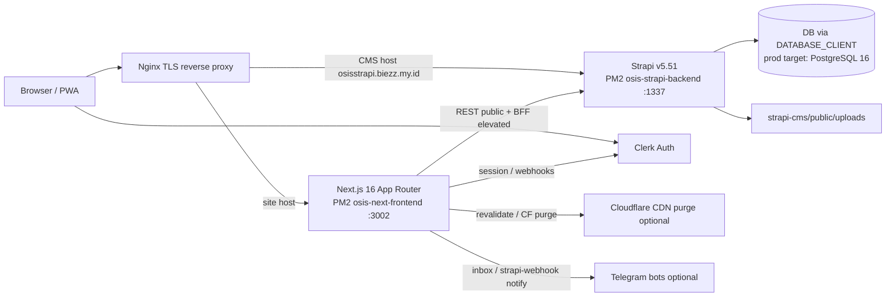
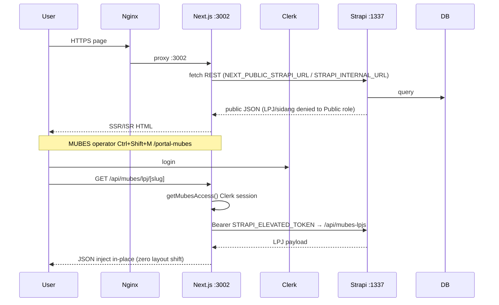

# System Architecture Codemap — Agora Acta (OSIS SMAIT Fithrah Insani)

**Purpose:** AI-agent map of live monorepo topology, request flows, domains, env names, and edit guardrails for the public OSIS portal + MUBES dual-layer stack. **Last updated: 2026-09-22.** Authoritative deep docs live under `docs/codemaps/`; `.devin/codemaps/` is a mirror of the same maps (no separate architecture).

---

## 1. System context



| Layer | Path / process | Runtime |
| :--- | :--- | :--- |
| Workspace root | `package.json` (`agoraacta-website-workspace@1.0.0`) | `concurrently` scripts `dev` / `start` / `build` |
| Frontend | `osis-smait-fi/` | **Next `16.2.11`**, **React `19.2.4`**, **Tailwind CSS v4**, TypeScript 5 |
| Backend CMS | `strapi-cms/` | **Strapi `@strapi/strapi@5.51.0`**, Node `>=20 <=26` |
| Process supervisor | `ecosystem.config.js` | PM2: `osis-next-frontend` → `npm run start:solo` cwd `./osis-smait-fi` **PORT 3002**; `osis-strapi-backend` → `npm run start` cwd `./strapi-cms` **PORT 1337** |
| Docs / agent maps | `docs/`, `docs/codemaps/`, root `CODEMAPS.md` | Human + AI; mirror `.devin/codemaps/` |

**Hosting model:** VPS + Nginx + PM2 (not serverless). Firebase was evaluated and rejected for Strapi persistence (`docs/firebase_deployment_analysis.md`).

---

## 2. Monorepo tree (verified)

```
AGORAACTA_WEBSITE/
├── package.json                 # workspace runner (concurrently)
├── package-lock.json
├── ecosystem.config.js          # PM2 apps
├── CODEMAPS.md                  # root index → prefer docs/codemaps/CODEMAPS.md
├── CHANGELOG.md
├── README.md
├── CLAUDE.md                    # agent workflow (changelog, Slack routing)
├── osis-smait-fi/               # FRONTEND
│   ├── package.json
│   ├── next.config.ts           # CSP, image remotePatterns, HSTS
│   ├── AGENTS.md                # Next 16 breaking-change notice
│   ├── public/                  # assets, manifest.json, sw.js (PWA)
│   └── src/
│       ├── proxy.ts             # Clerk middleware + cache headers (Next 16 entry)
│       ├── app/                 # App Router pages + route handlers
│       ├── components/          # UI, mubes, scenes, globe, home, …
│       ├── lib/                 # strapi.ts, mubes-*, lenis, gsap, search, …
│       ├── hooks/               # useSSE.ts
│       ├── context/             # ImageQualityContext.tsx
│       └── styles/              # module CSS (globals in app/globals.css)
├── strapi-cms/                  # BACKEND
│   ├── package.json
│   ├── config/                  # server, database, admin, api, middlewares, plugins
│   ├── src/api/                 # 24 content-type APIs (see §5)
│   ├── src/index.ts             # bootstrap RBAC, audit middleware, optional DB sync fork
│   ├── public/uploads/
│   ├── scripts/                 # seed, sync-db, sandbox helpers
│   └── .env.example
├── docs/
│   ├── ARCHITECTURE.md          # long-form design (may lag; prefer this codemap for paths)
│   ├── PRD.md, PRD_MUBES_DUAL_LAYER.md, MUBES_ARCHITECTURE_WALKTHROUGH.md
│   ├── CHANGELOG/
│   └── codemaps/                # ★ canonical agent codemaps
│       ├── CODEMAPS.md
│       ├── architecture.md      # this file
│       ├── frontend.md
│       ├── backend.md
│       ├── mubes-flow.md
│       └── devops-workflows.md
├── .devin/codemaps/             # mirror of deep-dive maps (keep in sync with docs/codemaps)
├── codemaps/                    # empty placeholder dir — do not treat as source of truth
├── scripts/, plans/, other-program/, Desain_Sementara/
└── .github/, .cursor/, …
```

---

## 3. Request flow (public + MUBES BFF)



**Clerk edge entry:** `osis-smait-fi/src/proxy.ts` (`clerkMiddleware`) — not classic `middleware.ts`. Matchers cover pages + `/api` + `/__clerk`.

**Key BFF / API routes** (`osis-smait-fi/src/app/api/`):

| Route | Role |
| :--- | :--- |
| `mubes/lpj/[slug]/route.ts` | MUBES LPJ BFF (Clerk + `STRAPI_ELEVATED_TOKEN`) |
| `webhooks/clerk/route.ts` | Clerk user sync → Strapi `anggota-osis` / `akses-user` |
| `strapi-webhook/route.ts` | CMS webhook → revalidate + optional CF purge + Telegram |
| `revalidate/route.ts` | On-demand ISR (`REVALIDATE_SECRET`) |
| `preview/route.ts`, `exit-preview/route.ts` | Draft preview cookies |
| `compress-image/route.ts` | Image proxy (gallery prefers direct Strapi formats) |
| `inbox/route.ts` | Feedback → Telegram |
| `sse/notifications`, `sse/broadcast` | SSE live channels |
| `spotify-rss`, `audio-proxy`, `telemetry/record` | Media / analytics helpers |

---

## 4. Product domains (what exists vs not)

| Domain | Status | Entry points |
| :--- | :--- | :--- |
| **Public site** | Live | `/` beranda, `/about`, `/anggota`, `/program-kerja`, `/program-kerja/[slug]`, `/sekbid/...`, `/events`, `/events/[slug]`, `/galeri`, `/galeri/galeri-preview-infinity`, `/media-sosial`, `/partners`, `/privacy-policy` |
| **Edufest Infinity** | Live | `/edufest-infinity`, `/timeline`, `/location`, `/panitia` + `components/scenes/`, `components/globe/`, `lib/edufest-api.ts` |
| **Portal MUBES** | Live | `/portal-mubes`, `/sso-callback`, `components/mubes/*`, `lib/mubes-access.ts`, `lib/mubes-proker.ts`, BFF above |
| **Student portal / aspirasi box** | Not in this app tree | Planned in org rules/agents; **no** `app/portal` student routes beyond MUBES |
| **E-voting** | **Not present** | No ballot/token routes or packages — do not invent |

Default public hosts (code fallbacks): site `https://osissmaitfi.biezz.my.id`, Strapi `https://osisstrapi.biezz.my.id`.

---

## 5. Strapi content APIs (`strapi-cms/src/api/`)

24 UIDs (folder = API):  
`akses-user`, `anggota-osis`, `artikel-mading`, `audit-log`, `bg-texture-config`, `edufest-config`, `edufest-division`, `edufest-member`, `edufest-timeline`, `event`, `footer-config`, `galeri-foto`, `halaman`, `inbox`, `login-event`, `media-asset`, `mubes-lpj`, `mubes-sidang`, `navbar-config`, `notification`, `partner`, `program-kerja`, `sekbid`, `telemetri-kunjungan`.

**Patterns:**

- Strapi **5 Document Service**: `strapi.documents('api::…')` (see bootstrap in `strapi-cms/src/index.ts`).
- Global **audit-log** middleware on CUD/publish.
- **MUBES**: `mubes-lpj` / `mubes-sidang` must stay **403 for Public**; elevated token only via Next BFF.
- DB client: `strapi-cms/config/database.ts` — `DATABASE_CLIENT` ∈ `mysql` \| `postgres` \| `sqlite` (default in code: **`mysql`**). Production migration/changelog targets **PostgreSQL 16** (historically container `mubes-postgres` on host port **5433**). Drivers present: `pg`, `mysql2`, `better-sqlite3`. Prefer env over hardcoding engine/port.

---

## 6. Frontend modules (hot paths)

| Module | Path | Notes |
| :--- | :--- | :--- |
| Strapi client / media | `osis-smait-fi/src/lib/strapi.ts` | `STRAPI_URL`, `getStrapiMediaUrl()`, server internal URL |
| Server fetch helpers | `osis-smait-fi/src/lib/strapi-server.ts` | RSC-oriented |
| MUBES access | `osis-smait-fi/src/lib/mubes-access.ts` | Clerk claim → role gate |
| MUBES proker/LPJ UI data | `osis-smait-fi/src/lib/mubes-proker.ts` | Dual-layer merge |
| Search | `osis-smait-fi/src/lib/search.ts` | Parallel CMS search + PJ routing |
| Motion | `lib/lenis.ts`, `lib/gsap.ts`, `lib/poisson-disk.ts` | Scroll / intro / particles |
| Root layout | `osis-smait-fi/src/app/layout.tsx` | `ClerkProvider`, PWA SW register |
| Config security | `osis-smait-fi/next.config.ts` | CSP includes Clerk, CF Turnstile, Strapi, embeds |

**UI stack (not Three.js package):** Framer Motion, GSAP, Lenis, D3 + topojson (globe), `@paper-design/shaders-react`, Lucide. Scene components under `components/scenes/` are custom React scenes (no `three` dep in `package.json`).

---

## 7. Environment variables (names only)

### Frontend (`osis-smait-fi`)

| Name | Use |
| :--- | :--- |
| `NEXT_PUBLIC_STRAPI_URL` | Public CMS base URL |
| `NEXT_PUBLIC_SITE_URL` | Canonical site (sitemap/robots) |
| `STRAPI_INTERNAL_URL` | Server-side Strapi (default `http://127.0.0.1:1337`) |
| `STRAPI_ELEVATED_TOKEN` | MUBES BFF + telemetry + Clerk webhook elevated calls |
| `STRAPI_TOKEN` / `STRAPI_API_TOKEN` | Notification service fallbacks |
| `CLERK_SECRET_KEY` | Server Clerk + webhook client |
| `CLERK_WEBHOOK_SECRET` | Svix verify |
| `NEXT_PUBLIC_CLERK_*` | Standard Clerk publishable (via Clerk SDK) |
| `REVALIDATE_SECRET` | `/api/revalidate`, strapi-webhook gate |
| `PREVIEW_SECRET` | Draft preview |
| `CF_ZONE_ID`, `CF_API_TOKEN` | Optional Cloudflare purge |
| `TELEGRAM_BOT_TOKEN`, `TELEGRAM_FEEDBACK_BOT_TOKEN`, `TELEGRAM_CHAT_ID` | Notify / inbox |

### Backend (`strapi-cms`)

| Name | Use |
| :--- | :--- |
| `HOST`, `PORT`, `PUBLIC_URL` / `URL` | Server bind & public URL |
| `APP_KEYS`, `API_TOKEN_SALT`, `ADMIN_JWT_SECRET`, `TRANSFER_TOKEN_SALT`, `JWT_SECRET`, `ENCRYPTION_KEY` | Strapi secrets |
| `DATABASE_CLIENT`, `DATABASE_HOST`, `DATABASE_PORT`, `DATABASE_NAME`, `DATABASE_USERNAME`, `DATABASE_PASSWORD`, `DATABASE_URL`, `DATABASE_SSL*`, `DATABASE_SCHEMA`, `DATABASE_FILENAME` | DB |
| `CLIENT_URL`, `FRONTEND_URL`, `PREVIEW_SECRET` | CORS / preview deep links |
| `CLERK_SECRET_KEY` | `akses-user` lifecycle → Clerk API |
| `DB_SYNC_INTERVAL_MS` | Optional fork interval for `scripts/sync-db.js` |
| `STRAPI_URL`, `STRAPI_ADMIN_EMAIL`, `STRAPI_ADMIN_PASSWORD` | Seed scripts only |

Never commit real values. Template: `strapi-cms/.env.example`.

---

## 8. Architectural patterns (keep)

1. **Dual-layer MUBES:** Same proker pages for public vs operator; sensitive LPJ only after Clerk + BFF; no URL change / no layout shift.
2. **BFF isolation:** Browser never holds elevated Strapi token; only Next route handlers.
3. **Media normalization:** Always `getStrapiMediaUrl()` — no hardcoded localhost/IP in UI.
4. **Gallery infinity:** `/galeri/galeri-preview-infinity` — gap `0px`, `rounded-none`, prefer Strapi `formats.medium|large` over `/api/compress-image` (see `osis-smait-fi/AGENTS.md`).
5. **Cache:** `proxy.ts` sets short SWR for HTML; API `no-store`; static `_next` immutable long cache; on-demand revalidate via secrets.
6. **Audit:** Strapi document middleware writes `api::audit-log`.

---

## 9. Agent decision guardrails

1. Read `osis-smait-fi/AGENTS.md` before App Router / caching changes (Next 16 ≠ training data).
2. Prefer **Document API** over legacy Entity Service in Strapi 5.
3. Do not open Public permissions on `mubes-lpj` / `mubes-sidang`.
4. Do not add e-voting or generic student portal without explicit product scope — **absent today**.
5. Codemap edits: write **`docs/codemaps/*` first**; mirror architecture (and agreed files) to **`.devin/codemaps/`**. Ignore empty root `codemaps/`. Root `CODEMAPS.md` should point at `docs/codemaps/`, not invent a second tree.
6. After feature work: update `CHANGELOG.md` + `docs/CHANGELOG/CHANGELOG.md` per `CLAUDE.md`.
7. Deep dives: `frontend.md`, `backend.md`, `mubes-flow.md`, `devops-workflows.md` — do not contradict this architecture map on ports, versions, or paths.

---

## 10. Related documents

- `docs/ARCHITECTURE.md` — narrative architecture (verify paths against this file if conflict).
- `docs/MUBES_ARCHITECTURE_WALKTHROUGH.md`, `docs/PRD_MUBES_DUAL_LAYER.md`
- `docs/codemaps/CODEMAPS.md` — index
- `osis-smait-fi/README.md`, `strapi-cms/.env.example`
- PM2: `ecosystem.config.js`
