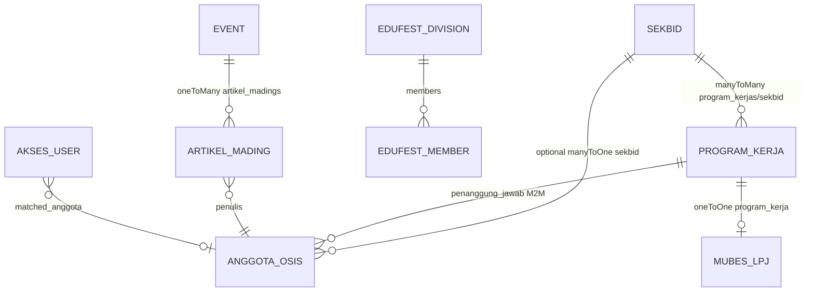

# Backend Codemap: `strapi-cms`

**Purpose:** AI-agent map of the live Strapi CMS for Agora Acta (OSIS SMAIT Fithrah Insani).  
**Last updated:** 2026-09-22  
**Root:** `/home/attabi/Documents/WEBSITE/AGORAACTA_WEBSITE/strapi-cms`

| Fact | Value |
|------|--------|
| Strapi | **5.51.0** (`@strapi/strapi`) |
| Node | `>=20.0.0 <=26.x.x` |
| DB drivers | `mysql2` ^3.23.2, `pg` ^8.22.0 |
| Default `DATABASE_CLIENT` | **`mysql`** (override: `postgres` \| `sqlite`) |
| Public URL default | `https://osisstrapi.biezz.my.id` |
| Port | `1337` (`HOST` `0.0.0.0`) |
| Content-type APIs | **24** under `src/api/` (exact count) |

---

## 1. Directory map

```
strapi-cms/
├── config/
│   ├── admin.ts          # JWT, API token salt, preview pathnames → frontend
│   ├── api.ts            # REST limits + documents.strictParams
│   ├── database.ts       # mysql | postgres | sqlite from env
│   ├── middlewares.ts    # stock Strapi stack (no custom)
│   ├── plugins.ts        # users-permissions sessions + upload MIME allow/deny
│   └── server.ts         # host/port/PUBLIC_URL/APP_KEYS
├── src/
│   ├── index.ts          # register: audit Document middleware; bootstrap: RBAC + seed
│   ├── api/              # 24 content-type APIs (see inventory)
│   └── components/       # 4 component schemas (edufest + shared + LPJ)
├── scripts/              # sync-db.js, seed, sandbox, schema sync
└── public/uploads/       # local media (when not external provider)
```

No custom `src/middlewares/` or `src/policies/`. No `src/extensions/` customizations in tree.

---

## 2. Strapi 5 Document API (mandatory)

**Use Document Service, not `entityService`.**

```ts
// Find published
const rows = await strapi.documents('api::sekbid.sekbid').findMany({
  status: 'published',
  filters: { nomor: 8 },
});

// CRUD + publish
const doc = await strapi.documents('api::mubes-lpj.mubes-lpj').create({ data: { ... } });
await strapi.documents('api::mubes-lpj.mubes-lpj').publish({ documentId: doc.documentId });
```

| Pattern | Notes |
|---------|--------|
| UID form | `api::<api-folder>.<singularName>` |
| IDs | Prefer `documentId` (string) for Document API; numeric `id` still appears on relations in seed code |
| Draft/publish | Many visitor CTs have `draftAndPublish: true` — REST public consumers need **published** docs |
| `config/api.ts` | `rest.defaultLimit: 25`, `maxLimit: 100`, `withCount: true`, `documents.strictParams: true` |

**Global Document middleware** (`src/index.ts` → `register`): on `create|update|delete|publish|unpublish`, writes `api::audit-log.audit-log` (skips self + `login-event`). Actor from admin user or `clerk_actor_id` / `clerk_actor_name` on params.

---

## 3. Content-type inventory (24)

Path pattern: `src/api/<name>/content-types/<name>/schema.json`  
Controllers/routes/services: **core factories only** (no custom handler logic). Security is RBAC + bootstrap public grants + BFF, not controller code.

### 3.1 Legend

| Tag | Meaning |
|-----|---------|
| 🌐 VISITOR | Public site content (bootstrap grants Public `find`/`findOne`) |
| 🏛️ MUBES | Confidential; **not** in public grant list |
| ⚙️ SYS | Operational / layout / telemetry — treat as non-public unless explicitly granted |

### 3.2 Full table

| # | Folder | UID | Kind | d&p | Purpose | Public find* |
|---|--------|-----|------|-----|---------|--------------|
| 1 | `akses-user` | `api::akses-user.akses-user` | collection | no | MUBES whitelist: Clerk ID, role, approval | **No** |
| 2 | `anggota-osis` | `api::anggota-osis.anggota-osis` | collection | yes | OSIS members (BPH/Sekbid) | Yes |
| 3 | `artikel-mading` | `api::artikel-mading.artikel-mading` | collection | yes | Digital mading articles | Yes |
| 4 | `audit-log` | `api::audit-log.audit-log` | collection | no | Document-change audit trail | **No** |
| 5 | `bg-texture-config` | `api::bg-texture-config.bg-texture-config` | **single** | no | Site background texture | Yes |
| 6 | `edufest-config` | `api::edufest-config.edufest-config` | **single** | no | Edufest page global config | Yes |
| 7 | `edufest-division` | `api::edufest-division.edufest-division` | collection | yes | Edufest committee divisions | Yes |
| 8 | `edufest-member` | `api::edufest-member.edufest-member` | collection | yes | Edufest committee people | Yes |
| 9 | `edufest-timeline` | `api::edufest-timeline.edufest-timeline` | collection | yes | Edufest year timeline | Yes |
| 10 | `event` | `api::event.event` | collection | yes | Events / agendas | Yes |
| 11 | `footer-config` | `api::footer-config.footer-config` | **single** | no | Footer CMS | **Not in bootstrap public list** |
| 12 | `galeri-foto` | `api::galeri-foto.galeri-foto` | collection | yes | Photo gallery | Yes |
| 13 | `halaman` | `api::halaman.halaman` | collection | yes | CMS pages (home, about, sosmed, …) | Yes |
| 14 | `inbox` | `api::inbox.inbox` | collection | no | Kotak aspirasi / messages | **No** |
| 15 | `login-event` | `api::login-event.login-event` | collection | no | MUBES login/presensi log | **No** |
| 16 | `media-asset` | `api::media-asset.media-asset` | collection | yes | Keyed media (hero, audio, ticker) | Yes |
| 17 | `mubes-lpj` | `api::mubes-lpj.mubes-lpj` | collection | yes | **LPJ + anggaran** (confidential) | **No** |
| 18 | `mubes-sidang` | `api::mubes-sidang.mubes-sidang` | collection | yes | Sidang docs / ketetapan | **No** |
| 19 | `navbar-config` | `api::navbar-config.navbar-config` | **single** | no | Navbar CMS | **Not in bootstrap public list** |
| 20 | `notification` | `api::notification.notification` | collection | no | Site notifications | **No** |
| 21 | `partner` | `api::partner.partner` | collection | yes | Partners & contributors | Yes |
| 22 | `program-kerja` | `api::program-kerja.program-kerja` | collection | yes | Work programs | Yes |
| 23 | `sekbid` | `api::sekbid.sekbid` | collection | yes | 8 seksi bidang | Yes |
| 24 | `telemetri-kunjungan` | `api::telemetri-kunjungan.telemetri-kunjungan` | collection | no | Visit analytics (IP, UA, path) | **No** |

\*Public = `setupPublicPermissions` in `src/index.ts` enables Public role `find` + `findOne` only. Create/update/delete stay false for Public.

**Single types (4):** `bg-texture-config`, `edufest-config`, `footer-config`, `navbar-config`.  
**Collection types (20):** the rest.

---

## 4. Sensitive / MUBES schemas (detail)

### `api::mubes-lpj.mubes-lpj` — CONFIDENTIAL

| Attribute | Type | Notes |
|-----------|------|--------|
| `program_kerja` | oneToOne → `program-kerja` | Link to public proker |
| `realisasi_anggaran` | decimal required | Financial |
| `sumber_dana` | string required | Funding source |
| `evaluasi_internal` | richtext required | Internal eval |
| `kendala_solusi` | json | Issues |
| `nota_kwitansi` | media multiple | Receipts |
| `status_pengesahan` | enum `draft\|ditinjau\|disahkan` | Approval |
| `sections` | repeatable `program-kerja.lpj-section` | Structured LPJ body |

### `api::mubes-sidang.mubes-sidang` — CONFIDENTIAL

| Attribute | Type |
|-----------|------|
| `tahun_periode` | string required |
| `tata_tertib` | richtext |
| `daftar_komisi` | json |
| `draft_konsideran` | richtext |
| `status_sidang` | enum `pra_mubes\|berlangsung\|selesai` |

### `api::akses-user.akses-user` — CONFIDENTIAL

| Attribute | Type |
|-----------|------|
| `clerk_user_id` | string unique required |
| `nama_lengkap_input` | string required |
| `email` | email |
| `role` | `member\|operator\|admin_pembina` |
| `status` | `pending\|approved\|ditolak` |
| `matched_anggota` | oneToOne → `anggota-osis` |
| `catatan_review`, `approved_by` | text/string |

### `api::audit-log.audit-log` / `api::login-event.login-event`

- Audit: `content_type`, `target_document_id`, `action`, actor, `before_data`/`after_data` JSON.  
- Login: `identifier`, `clerk_user_id`, `ip_address`, `success`, `user_agent`.

### `api::telemetri-kunjungan.telemetri-kunjungan`

PII-ish: `device_id`, optional Clerk fields, `ip_address`, `user_agent`, `page_path`, `is_mubes_session`.

---

## 5. Components (`src/components/`) — 4 files

| Path | UID-style | Used by |
|------|-----------|---------|
| `edufest/scene.json` | `edufest.scene` | `edufest-config.scenes` |
| `edufest/guest.json` | `edufest.guest` | `edufest-timeline.guests` |
| `shared/tujuan-detail.json` | `shared.tujuan-detail` | `program-kerja.tujuan_detail` |
| `program-kerja/lpj-section.json` | `program-kerja.lpj-section` | `mubes-lpj.sections` |

---

## 6. Relations (Mermaid)



Visitor graph is public. **MUBES_LPJ** and **AKSES_USER** must never be exposed on unauthenticated REST.

---

## 7. Config reference

### `config/database.ts`

- Env: `DATABASE_CLIENT` (`mysql` default), `DATABASE_HOST`, `DATABASE_PORT` (mysql default **3306**, postgres **5432**), `DATABASE_NAME`, `DATABASE_USERNAME`, `DATABASE_PASSWORD`, optional `DATABASE_URL` / SSL / pool / `DATABASE_SCHEMA`.
- Docker MUBES postgres often uses host port **5433** — set via env, not hard-coded in config.

### `config/server.ts`

- `PUBLIC_URL` / `URL`, `HOST`, `PORT`, `APP_KEYS`, webhooks `populateRelations`.
- **MCP** (Strapi built-in ≥5.47): `mcp.enabled` via `MCP_ENABLED` (default `true`), timeouts `MCP_CONNECT_TIMEOUT_MS` / `MCP_REQUEST_TIMEOUT_MS`. Endpoint `POST /mcp`. Auth = **Admin token** Bearer (not Content-API token).
- Setup guide: [`docs/guides/strapi-mcp-setup.md`](../guides/strapi-mcp-setup.md). Token helper: `npm run mcp:token` / `mcp:token:rotate` → `~/.config/agoraacta/strapi-mcp.token`.
- Default token scope: visitor CTs + Media Library only (no MUBES/PII). Cursor: `~/.cursor/mcp.json`; Claude Code: `claude mcp add strapi-mcp --transport http http://127.0.0.1:1337/mcp -H "Authorization: Bearer …"`.

### `config/middlewares.ts`

Stock only: logger, errors, security, cors, poweredBy, query, body, session, favicon, public.

### `config/plugins.ts`

- **users-permissions:** `jwtManagement: 'refresh'`, sessions `httpOnly: true`.
- **upload:** allow images/video/audio/pdf/office/text/csv; **deny** PE/exe/shell/mach-o MIME types.
- **schema-visualizer:** enabled.

### `config/admin.ts`

- Secrets from env; **preview** maps CT slugs → frontend paths (`CLIENT_URL` / `FRONTEND_URL`).

---

## 8. Bootstrap & RBAC (`src/index.ts`)

### register

1. Document audit middleware → `audit-log`.

### bootstrap order

1. **`setupRBAC`** — ensure roles:
   - **Chief Editor** (`chief_editor`): full CRUD on visitor CTs list + upload destroy.
   - **Content Contributor** (`content_contributor`): read all listed CTs; write only `program-kerja`, `event`, `artikel-mading`; no delete; upload no destroy.
2. **`setupPublicPermissions`** — Public role read-only on the 14 visitor CTs listed in §3 table “Yes”.
3. **Seed** if empty: sekbid (8), anggota (~65), program-kerja, event Edufest, media-asset, halaman, edufest-*, partners; always try media defaults + halaman/edufest helpers.
4. **`publishExistingDrafts`** for key visitor CTs.
5. If DB client is **`mysql`**: fork `scripts/sync-db.js` on start + every `DB_SYNC_INTERVAL_MS` (default 600000).

**Not granted to Public by bootstrap:**  
`mubes-lpj`, `mubes-sidang`, `akses-user`, `audit-log`, `login-event`, `inbox`, `notification`, `telemetri-kunjungan`, `footer-config`, `navbar-config`.

Authenticated admin JWT / API token still required for writes; MUBES reads should go through **Next.js BFF + Clerk**, not public Strapi tokens.

---

## 9. Controllers / routes / services

Every API uses:

```ts
factories.createCoreController('api::…')
factories.createCoreRouter('api::…')
factories.createCoreService('api::…')
```

**No custom route policies in-repo.** Do not assume controller-level LPJ guards — rely on Users & Permissions + never enabling Public on MUBES UIDs + BFF.

---

## 10. Media & uploads

| Path | Role |
|------|------|
| Plugin `upload` | Local (default) under `public/uploads/` |
| `media-asset` | Logical keys + optional `file` or `url_external` (frontend static paths seeded) |
| MIME gate | `config/plugins.ts` allow/deny lists |

---

## 11. Scripts

| File | Role |
|------|------|
| `scripts/sync-db.js` | MySQL background sync (spawned from bootstrap) |
| `scripts/seed.ts` / `sync-data.ts` / `sync-kepengurusan.ts` | Ops/seed utilities |
| `scripts/apply-sandbox-selective.*` | Selective sandbox apply |
| `scripts/sync-schemas.sh` | Schema sync helper |

---

## 12. Agent guardrails

1. **Never** enable Public `find`/`findOne` on `mubes-lpj`, `mubes-sidang`, `akses-user`, `audit-log`, `login-event`, or dump LPJ receipts/`realisasi_anggaran` to public pages.
2. **Always** `strapi.documents('api::…')` — do not revive `entityService` for new code.
3. Count APIs as **24** — do not invent “22+” or missing folders.
4. Controllers are factories — security changes belong in **permissions**, **BFF**, or **Document middleware**, not empty stubs.
5. Publish drafts before expecting public REST responses on d&p types.
6. `footer-config` / `navbar-config` are not auto-public; grant explicitly or serve via authenticated/server token if needed.
7. Telemetry/login fields may contain IP/UA — treat as sensitive.
8. Seed data in `index.ts` embeds real member names; do not expose seed-only secrets (there are none beyond public org data).

---

## 13. REST surface (conceptual)

```
GET  /api/<plural>              # Public only if role grants find
GET  /api/<plural>/:documentId  # findOne
POST/PUT/DELETE                 # authenticated / admin token
GET  /api/<single>              # single types (e.g. /api/edufest-config)
```

Plural names from schema `info.pluralName` (e.g. `mubes-lpjs`, `anggota-oses`, `sekbids`).

---

## 14. Related codemaps

- Frontend BFF / Clerk MUBES: `docs/codemaps/frontend.md`, `docs/codemaps/mubes-flow.md`
- Deploy: `docs/codemaps/devops-workflows.md`
)
