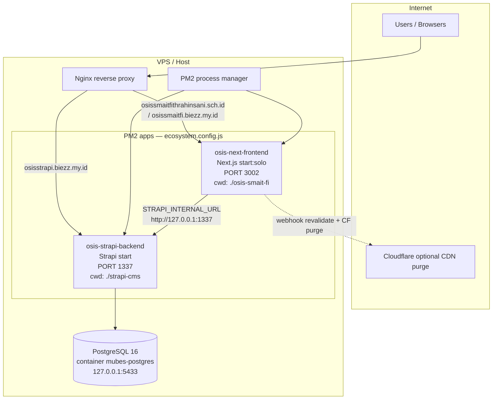

# DevOps, PM2 & Environment Codemap

**Purpose:** AI-agent map of production process supervision, monorepo scripts, env catalogs (names only), DB connection config, CI, reverse-proxy notes, and deploy guardrails for Agora Acta (OSIS SMAIT Fithrah Insani).

**Last updated:** 2026-09-22

**Project root:** `/home/attabi/Documents/WEBSITE/AGORAACTA_WEBSITE`

> **Note:** `.codemap/` is Codemap *tool runtime* state (sessions, hubs, agent_edits) — not architecture docs. Human/AI navigation docs live in `docs/codemaps/`. Historical Devin index may reference `.devin/codemaps/`; that path is optional and may be absent.

---

## 1. Deploy topology



**Public hostnames (from docs / defaults in code):**

| Role | Hostname | Upstream |
|------|----------|----------|
| Site / Next.js | `osissmaitfithrahinsani.sch.id`, `osissmaitfi.biezz.my.id` | `127.0.0.1:3002` |
| Strapi public API | `osisstrapi.biezz.my.id` | `127.0.0.1:1337` |

Nginx vhost files are **not** checked into this repo; mapping is documented in `docs/ARCHITECTURE.md` and `docs/CATATAN.md`.

---

## 2. PM2 — `ecosystem.config.js`

**Path:** `/home/attabi/Documents/WEBSITE/AGORAACTA_WEBSITE/ecosystem.config.js`

| `name` | `script` | `args` | `cwd` | Injected `env` |
|--------|----------|--------|-------|----------------|
| `osis-strapi-backend` | `npm` | `run start` | `./strapi-cms` | `NODE_ENV=production`, `PORT=1337` |
| `osis-next-frontend` | `npm` | `run start:solo` | `./osis-smait-fi` | `NODE_ENV=production`, `PORT=3002` |

**Process inventory (live config):**

1. **osis-strapi-backend** — Strapi v5 production (`strapi start`), port **1337**
2. **osis-next-frontend** — Next.js production (`next start` via `start:solo`), port **3002** (not 3000)

**Essential PM2 commands:**

```bash
# From repo root
pm2 start ecosystem.config.js
pm2 status
pm2 restart osis-next-frontend
pm2 restart osis-strapi-backend
pm2 logs osis-next-frontend --lines 50
pm2 logs osis-strapi-backend --lines 50
```

**Typical frontend deploy:**

```bash
cd /home/attabi/Documents/WEBSITE/AGORAACTA_WEBSITE/osis-smait-fi
npm run build && pm2 restart osis-next-frontend
```

**Typical Strapi deploy:**

```bash
cd /home/attabi/Documents/WEBSITE/AGORAACTA_WEBSITE/strapi-cms
npm run build && pm2 restart osis-strapi-backend
```

---

## 3. Monorepo & package scripts

### 3.1 Root workspace

**Path:** `/home/attabi/Documents/WEBSITE/AGORAACTA_WEBSITE/package.json`  
**Name:** `agoraacta-website-workspace`

| Script | Command |
|--------|---------|
| `dev` | `concurrently` → `npm run dev:solo --prefix osis-smait-fi` + `npm run dev --prefix strapi-cms` |
| `start` | `concurrently` → `npm run start:solo --prefix osis-smait-fi` + `npm run start --prefix strapi-cms` |
| `build` | `npm run build --prefix osis-smait-fi` then `npm run build --prefix strapi-cms` |

Root uses `concurrently` (devDependency). PM2 does **not** use root `start`; it runs each app solo.

### 3.2 Frontend — `osis-smait-fi`

**Path:** `/home/attabi/Documents/WEBSITE/AGORAACTA_WEBSITE/osis-smait-fi/package.json`

| Script | Command | Notes |
|--------|---------|-------|
| `dev` | `npm run dev --prefix ..` | Delegates to monorepo dual-dev |
| `dev:solo` | `next dev` | Local Next only (default Next port unless `PORT` set) |
| `build` | `next build` | Production build |
| `start` | `npm start --prefix ..` | Monorepo dual-start |
| `start:solo` | `next start` | **PM2 production entry** |
| `lint` | `eslint` | |

Stack pin (package): Next `16.2.11`, React `19.2.4`.

### 3.3 Backend — `strapi-cms`

**Path:** `/home/attabi/Documents/WEBSITE/AGORAACTA_WEBSITE/strapi-cms/package.json`

| Script | Command | Notes |
|--------|---------|-------|
| `build` | `strapi build` | Admin + server build |
| `dev` / `develop` | `strapi develop` | Dev with reload |
| `start` | `strapi start` | **PM2 production entry** |
| `console` | `strapi console` | REPL |
| `deploy` | `strapi deploy` | Strapi Cloud CLI (optional; not primary VPS path) |
| `strapi` | `strapi` | Passthrough |
| `upgrade` / `upgrade:dry` | `@strapi/upgrade` | Version upgrade helpers |
| `lint` | `tsc --noEmit` | Typecheck |
| `seed` | `npx tsx scripts/seed.ts` | Seed sample data |
| `db:sync` | `node scripts/sync-db.js` | Legacy MySQL→SQLite sync worker |

**Related scripts (not always in package.json):**

| Path | Role |
|------|------|
| `strapi-cms/scripts/seed.ts` | Seed |
| `strapi-cms/scripts/sync-db.js` | MySQL → SQLite lock-file sync (legacy path; prod DB is Postgres) |
| `strapi-cms/scripts/sync-data.ts` | Data sync utility |
| `strapi-cms/scripts/sync-kepengurusan.ts` | Kepengurusan sync |
| `strapi-cms/scripts/sync-schemas.sh` | Schema sync shell |
| `strapi-cms/scripts/apply-sandbox-selective.{js,ts}` | Selective sandbox apply |

### 3.4 Out-of-band package (not PM2)

**Path:** `/home/attabi/Documents/WEBSITE/AGORAACTA_WEBSITE/other-program/infinity-edufest/package.json`  
Standalone Next demo (`dev` / `build` / `start`). **Not** in `ecosystem.config.js`.

---

## 4. Build / start / dev workflows

| Goal | Where | Command |
|------|-------|---------|
| Full stack local | repo root | `npm run dev` |
| Frontend only | `osis-smait-fi` | `npm run dev:solo` |
| Strapi only | `strapi-cms` | `npm run dev` or `npm run develop` |
| Full monorepo build | repo root | `npm run build` |
| Prod FE build + reload | `osis-smait-fi` | `npm run build && pm2 restart osis-next-frontend` |
| Prod BE build + reload | `strapi-cms` | `npm run build && pm2 restart osis-strapi-backend` |
| Dual start without PM2 | repo root | `npm run start` |
| Seed Strapi | `strapi-cms` | `npm run seed` |

**Ports (production convention):**

| Service | Port |
|---------|------|
| Next.js (PM2) | **3002** |
| Strapi (PM2) | **1337** |
| Postgres (`mubes-postgres`) | **5433** on `127.0.0.1` (host-mapped; documented in CHANGELOG / architecture) |

---

## 5. Environment variable catalog (NAMES ONLY)

Never commit real `.env` / `.env.local` values. Sample template: `strapi-cms/.env.example`. Frontend has **no** checked-in `.env.example`; names below are from code usage.

### 5.1 Frontend (`osis-smait-fi` — `.env` / `.env.local`)

| Name | Used for |
|------|----------|
| `NEXT_PUBLIC_STRAPI_URL` | Public Strapi base (client + media rewrite); default `https://osisstrapi.biezz.my.id` |
| `STRAPI_INTERNAL_URL` | Server-side BFF → Strapi loopback; default `http://127.0.0.1:1337` |
| `STRAPI_ELEVATED_TOKEN` | MUBES BFF / Clerk webhook / telemetry elevated Strapi API token |
| `STRAPI_URL` | Fallback alias in notification helper |
| `STRAPI_TOKEN` / `STRAPI_API_TOKEN` | Notification service Strapi token aliases |
| `NEXT_PUBLIC_SITE_URL` | Canonical site URL (sitemap, robots, CF purge); default `https://osissmaitfi.biezz.my.id` |
| `CLERK_SECRET_KEY` | Clerk backend client |
| `CLERK_WEBHOOK_SECRET` | Svix verification on `/api/webhooks/clerk` |
| `NEXT_PUBLIC_CLERK_PUBLISHABLE_KEY` | Clerk client (standard Clerk Next.js; required by `@clerk/nextjs` at runtime) |
| `PREVIEW_SECRET` | Draft preview gate (`/api/preview`) |
| `REVALIDATE_SECRET` | On-demand revalidate + Strapi webhook auth |
| `TELEGRAM_BOT_TOKEN` | Strapi webhook Telegram notify |
| `TELEGRAM_FEEDBACK_BOT_TOKEN` | Inbox feedback bot |
| `TELEGRAM_CHAT_ID` | Telegram destination chat |
| `CF_ZONE_ID` | Cloudflare zone for cache purge |
| `CF_API_TOKEN` | Cloudflare API token for purge |
| `PORT` | Overridden by PM2 to `3002` in production |
| `NODE_ENV` | Set `production` by PM2 |

**Key code paths:**

- `osis-smait-fi/src/lib/strapi.ts` — `NEXT_PUBLIC_STRAPI_URL`, `STRAPI_INTERNAL_URL`
- `osis-smait-fi/src/app/api/mubes/lpj/[slug]/route.ts` — `STRAPI_ELEVATED_TOKEN`
- `osis-smait-fi/src/app/api/webhooks/clerk/route.ts` — Clerk + elevated token
- `osis-smait-fi/src/app/api/strapi-webhook/route.ts` — revalidate, Telegram, Cloudflare
- `osis-smait-fi/next.config.ts` — CSP / image hosts (not env-driven)

### 5.2 Strapi (`strapi-cms` — `.env`)

From `.env.example` + `config/*`:

| Name | Used for |
|------|----------|
| `HOST` | Bind host (default `0.0.0.0`) |
| `PORT` | HTTP port (default / PM2 `1337`) |
| `APP_KEYS` | Cookie/session app keys (array) |
| `API_TOKEN_SALT` | API token hashing |
| `ADMIN_JWT_SECRET` | Admin JWT |
| `TRANSFER_TOKEN_SALT` | Transfer tokens |
| `JWT_SECRET` | Users-permissions JWT (example file) |
| `ENCRYPTION_KEY` | Admin encryption |
| `PUBLIC_URL` / `URL` | Public Strapi URL (default `https://osisstrapi.biezz.my.id`) |
| `FRONTEND_URL` | Preview / CORS client URL |
| `CLIENT_URL` | Primary client URL (default `https://osis.biezz.my.id`) |
| `PREVIEW_SECRET` | Shared preview secret with Next |
| `STRAPI_URL` | Seed script base URL |
| `STRAPI_ADMIN_EMAIL` | Seed admin |
| `STRAPI_ADMIN_PASSWORD` | Seed admin |
| `FLAG_NPS` / `FLAG_PROMOTE_EE` | Admin feature flags |
| `WEBHOOKS_POPULATE_RELATIONS` | Webhook relation populate |
| `NODE_ENV` | PM2 sets `production` |

**Database (Postgres production — names only):**

| Name | Role |
|------|------|
| `DATABASE_CLIENT` | `postgres` \| `mysql` \| `sqlite` (code default string is `mysql`; prod uses `postgres`) |
| `DATABASE_HOST` | Host |
| `DATABASE_PORT` | Port (Postgres default in config `5432`; live mapping often **5433**) |
| `DATABASE_NAME` | DB name |
| `DATABASE_USERNAME` | User |
| `DATABASE_PASSWORD` | Password |
| `DATABASE_URL` | Optional full connection string (Postgres) |
| `DATABASE_SSL` | SSL toggle |
| `DATABASE_SSL_KEY` / `DATABASE_SSL_CERT` / `DATABASE_SSL_CA` / `DATABASE_SSL_CAPATH` / `DATABASE_SSL_CIPHER` | SSL material |
| `DATABASE_SSL_REJECT_UNAUTHORIZED` | TLS verify |
| `DATABASE_SCHEMA` | Postgres schema (default `public`) |
| `DATABASE_POOL_MIN` / `DATABASE_POOL_MAX` | Pool |
| `DATABASE_CONNECTION_TIMEOUT` | Acquire timeout ms |
| `DATABASE_FILENAME` | SQLite path only |

**Config locations:**

| File | Responsibility |
|------|----------------|
| `strapi-cms/config/database.ts` | Client selection + connection |
| `strapi-cms/config/server.ts` | `HOST`, `PORT`, `PUBLIC_URL`/`URL`, `APP_KEYS` |
| `strapi-cms/config/admin.ts` | JWT/salts, preview, `CLIENT_URL`/`FRONTEND_URL` |
| `strapi-cms/config/middlewares.ts` | CORS/security stack (static list) |
| `strapi-cms/.env.example` | Documented sample names |

---

## 6. Database (PostgreSQL)

**Production posture (documented):** PostgreSQL 16, Docker container name `mubes-postgres`, host port **`127.0.0.1:5433`** (see `docs/CHANGELOG/CHANGELOG.md` §2.0.0, `docs/codemaps/architecture.md`).

**Connection is configured only via env +:**

- `/home/attabi/Documents/WEBSITE/AGORAACTA_WEBSITE/strapi-cms/config/database.ts`

No `docker-compose*.yml` is checked into this monorepo. Agent must not invent compose files or print live credentials.

**Legacy:** `npm run db:sync` / `scripts/sync-db.js` targets MySQL→SQLite; treat as historical unless operators still run it. Primary runtime is Postgres.

---

## 7. CI/CD

**Path:** `/home/attabi/Documents/WEBSITE/AGORAACTA_WEBSITE/.github/workflows/security-scan.yml`

| Trigger | Branches |
|---------|----------|
| `push`, `pull_request` | `main` |

| Job | Steps |
|-----|-------|
| `audit` | checkout → Node 20 → `npm audit --audit-level=critical` in `osis-smait-fi` (non-fatal) → `npm ci` + `npm run build` in `osis-smait-fi` |

**Not present:** deploy-to-VPS workflow, Strapi CI job, Docker build/push. Production deploy is **manual build + PM2 restart** on the host.

---

## 8. Nginx / reverse proxy

- **In-repo:** no `nginx.conf` / sites-available samples for main OSIS stack.
- **Documented mapping:** `docs/ARCHITECTURE.md` § Deployment (PM2) — Nginx terminates TLS and proxies:
  - school / site domain → `localhost:3002`
  - `osisstrapi.biezz.my.id` → `localhost:1337`
- **Related only:** `docs/plans/telegram-bot-enhancement-plan.md` includes sample Nginx for **n8n** (`n8n.biezz.my.id` → `:5678`) — not core Agora Acta PM2 apps.
- **Firebase:** `docs/firebase_deployment_analysis.md` analyzes a *possible* migration; current production path remains **VPS + PM2 + Postgres**.

---

## 9. Agent guardrails (backup / deploy)

1. **Do not** print or commit secrets from `.env`, `.env.local`, or live tokens. Catalog **names only**.
2. **Do not** treat `.codemap/` as source-of-truth architecture; use `docs/codemaps/`.
3. **Ports:** production Next is **3002**, not 3000. Strapi **1337**. Postgres host map **5433** when using `mubes-postgres`.
4. **PM2 names are fixed:** restart `osis-next-frontend` / `osis-strapi-backend` only — do not invent process names.
5. **Deploy order:** `build` then `pm2 restart` for the changed app; avoid killing both unless intentional full restart via `ecosystem.config.js`.
6. **Media URLs:** always normalize via `getStrapiMediaUrl()` / `osis-smait-fi/src/lib/strapi.ts` — never hardcode `localhost:1337` in client-facing HTML.
7. **MUBES:** elevated Strapi token stays server-side (`STRAPI_ELEVATED_TOKEN`); public Strapi must not expose MUBES private types (see mubes codemap).
8. **Home ISR:** do not convert `/` to `force-dynamic` without product decision (`docs/CATATAN.md`).
9. **Gallery:** infinity gallery gap/`rounded-none` constraints in `osis-smait-fi/AGENTS.md` — no visual regressions on deploy.
10. **Backup:** no automated backup scripts in-repo. Operators own DB dumps and `strapi-cms/public/uploads/` retention outside git. Prefer read-only audits of prod DB unless explicitly tasked.
11. **CI scope:** GitHub Actions only audits/builds frontend; green CI ≠ deployed production.
12. **Side packages:** `other-program/infinity-edufest` is not production PM2 — do not wire into `ecosystem.config.js` without explicit request.

---

## 10. Quick path index

| Artifact | Absolute path |
|----------|----------------|
| PM2 ecosystem | `/home/attabi/Documents/WEBSITE/AGORAACTA_WEBSITE/ecosystem.config.js` |
| Root scripts | `/home/attabi/Documents/WEBSITE/AGORAACTA_WEBSITE/package.json` |
| Frontend package | `/home/attabi/Documents/WEBSITE/AGORAACTA_WEBSITE/osis-smait-fi/package.json` |
| Strapi package | `/home/attabi/Documents/WEBSITE/AGORAACTA_WEBSITE/strapi-cms/package.json` |
| Strapi DB config | `/home/attabi/Documents/WEBSITE/AGORAACTA_WEBSITE/strapi-cms/config/database.ts` |
| Strapi server config | `/home/attabi/Documents/WEBSITE/AGORAACTA_WEBSITE/strapi-cms/config/server.ts` |
| Strapi env example | `/home/attabi/Documents/WEBSITE/AGORAACTA_WEBSITE/strapi-cms/.env.example` |
| CI workflow | `/home/attabi/Documents/WEBSITE/AGORAACTA_WEBSITE/.github/workflows/security-scan.yml` |
| Deploy notes | `/home/attabi/Documents/WEBSITE/AGORAACTA_WEBSITE/docs/ARCHITECTURE.md` |
| Short ops notes | `/home/attabi/Documents/WEBSITE/AGORAACTA_WEBSITE/docs/CATATAN.md` |
| This codemap | `/home/attabi/Documents/WEBSITE/AGORAACTA_WEBSITE/docs/codemaps/devops-workflows.md` |
| Codemap index | `/home/attabi/Documents/WEBSITE/AGORAACTA_WEBSITE/docs/codemaps/CODEMAPS.md` |

---

## 11. Script inventory (summary)

**Root:** `dev`, `start`, `build`

**osis-smait-fi:** `dev`, `dev:solo`, `build`, `start`, `start:solo`, `lint`

**strapi-cms:** `build`, `console`, `deploy`, `dev`, `develop`, `start`, `strapi`, `upgrade`, `upgrade:dry`, `lint`, `seed`, `db:sync`

**PM2 entrypoints:** `strapi-cms` → `npm run start`; `osis-smait-fi` → `npm run start:solo`
