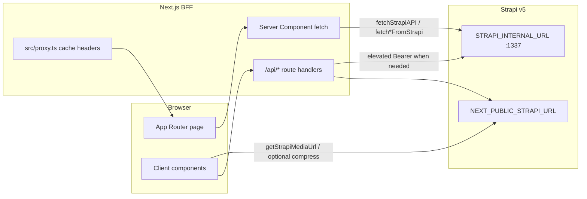

# Frontend Codemap: `osis-smait-fi`

**Purpose:** AI-agent map of the live Next.js frontend (routes, BFF, components, libs, auth, data patterns).  
**Last updated:** 2026-09-22  
**Root:** `/home/attabi/Documents/WEBSITE/AGORAACTA_WEBSITE/osis-smait-fi`  
**Stack:** Next.js `16.2.11` (App Router, Turbopack), React `19.2.4`, Tailwind CSS v4 (`@tailwindcss/postcss`), TypeScript 5, Clerk (`@clerk/nextjs` ^6.39), Framer Motion, GSAP, Lenis, Sharp, Svix  
**Runtime:** PM2 `osis-next-frontend`, port **3002**  
**CMS:** Strapi v5 — public `https://osisstrapi.biezz.my.id`, internal `http://127.0.0.1:1337`  
**Agent rules:** `osis-smait-fi/AGENTS.md` (Next 16 ≠ training data; gallery `GAP = 0`)

---

## 1. Source layout

```
osis-smait-fi/
├── package.json
├── next.config.ts              # CSP, image remotePatterns, security headers
├── postcss.config.mjs          # Tailwind v4
├── AGENTS.md
├── public/                     # static assets, manifest.json, sw.js
└── src/
    ├── proxy.ts                # Next 16 request proxy (Clerk middleware + cache headers)
    ├── app/                    # App Router pages + API route handlers
    ├── components/             # UI by domain
    ├── context/                # ImageQualityContext
    ├── data/                   # committee.ts (Edufest static fallback data)
    ├── hooks/                  # useSSE
    ├── lib/                    # Strapi clients, MUBES, Edufest, utils
    └── styles/                 # CSS modules (Slider, TickerGallery)
```

**Note:** There is **no** `middleware.ts`. Clerk + cache headers live in `src/proxy.ts` (Next 16 proxy convention).

---

## 2. App Router — page map

All paths are under `src/app/`. Only routes that exist on disk are listed.

### 2.1 Core site

| URL | File | Notes |
|-----|------|--------|
| `/` | `page.tsx` | Home — Server Component; ISR `revalidate = 10800`; `fetchHalamanFromStrapi('home')` |
| `/about` | `about/page.tsx` | About; ISR 60s |
| `/anggota` | `anggota/page.tsx` | Member directory (BPH + sekbid); Strapi `anggota-oses`, `sekbids` |
| `/events` | `events/page.tsx` | Events list; ISR 60s |
| `/events/[slug]` | `events/[slug]/page.tsx` + `layout.tsx` | Event detail (themed client sections) |
| `/galeri` | `galeri/page.tsx` | **Redirect only** → `/galeri/galeri-preview-infinity` |
| `/galeri/galeri-preview-infinity` | `galeri/galeri-preview-infinity/page.tsx` | Infinite 2D photo grid (client physics); **GAP=0** |
| `/media-sosial` | `media-sosial/page.tsx` | Social hub (YT / IG / TikTok / Spotify) |
| `/partners` | `partners/page.tsx` | Partners showcase |
| `/privacy-policy` | `privacy-policy/page.tsx` | Legal / privacy |
| `/program-kerja` | `program-kerja/page.tsx` | Program Kerja grid |
| `/program-kerja/[slug]` | `program-kerja/[slug]/page.tsx` | Program Kerja detail |
| `/portal-mubes` | `portal-mubes/page.tsx` | MUBES portal; `force-dynamic`; Clerk gate via `getMubesAccess()` |
| `/sso-callback` | `sso-callback/page.tsx` | Clerk `AuthenticateWithRedirectCallback` → portal-mubes signup |
| `/sitemap.xml` | `sitemap.ts` | Dynamic sitemap |
| `/robots.txt` | `robots.ts` | Crawler rules |

**Root layout:** `src/app/layout.tsx`  
- Fonts via `next/font/google`: Geist, Geist Mono, Playfair, Great Vibes, Inter, Cinzel, Cormorant Garamond  
- `ClerkProvider`, `ImageQualityProvider`, `LivePreviewListener`, `MubesSessionBanner`, `TelemetryTracker`, optional `GlobalBgTexture`  
- Dark-mode boot script + service worker `/sw.js`  
- **Does not** mount global Navbar/Footer (pages import them themselves)  
- Domain metadata: `https://osissmaitfithrahinsani.sch.id`

### 2.2 Edufest Infinity (event microsite)

| URL | File |
|-----|------|
| `/edufest-infinity` | `edufest-infinity/page.tsx` |
| `/edufest-infinity/location` | `edufest-infinity/location/page.tsx` |
| `/edufest-infinity/timeline` | `edufest-infinity/timeline/page.tsx` |
| `/edufest-infinity/panitia` | `edufest-infinity/panitia/page.tsx` |

**Layout:** `edufest-infinity/layout.tsx` (`"use client"`) — Lenis smooth scroll, GSAP ScrollTrigger, `LiquidGlassNav`, `EdufestBackHomeNav`, dynamic `IntroOrchestrator`, `CursorParticles`, `AudioManager`.

Data helpers: `src/lib/edufest-api.ts` (`getEdufestConfig`, `getEdufestCommittee`, `getEdufestTimeline`).

### 2.3 Sekbid 1–8 (static deep links + dynamic catch-alls)

**Static hub pages** (each has `page.tsx`):

- `/sekbid/sekbid-1` … `/sekbid/sekbid-8`

**Static program pages** (rutinan / insidental) — exact paths on disk:

**Sekbid 1**  
- rutinan: `hadist-of-the-week`, `kultum`, `pendampingan-rohis`, `takhosus`, `tilawah-osis`  
- insidental: `one-day-one-juz`, `phbi`, `ramadhan-ceria`

**Sekbid 2**  
- rutinan: `class-of-discipline`, `kompas-osis`, `piket-kedisiplinan`, `sidak-tata-tertib`  
- insidental: `bakti-sosial`, `phbn`

**Sekbid 3**  
- rutinan: `notifikasi-edukasi`, `study-club`, `two-minutes-class`  
- insidental: `hari-pendidikan`, `university-day`

**Sekbid 4**  
- rutinan: `enlightment-trip`, `quotes-of-the-month`, `suara-sastra`, `write-your-ideas`  
- insidental: `hari-buku`, `ulti`

**Sekbid 5**  
- rutinan: `ourself-journey`, `raga-nada`, `talent-showcase`, `the-rising-talent`  
- insidental: `classmeet`

**Sekbid 6**  
- rutinan: `breakfast-time`, `cleaning-day`, `health-report`, `healthy-movement`, `healthy-station`  
- insidental: `environment-day`, `nutrition-day`

**Sekbid 7**  
- rutinan: `ngobrol-bisnis`, `weekly-market`  
- insidental: `direct-marketing`, `fi-flick`, `market-day`

**Sekbid 8**  
- rutinan: `mading`, `school-announcement`, `sites-stream`, `social-media`, `studio-osis`  
- (no static insidental folder)

**Dynamic fallbacks (Strapi-driven):**

| Pattern | File | Behavior |
|---------|------|----------|
| `/sekbid/[sekbidId]` | `sekbid/[sekbidId]/page.tsx` | `fetchSekbidFromStrapi` → `SekbidDetail` |
| `/sekbid/[sekbidId]/[...slug]` | `sekbid/[sekbidId]/[...slug]/page.tsx` | Last slug segment → `fetchProgramKerjaFromStrapi` → `ProgramKerjaDetailPage` |

Prefer static trees when present; dynamic routes cover CMS-only or new slugs.

---

## 3. API routes / BFF (`src/app/api`)

| Method | Path | File | Purpose / auth |
|--------|------|------|----------------|
| GET | `/api/audio-proxy` | `api/audio-proxy/route.ts` | Proxy audio; host allowlist (CloudFront/Spotify podcast hosts) |
| GET | `/api/compress-image` | `api/compress-image/route.ts` | Sharp on-the-fly WebP/JPEG; host allowlist; disk `.image-cache` |
| GET | `/api/exit-preview` | `api/exit-preview/route.ts` | Disable Next draft mode |
| GET | `/api/preview` | `api/preview/route.ts` | Enable draft mode; `?secret=` vs `PREVIEW_SECRET` |
| GET/POST | `/api/revalidate` | `api/revalidate/route.ts` | On-demand revalidate; `secret` vs `REVALIDATE_SECRET` |
| POST | `/api/strapi-webhook` | `api/strapi-webhook/route.ts` | CMS webhook → `revalidatePath` map + optional Telegram; secret header/query |
| POST | `/api/webhooks/clerk` | `api/webhooks/clerk/route.ts` | Clerk user sync → Strapi `anggota-oses` (Svix + `CLERK_WEBHOOK_SECRET`); elevated Strapi token |
| GET | `/api/mubes/lpj/[slug]` | `api/mubes/lpj/[slug]/route.ts` | MUBES LPJ BFF; **Clerk** `getMubesAccess()`; Strapi with `STRAPI_ELEVATED_TOKEN` |
| POST | `/api/inbox` | `api/inbox/route.ts` | Public/contact inbox → Strapi |
| GET | `/api/spotify-rss` | `api/spotify-rss/route.ts` | Spotify/podcast RSS fetch helper |
| GET | `/api/sse/notifications` | `api/sse/notifications/route.ts` | SSE stream (`force-dynamic`) |
| POST | `/api/sse/broadcast` | `api/sse/broadcast/route.ts` | Push notification into SSE bus |
| POST | `/api/telemetry/record` | `api/telemetry/record/route.ts` | Page telemetry; optional Clerk identity → Strapi |

**Removed / do not document as live:** nothing else under `api/` beyond the table above. Gallery infinity loads **direct Strapi CDN** images (not required to go through `/api/compress-image`).

---

## 4. Components taxonomy (`src/components`)

| Area | Path | Role |
|------|------|------|
| Shell | `Navbar.tsx`, `Footer.tsx`, `EdufestFooter.tsx` | Global / Edufest chrome |
| Home | `home/Hero.tsx`, `Introduction.tsx`, `LatestEvent.tsx` | Landing sections |
| About | `about/AboutUs.tsx`, `MeetTeam.tsx`, `SymbolMeaning.tsx`, `AnggotaSekbid.tsx` | About page blocks |
| Anggota | `anggota/AnggotaList.tsx` | Member grid/list |
| Events | `events/EventCard.tsx` | List cards |
| Event detail | `event-detail/*` | Hero, dome, intro, others, theme, navbar, CTA, client shell |
| Program Kerja | `program-kerja/ProgramKerja.tsx`, `SeksiBidangGrid.tsx`, `SekbidDetail.tsx`, `ProgramKerjaDetailPage.tsx`, `MubesLpjSection.tsx` | Proker + sekbid + MUBES LPJ UI |
| MUBES | `mubes/MubesPortalView.tsx`, `MubesLoginForm.tsx`, `MubesSignUpForm.tsx`, `MubesPresentationHero.tsx`, `MubesPresentationViewer.tsx`, `MubesHero.tsx`, `MubesSessionBanner.tsx`, `MubesBphHelpModal.tsx` | Auth portal + sidang UI |
| Partners | `partners/PartnersShowcase.tsx` | Partners |
| Sosmed | `sosmed/SosmedHub.tsx` | Media sosial hub |
| Edufest intro | `intro/IntroOrchestrator.tsx`, `LoaderStage.tsx`, `RevealStage.tsx`, `WireframeStage.tsx` | Boot sequence |
| Scenes | `scenes/Scene*.tsx` | Edufest scroll scenes (Intro, One, Visual, About, Interactive, Selayang, Outro) |
| Globe | `globe/GlobeToMapTransform.tsx` | D3/Three globe → map |
| Timeline | `timeline/TimelineOrchestrator.tsx`, `TimelineItem.tsx` | Edufest timeline |
| Telemetry | `telemetry/TelemetryTracker.tsx` | Client visit tracker |
| Preview | `LivePreviewListener.tsx` | Draft/live preview bridge |
| FX | `CursorParticles.tsx` (+ `.module.css`), `AudioManager.tsx`, `TickerGallery.tsx`, `Slider.tsx` | Particles, audio, galleries |
| UI kit | `ui/*` | Loaders, MegaMenu, LiquidGlassNav, glass-card, layout-grid, sticky-scroll, inputs, theme toggler, GlobalBgTexture, DataSaverToggle, MagneticButton, etc. |

---

## 5. `lib/` helpers (exact paths)

| File | Exports / role |
|------|----------------|
| `src/lib/strapi.ts` | `STRAPI_URL`, `STRAPI_INTERNAL_URL`, `getStrapiMediaUrl`, `fetchStrapiAPI`, page/entity fetchers (`fetchHalamanFromStrapi`, `fetchEventBySlug`, `fetchAllAnggotaFromStrapi`, `fetchSekbidFromStrapi`, `fetchProgramKerjaFromStrapi`, `fetchGaleriFotoFromStrapi`, `fetchPartnersFromStrapi`, `fetchNavbarConfigFromStrapi`, `fetchFooterConfigFromStrapi`, `fetchBgTextureConfig`, …); re-exports `mubes-proker` |
| `src/lib/strapi-server.ts` | `isDraftModeEnabled`, `fetchStrapiServerAPI` (draft-aware wrapper) |
| `src/lib/mubes-access.ts` | `getMubesAccess()` — Clerk `auth()` + `publicMetadata.status/role` |
| `src/lib/mubes-proker.ts` | LPJ/proker types, `FALLBACK_MUBES_PROKER`, `buildSekbidGroups`, `fetchMubesProkerList` / `fetchMubesProkerData` |
| `src/lib/edufest-api.ts` | Edufest config, committee, timeline from Strapi |
| `src/lib/lenis.ts` | `useSmoothScroll` |
| `src/lib/gsap.ts` | `useGSAP`, `gsap`, `ScrollTrigger` |
| `src/lib/search.ts` | `searchGlobalContent` |
| `src/lib/notificationService.ts` | In-memory notification bus for SSE |
| `src/lib/poisson-disk.ts` | `PoissonDiskSampling` (layout sampling) |
| `src/lib/utils.ts` | `cn()` — `clsx` + `tailwind-merge` |

**Not present (outdated docs):** `src/lib/image-cache.ts` — image disk cache is **inside** `api/compress-image/route.ts` (`.image-cache` dir).

---

## 6. Hooks & context

| Path | Role |
|------|------|
| `src/hooks/useSSE.ts` | Client `EventSource` → `/api/sse/notifications`; auto-reconnect 5s |
| `src/context/ImageQualityContext.tsx` | Compression quality (20/50/75/100); `getOptimizedImageUrl` → `/api/compress-image?url=&q=` |

---

## 7. Auth patterns (Clerk)

1. **Provider:** `ClerkProvider` in root `layout.tsx`.  
2. **Edge/proxy:** `src/proxy.ts` wraps `clerkMiddleware` and sets:
   - static: `immutable` 1y  
   - `/api/*`: `no-store`  
   - HTML: `s-maxage=10, stale-while-revalidate=60`  
3. **SSO:** `/sso-callback` → continue signup to `/portal-mubes?mode=signup`.  
4. **MUBES gate:** Server `getMubesAccess()` requires `userId` + `publicMetadata.status === 'approved'` + role in `{admin, administrator, bph, member, operator, admin_pembina}`. Unapproved users get `MubesPortalView` only (no LPJ leakage).  
5. **BFF LPJ:** `/api/mubes/lpj/[slug]` re-checks access, then Strapi with `STRAPI_ELEVATED_TOKEN`.  
6. **Webhook:** `/api/webhooks/clerk` — Svix verify → fuzzy-match name to `anggota-oses` → write Clerk metadata.  
7. **Telemetry:** optional `auth()` / `currentUser()` on `/api/telemetry/record`.

Env (names only): `CLERK_SECRET_KEY`, `CLERK_WEBHOOK_SECRET`, `NEXT_PUBLIC_CLERK_*`, `STRAPI_ELEVATED_TOKEN`, `STRAPI_INTERNAL_URL`, `REVALIDATE_SECRET`, `PREVIEW_SECRET`.

---

## 8. Data fetching patterns



| Pattern | Where | Details |
|---------|--------|---------|
| **Server Components + ISR** | Home, about, events, anggota, sekbid, proker | `export const revalidate = 60` or `10800`; fetch in page, pass `initialData` props |
| **force-dynamic** | `portal-mubes` | Auth-dependent; no static shell with LPJ |
| **Draft mode** | preview APIs + `strapi-server` / cookie detection in `fetchStrapiAPI` | Appends `status=draft`; `cache: 'no-store'` |
| **Client fetch** | Gallery infinity, some Edufest, ImageQuality | Browser hits public Strapi or `/api/*` |
| **Default Strapi cache** | `fetchStrapiAPI` | `{ next: { revalidate: 60, tags: ['strapi'] } }`, 5s timeout |
| **Dynamic import** | Home/about sections, Edufest client-only | `next/dynamic` (+ `ssr: false` for WebGL/particles) |
| **Media URLs** | Everywhere | **Always** `getStrapiMediaUrl(media, fallback, preferredFormat)` — never hardcode localhost:1337 |

---

## 9. Styling

- **Tailwind CSS v4** via `@tailwindcss/postcss`; global entry `src/app/globals.css`.  
- **CSS modules:** `src/styles/Slider.module.css`, `TickerGallery.module.css`; `components/CursorParticles.module.css`.  
- **Utility merge:** `cn()` in `src/lib/utils.ts`.  
- **Fonts:** CSS variables from root layout (`--font-geist-sans`, `--font-playfair`, etc.).  
- **Dark mode:** `class` on `<html>` + localStorage / `prefers-color-scheme` boot script.  
- **next/image:** remote host `osisstrapi.biezz.my.id` (+ localhost:1337 for dev); AVIF/WebP.

---

## 10. Agent guardrails (do not break)

1. **Infinite gallery** (`galeri/galeri-preview-infinity/page.tsx`):
   - Keep `GAP = 0` and photo tiles `rounded-none` (seamless tiling).  
   - Prefer **direct Strapi formats** (`medium`/`large` URL) — do not force all tiles through `/api/compress-image`.  
   - Do not reintroduce `contentVisibility: "auto"` on tiles (Chromium/WebKit hide-on-drag bug).  
   - Keep `GX_RANGE = [-1, 0, 1, 2]`, `CI_RANGE = [-2, -1, 0, 1, 2]`, min column repeat height ~3600px.  
2. **Media helper:** resolve images with `getStrapiMediaUrl` from `src/lib/strapi.ts`.  
3. **Next.js 16:** APIs may differ from older training data — read `node_modules/next/dist/docs/` and `AGENTS.md` before changing framework APIs. Request proxy is `src/proxy.ts`, not classic `middleware.ts`.  
4. **SSR security headers / CSP:** owned by `next.config.ts` — extend carefully (Clerk, Strapi, YT/IG/TikTok/Spotify already allowlisted).  
5. **MUBES:** never render LPJ payload without `getMubesAccess().allowed`.  
6. **compress-image / audio-proxy:** host allowlists are security-critical; do not open to arbitrary URLs.  
7. **Params:** App Router `params` are often `Promise<...>` (Next 15+/16) — await them.

---

## 11. Config & ops touchpoints

| File | Why it matters |
|------|----------------|
| `next.config.ts` | CSP, HSTS, COOP, image remotePatterns, `allowedDevOrigins` |
| `src/proxy.ts` | Clerk + CDN/browser cache policy |
| `src/app/api/strapi-webhook/route.ts` | `PATH_MAP` model → paths to revalidate |
| `public/sw.js`, `public/manifest.json` | PWA / offline shell |
| PM2 / port | Frontend **3002** (see AGENTS.md) |

---

## 12. Outdated claims removed (vs prior codemap)

| Old claim | Live reality (2026-09-22) |
|-----------|---------------------------|
| Root layout “loads Lenis + Navbar + Footer” | Root has Clerk/providers/bg; Lenis is Edufest-local; Navbar/Footer per-page |
| `lib/image-cache.ts` | Gone; cache lives in compress-image route |
| API list incomplete | Full set: preview, exit-preview, revalidate, inbox, spotify-rss, sse/*, telemetry, audio-proxy, compress-image, mubes LPJ, strapi-webhook, clerk webhook |
| Only Inter fonts | Multiple `next/font` families (Geist, Playfair, Cinzel, …) |
| Middleware file | `src/proxy.ts` only |
| Gallery via compress proxy | Infinity gallery uses direct Strapi CDN |
| Missing routes | Now documented: partners, privacy-policy, sso-callback, edufest panitia/location/timeline, full sekbid static tree, dynamic sekbid catch-alls |

---

## 13. Quick “where do I edit X?”

| Task | Start here |
|------|------------|
| Home hero copy/images | Strapi `halaman` slug `home` + `components/home/*` |
| New event page | Strapi `events` + `/events/[slug]` |
| New sekbid program (static) | `app/sekbid/sekbid-N/.../page.tsx` or rely on dynamic `[...slug]` |
| Gallery behavior | `app/galeri/galeri-preview-infinity/page.tsx` only |
| MUBES access / LPJ | `lib/mubes-access.ts`, `portal-mubes/page.tsx`, `api/mubes/lpj/[slug]` |
| Global nav links | `components/Navbar.tsx` + optional Strapi navbar config |
| Edufest scenes | `components/scenes/*`, `edufest-infinity/*`, `lib/edufest-api.ts` |
| Cache bust after CMS | Webhook `api/strapi-webhook` or `api/revalidate` |
