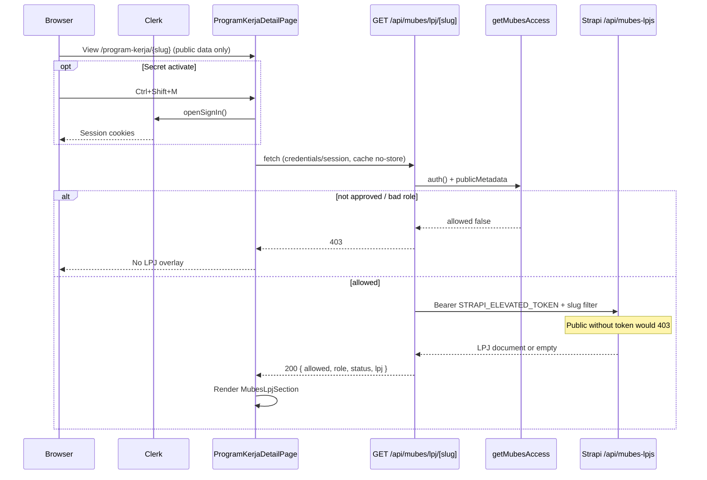
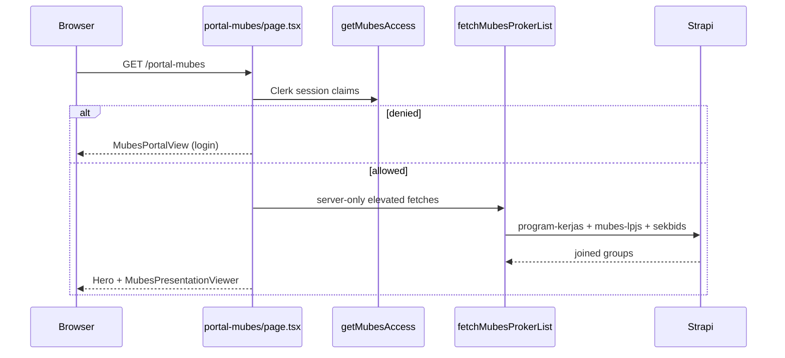
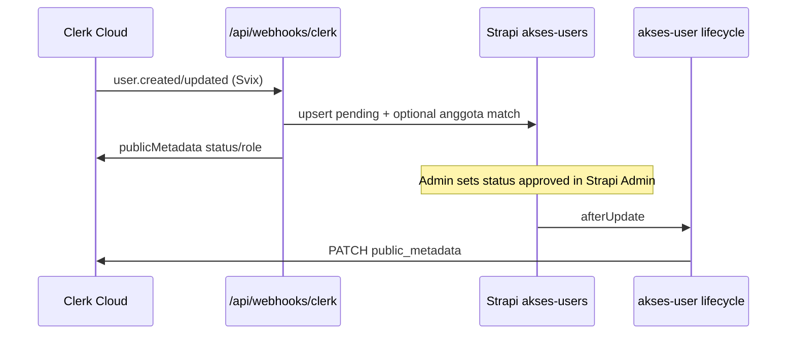

# MUBES Dual-Layer Security & Data Flow Codemap

> **Purpose**: AI-agent map of LIVE Musyawarah Besar (MUBES) isolation — how confidential LPJ / sidang data stays locked on Strapi Public while approved Clerk sessions receive it only via Next.js BFF.  
> **Last updated**: 2026-09-22  
> **Verified against**: `osis-smait-fi` + `strapi-cms` source (not outdated FigJam-only plans).

**Cross-links (read with caveats):**

| Doc | Role | Accuracy note |
| --- | --- | --- |
| [docs/ARCHITECTURE.md](../ARCHITECTURE.md) § MUBES Dual-Layer | High-level Clerk + BFF diagram | Mostly aligned; webhook match is **exact name**, not fuzzy |
| [docs/MUBES_ARCHITECTURE_WALKTHROUGH.md](../MUBES_ARCHITECTURE_WALKTHROUGH.md) | FigJam / design history | **Partially stale**: describes Strapi `POST /api/auth/local`, cookie `mubes_session`, `/mubes/login` — **not in live code** |
| [docs/PRD_MUBES_DUAL_LAYER.md](../PRD_MUBES_DUAL_LAYER.md) | Product requirements | Design intent OK; auth implementation is **Clerk**, not Strapi Users-Permissions JWT for operators |
| [docs/ANALISIS_ARSITEKTUR_MUBES_DAN_SISTEM_OSIS.md](../ANALISIS_ARSITEKTUR_MUBES_DAN_SISTEM_OSIS.md) | Analysis | Same caveat on local Strapi session |
| [docs/codemaps/CODEMAPS.md](./CODEMAPS.md) | Codemap index | Points at `.devin/codemaps/` (may be absent); canonical copies live under `docs/codemaps/` |

---

## 1. Dual-layer isolation (for agents)

MUBES uses **two independent locks**. Both must hold. Breaking either is a security regression.

### Layer A — Strapi Public lockdown (origin lock)

- Content-types under `strapi-cms/src/api/`:
  - `mubes-lpj` → REST plural **`/api/mubes-lpjs`**
  - `mubes-sidang` → REST plural **`/api/mubes-sidangs`**
  - `akses-user` → **`/api/akses-users`**
  - `audit-log` → **`/api/audit-logs`**
  - `login-event` → **`/api/login-events`**
- Controllers/routes are **default core factories** (no custom policy code). Isolation relies on **Users & Permissions**: role `Public` is **not** granted `find` / `findOne` on these APIs.
- Bootstrap (`strapi-cms/src/index.ts` → `setupPublicPermissions`) only enables Public read on a **whitelist** of public CTs (`sekbid`, `program-kerja`, `event`, …). **MUBES CTs are omitted** → unauthenticated Strapi REST calls must return **HTTP 403**.
- Controllers do **not** soft-filter; denial is RBAC at the permission plugin.

**MUST return 403 for Public (no Bearer / no API token):**

| Strapi path | Why confidential |
| --- | --- |
| `GET/POST/PUT/DELETE /api/mubes-lpjs` (+ `/:id`) | Budget realization, internal eval, receipts |
| `GET/POST/PUT/DELETE /api/mubes-sidangs` (+ `/:id`) | Tata tertib, komisi, konsideran |
| `GET/POST/PUT/DELETE /api/akses-users` (+ `/:id`) | Clerk IDs, roles, approval status |
| `GET/POST/PUT/DELETE /api/audit-logs` (+ `/:id`) | Change trail |
| `GET/POST/PUT/DELETE /api/login-events` (+ `/:id`) | Login/presence telemetry store |

Agents **must not** enable Public `find` on any of the above “for convenience.”

### Layer B — Next.js BFF + Clerk claims (delivery lock)

- Browser **never** holds Strapi elevated credentials.
- Sensitive reads go:
  1. Clerk session on Next server (`auth()`), and/or
  2. BFF route that re-checks access, then calls Strapi with server-only token.
- Elevated Strapi calls use env **`STRAPI_ELEVATED_TOKEN`** (name only — never commit values) against **`STRAPI_INTERNAL_URL`** (default `http://127.0.0.1:1337`).

```
┌─────────────────────────────────────────────────────────────────┐
│ Layer A: Strapi Public ──X──► mubes-* / akses-user / audit-*   │
│ Layer B: Browser ──► Next BFF (Clerk) ──Bearer ELEVATED──► Strapi│
└─────────────────────────────────────────────────────────────────┘
```

---

## 2. Auth model (LIVE)

| Concern | LIVE implementation | NOT live (stale docs) |
| --- | --- | --- |
| Identity | **Clerk** (`@clerk/nextjs`) | Strapi `POST /api/auth/local` |
| Session | Clerk session cookies / JWT claims | `mubes_session` HTTP-only cookie |
| Gate helper | `getMubesAccess()` in `osis-smait-fi/src/lib/mubes-access.ts` | Middleware on `/mubes/*` only |
| Role source at request time | **`sessionClaims.publicMetadata`** (`status`, `role`) | Live query to `akses-user` on every LPJ GET |
| Whitelist DB | Strapi `api::akses-user` + Clerk webhook + lifecycle sync | Email-only whitelist inside BFF |
| Operator UI login | `/portal-mubes` forms + Navbar Masuk/Daftar + `Ctrl+Shift+M` → `/portal-mubes` | `/mubes/login`, modal Clerk generik, `MubesLoginModal` + Strapi password |

### `getMubesAccess()` rules (code-exact)

File: `osis-smait-fi/src/lib/mubes-access.ts`

1. `auth()` from `@clerk/nextjs/server` → no `userId` ⇒ `allowed: false`.
2. `publicMetadata.status === 'approved'` required.
3. `publicMetadata.role` must be one of:  
   `admin` | `administrator` | `bph` | `member` | `operator` | `admin_pembina`.
4. Returns `{ allowed, userId, role, status }`.

**Note:** Strapi schema `akses-user.role` enum is only `member` | `operator` | `admin_pembina`. Extra roles (`admin`, `administrator`, `bph`) are accepted by the Next gate if present in Clerk metadata (manual / ops).

### Provisioning path (akses-user ↔ Clerk)

| Step | File | Behavior |
| --- | --- | --- |
| Webhook | `osis-smait-fi/src/app/api/webhooks/clerk/route.ts` | Svix verify (`CLERK_WEBHOOK_SECRET`); on `user.created` / `user.updated`: load `anggota-oses`, **exact** full-name match (not substring), upsert `akses-users` via elevated token, set Clerk `publicMetadata` |
| New users | same | Always **`status: 'pending'`** even if roster matched — manual BPH/presidium approval |
| Admin approve | `strapi-cms/src/api/akses-user/.../lifecycles.ts` `afterUpdate` | PATCH Clerk `public_metadata` with `status` + `role` using `CLERK_SECRET_KEY` |

Env names (secrets never in docs body):  
`CLERK_SECRET_KEY`, `CLERK_WEBHOOK_SECRET`, `STRAPI_ELEVATED_TOKEN`, `STRAPI_INTERNAL_URL`, plus standard Clerk publishable keys on the frontend.

---

## 3. Exact BFF / API routes (Next.js)

### A. LPJ by program-kerja slug (primary dual-layer path)

| | |
| --- | --- |
| **Route** | `GET /api/mubes/lpj/[slug]` |
| **File** | `osis-smait-fi/src/app/api/mubes/lpj/[slug]/route.ts` |
| **Auth** | `getMubesAccess()` — fail ⇒ **403** `{ allowed: false, error: '...' }` |
| **Token** | `process.env.STRAPI_ELEVATED_TOKEN` (missing ⇒ **500**) |
| **Upstream** | `{STRAPI_INTERNAL_URL}/api/mubes-lpjs?filters[$or][0|1][program_kerja][slug][$eq]=...&populate=*` (case variants) |
| **Success body** | `{ allowed: true, role, status, lpj }` — `lpj` is first Strapi row or `null` |
| **Cache** | `cache: 'no-store'` on Strapi fetch |

There is **no** other `/api/mubes/*` route in the tree (no `/api/mubes/login`).

### B. Clerk webhook (identity bridge)

| | |
| --- | --- |
| **Route** | `POST /api/webhooks/clerk` |
| **File** | `osis-smait-fi/src/app/api/webhooks/clerk/route.ts` |
| **Auth** | Svix headers + `CLERK_WEBHOOK_SECRET` |
| **Strapi** | Elevated token → `anggota-oses`, `akses-users` CRUD |

### C. Telemetry (related, not LPJ)

| | |
| --- | --- |
| **Route** | `POST /api/telemetry/record` |
| **File** | `osis-smait-fi/src/app/api/telemetry/record/route.ts` |
| **Strapi** | Elevated POST → `/api/telemetri-kunjungans` (not `login-events`) |
| **Note** | Sets `is_mubes_session: Boolean(userId)` — presence of any signed-in user, not full MUBES approval |

### D. Server-side portal data (not a public BFF URL)

| | |
| --- | --- |
| **Caller** | `portal-mubes/page.tsx` only after `getMubesAccess().allowed` |
| **Helper** | `fetchMubesProkerList` / `fetchMubesProkerData` in `osis-smait-fi/src/lib/mubes-proker.ts` |
| **Strapi** | Elevated headers on `/api/program-kerjas`, **`/api/mubes-lpjs`**, `/api/sekbids` |
| **Risk if misused** | Must never be imported into client components or unguarded RSC pages |

---

## 4. Strapi entities

### `api::mubes-lpj` (`mubes_lpjs`)

- Schema: `strapi-cms/src/api/mubes-lpj/content-types/mubes-lpj/schema.json`
- Relation: **oneToOne** → `api::program-kerja.program-kerja`
- Fields: **`sections`** (repeatable `program-kerja.lpj-section`: `judul`, `isi`, `order`) — body LPJ dinamis; opsional: `realisasi_anggaran`, `sumber_dana`, `evaluasi_internal`, `kendala_solusi`, `nota_kwitansi`, `status_pengesahan`
- `draftAndPublish: true`
- Controller/service/router: default core factories only

### `api::mubes-sidang` (`mubes_sidangs`)

- Schema: `strapi-cms/src/api/mubes-sidang/content-types/mubes-sidang/schema.json`
- Fields: `tahun_periode`, `tata_tertib`, `daftar_komisi` (json), `draft_konsideran`, `status_sidang` (`pra_mubes`|`berlangsung`|`selesai`)
- **No Next.js consumer found** that fetches `/api/mubes-sidangs` yet — still **must stay Public-403**; future portal features should reuse Layer B pattern (new BFF + elevated token), never Public read.

### `api::akses-user` (`akses_users`)

- Bridge Clerk ↔ MUBES RBAC; unique `clerk_user_id`
- Lifecycle syncs approval to Clerk metadata

### `api::audit-log` (`audit_logs`)

- Written by **Document Service Middleware** in `strapi-cms/src/index.ts` `register()` on create/update/delete/publish/unpublish (skips self + `login-event`)
- **Does not** log BFF `GET /api/mubes/lpj/[slug]` access events (old codemap claim was wrong)

### `api::login-event` (`login_events`)

- Schema exists for identifier / clerk_user_id / ip / success / user_agent
- LIVE page telemetry uses **`telemetri-kunjungan`**, not this CT, from the Next telemetry route

---

## 5. Frontend pages & components

| Path / symbol | Role |
| --- | --- |
| `osis-smait-fi/src/app/portal-mubes/page.tsx` | `dynamic = 'force-dynamic'`; gate with `getMubesAccess()`; denied → `MubesPortalView`; allowed → hero + `MubesPresentationViewer` with elevated proker/LPJ groups |
| `osis-smait-fi/src/app/sso-callback/page.tsx` | Clerk OAuth callback → portal signup complete URL |
| `osis-smait-fi/src/app/layout.tsx` | Mounts `MubesSessionBanner` globally |
| `components/mubes/MubesPortalView.tsx` | Medieval login/signup shell |
| `components/mubes/MubesLoginForm.tsx` / `MubesSignUpForm.tsx` | Clerk password + Google OAuth |
| `components/mubes/MubesBphHelpModal.tsx` | Access help / WA BPH |
| `components/mubes/MubesPresentationHero.tsx` | Sidang hero (halaman CMS `portal-mubes`) |
| `components/mubes/MubesPresentationViewer.tsx` | Sekbid/proker presentation + LPJ from server props |
| `components/mubes/MubesSessionBanner.tsx` | Floating session toast (role/status; sign out) |
| `components/program-kerja/ProgramKerjaDetailPage.tsx` | **In-place dual UI**: public proker layout; if signed in, `GET /api/mubes/lpj/{slug}`; `Ctrl+Shift+M` opens Clerk sign-in |
| `components/program-kerja/MubesLpjSection.tsx` | Renders LPJ overlay (anggaran, evaluasi, nota) |
| `components/telemetry/TelemetryTracker.tsx` | Cookie `mubes_device_id` + posts telemetry |
| Nav/Footer | Links to `/portal-mubes` |

**UI design rule:** Public and MUBES operators share the same program-kerja layout; sensitive blocks inject **in-place** (zero layout shift) only when BFF returns `allowed` + `lpj`.

---

## 6. Sequence (browser → Next BFF → Strapi)

### 6.1 In-place LPJ on program-kerja detail



### 6.2 Portal presentation (RSC)



### 6.3 Approval sync



---

## 7. Failure modes

| Symptom | Likely cause | Code locus |
| --- | --- | --- |
| 403 from BFF | No Clerk session, `status !== approved`, or role not in allow-list | `mubes-access.ts`, BFF route |
| 200 allowed but `lpj: null` | No matching LPJ for slug / Strapi empty | BFF filter + CMS content |
| 500 BFF “configuration error” | Missing `STRAPI_ELEVATED_TOKEN` | BFF route |
| Strapi 4xx/5xx proxied | Upstream failure; BFF still may send `allowed: true` with `lpj: null` + error | BFF route |
| Portal shows login forever | Pending approval; metadata not synced after Strapi approve | webhook + lifecycle + Clerk session refresh |
| Public curl gets LPJ | **Critical**: Public permissions wrongly enabled or elevated token leaked to client | Strapi Admin RBAC / env exposure |
| Roster match never approves | By design: match only links `matched_anggota`; status stays pending | webhook `assignedStatus = 'pending'` |
| Google OAuth lands wrong place | Login form `redirectUrlComplete: '/'` vs email path `/portal-mubes` | `MubesLoginForm.tsx` |

---

## 8. Agent do-nots

1. **Do not** call `/api/mubes-lpjs` or `/api/mubes-sidangs` from the browser or with Public role.
2. **Do not** put `STRAPI_ELEVATED_TOKEN` (or any full-access API token) in `NEXT_PUBLIC_*`, client bundles, or markdown samples with real values.
3. **Do not** reintroduce Strapi local JWT / `mubes_session` cookie auth without an explicit architecture change + this codemap rewrite.
4. **Do not** grant Public `find` on MUBES CTs “temporarily” for Postman demos.
5. **Do not** use `fetchMubesProkerList` on unauthenticated pages — it uses elevated token server-side.
6. **Do not** treat `audit-log` as access-log for BFF reads; it tracks Document Service mutations.
7. **Do not** auto-`approved` users on webhook name match (anti-spoofing).
8. **Do not** document env as `STRAPI_API_TOKEN_MUBES` — live name is **`STRAPI_ELEVATED_TOKEN`**.
9. **Do not** assume BFF re-queries `akses-user` per request — it trusts **Clerk `publicMetadata`** after lifecycle/webhook sync.
10. **Do not** enable ISR/static cache on LPJ payloads (`no-store` / `force-dynamic` patterns).

---

## 9. Verification checklist (agents / CI)

```bash
# Layer A: Public must 403 (no Authorization)
curl -s -o /dev/null -w "%{http_code}\n" "$STRAPI_URL/api/mubes-lpjs"
curl -s -o /dev/null -w "%{http_code}\n" "$STRAPI_URL/api/mubes-sidangs"
curl -s -o /dev/null -w "%{http_code}\n" "$STRAPI_URL/api/akses-users"

# Layer B: BFF without session → 403
curl -s -o /dev/null -w "%{http_code}\n" "http://127.0.0.1:3002/api/mubes/lpj/some-slug"

# Schema smoke (repo script)
node scripts/verify-mubes-schemas.js
```

Expected: Strapi Public → **403**; unauthenticated BFF → **403**.

---

## 10. File index (quick jump)

```
osis-smait-fi/
  src/app/api/mubes/lpj/[slug]/route.ts    # BFF LPJ
  src/app/api/webhooks/clerk/route.ts      # Roster + akses-user
  src/app/api/telemetry/record/route.ts    # Telemetry elevated write
  src/app/portal-mubes/page.tsx            # Gated portal RSC
  src/lib/mubes-access.ts                  # Clerk claim gate
  src/lib/mubes-proker.ts                  # Elevated proker+LPJ join
  src/components/mubes/*                   # Portal UI
  src/components/program-kerja/ProgramKerjaDetailPage.tsx
  src/components/program-kerja/MubesLpjSection.tsx

strapi-cms/
  src/api/mubes-lpj/**
  src/api/mubes-sidang/**
  src/api/akses-user/**                    # + lifecycles Clerk sync
  src/api/audit-log/**
  src/api/login-event/**
  src/index.ts                             # Public RBAC bootstrap + audit middleware
```

---

## 11. Corrected claims vs previous codemap

| Old claim | Verdict |
| --- | --- |
| Token `STRAPI_API_TOKEN_MUBES` | **False** → `STRAPI_ELEVATED_TOKEN` |
| BFF checks Strapi `akses-user` each LPJ request | **False** → Clerk `publicMetadata` only |
| Fuzzy name match on webhook | **False** → exact normalized full name |
| Audit-log records each LPJ BFF access | **False** → Document CUD middleware only |
| Strapi local login + `mubes_session` | **Obsolete design** |
| Live path `/api/mubes/login` | **Does not exist** |
