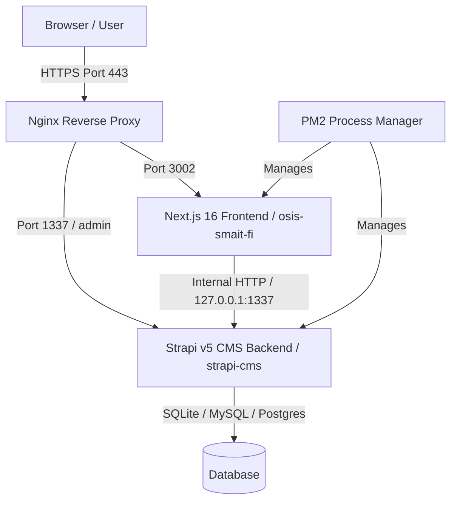

# 📊 Analisis Komprehensif Proyek Agora Acta (Website OSIS SMAIT FI & Strapi CMS)

Dokumen ini berisi analisis arsitektur, frontend, backend Strapi CMS, serta skema deployment infrastruktur untuk ekosistem **Agora Acta (OSIS SMAIT Fithrah Insani)**.

---

## 🏛️ 1. Ikhtisar Arsitektur Sistem

Ekosistem proyek dibangun menggunakan pola **Headless CMS + Jamstack / SSR-ISR Dynamic Web**:

### Komponen Utama:
1. **Frontend (`osis-smait-fi`)**:
   - **Framework**: Next.js 16 (App Router, React 19, TypeScript).
   - **Styling & Animasi**: Tailwind CSS v4, Framer Motion, GSAP, Lenis Smooth Scroll, Lucide Icons.
   - **Fitur Khusus**: PWA, Live Preview / Draft Mode, Image Auto Compression API, SSE (Server-Sent Events) Notifications.

2. **Backend CMS (`strapi-cms`)**:
   - **Framework**: Strapi v5 (Headless CMS, Node.js >= 20).
   - **Plugins**: `@strapi-community/plugin-better-auth`, `strapi-plugin-bulk-editor`, `strapi-plugin-schema-visualizer`.
   - **Database**: Flexible multi-driver (SQLite / Postgres / MySQL).

---

## 💻 2. Analisis Frontend (`osis-smait-fi`)

### Strategi Rendering & Performance:
- **ISR (Incremental Static Regeneration)**: Digunakan pada Beranda (`/`) dengan revalidasi 60 detik (`next: { revalidate: 60 }`) untuk caching maksimal.
- **Dynamic SSR (`force-dynamic`)**: Digunakan pada Rute Anggota (`/anggota`) untuk memastikan ketersediaan data kepengurusan ter-update real-time.
- **Sanitasi Media**: Seluruh konsumsi media dari Strapi menggunakan helper `getStrapiMediaUrl()` di [`osis-smait-fi/src/lib/strapi.ts`](osis-smait-fi/src/lib/strapi.ts:6) untuk auto-switch antara URL lokal dan CDN/Produksi (`https://osisstrapi.biezz.my.id`).
- **In-Memory Server Deduplication**: Layer abstraksi `fetchStrapiAPI` menangani *in-flight deduplication* dan *short-term memory caching* di server (30s-60s) untuk mencegah thundering herd problem.

---

## ⚙️ 3. Analisis Backend Strapi CMS (`strapi-cms`)

### Struktur Data & Fitur CMS:
- **Format Data Strapi v5**: Menerapkan pertahanan *compatibility layer* (`item.attributes || item`) untuk menangani payload flat Strapi v5 vs v4.
- **Content Types Utama**:
  - `sekbids`: Data Seksi Bidang 1-8.
  - `program-kerjas`: Detail Proker, penanggung jawab, galeri, dan banner.
  - `anggota-oses`: Data struktur organisasi & anggota.
  - `events`: Agenda kegiatan dengan fallback sorting (`tanggal_mulai` & `createdAt`).
  - `media-assets` & `galeri-fotos`: Asset perpustakaan media & galeri visual.
  - `bg-texture-config`: Konfigurasi global tekstur latar belakang dinamis.

---

## 🚀 4. Analisis Deployment & Operasional

### Konfigurasi Process Manager (`ecosystem.config.js`):
- **Frontend App**: `osis-next-frontend` pada port **3002** (`npm run start:solo`).
- **Backend App**: `osis-strapi-backend` pada port **1337** (`npm run start`).

### Keamanan & Best Practices:
- Fallback internal fetch via `127.0.0.1:1337` (`STRAPI_INTERNAL_URL`) meminimalkan latency network loopback internal.
- Draft Mode & Preview listener terintegrasi cookie bypass Next.js (`__prerender_bypass`).

---

## 📝 5. Rekomendasi Pengembang (Actionable Tasks)

1. Implementasi halaman error boundary `error.tsx` per rute untuk fallback UI saat Strapi offline.
2. Refaktorisasi komponen besar seperti `AnggotaList.tsx` ke dalam sub-komponen terisolasi.
3. Evaluasi pemakaian `force-dynamic` di halaman `/anggota` ke ISR 60s untuk efisiensi server load.
