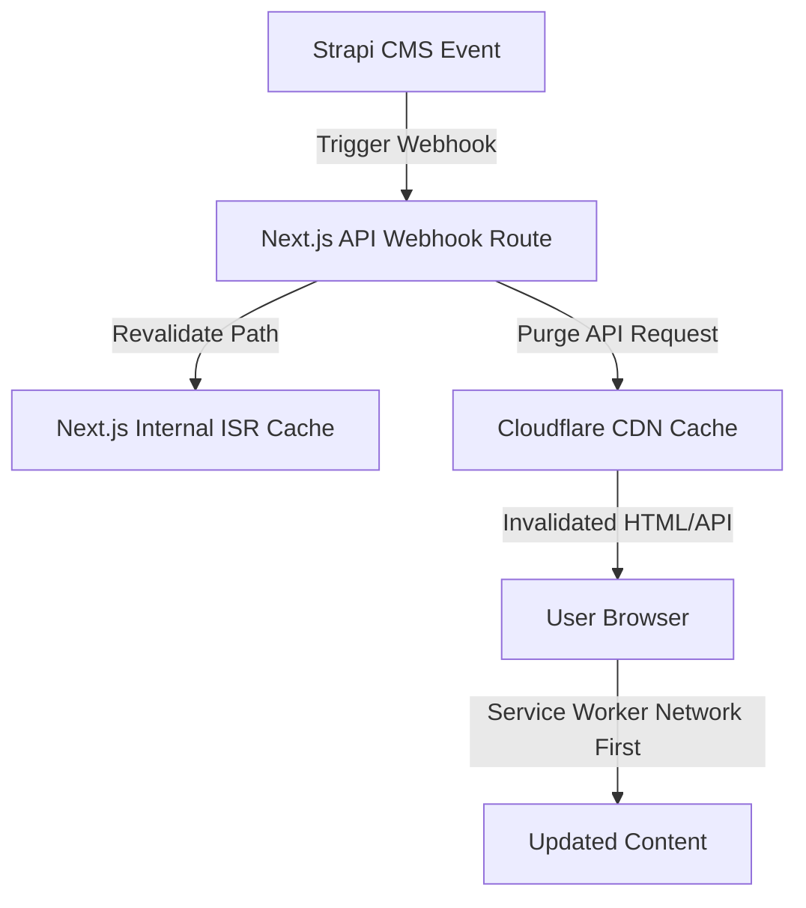

# Rencana Implementasi Optimasi Cache & Auto-Invalidation

## Overview
Optimasi sinkronisasi cache antara Strapi CMS, Next.js App Router, Cloudflare CDN, dan Browser Service Worker.

## Architecture & Data Flow

## Detailed Steps

1. **Revalidation Route Handler**
   - File: [`osis-smait-fi/src/app/api/revalidate/route.ts`](osis-smait-fi/src/app/api/revalidate/route.ts)
   - Fungsi: Menangani revalidasi via Next.js `revalidatePath`.
   - Autentikasi: Validasi query param `secret` terhadap `process.env.REVALIDATE_SECRET`.

2. **Strapi Webhook & Cloudflare Purge Handler**
   - File: [`osis-smait-fi/src/app/api/strapi-webhook/route.ts`](osis-smait-fi/src/app/api/strapi-webhook/route.ts)
   - Fungsi: Menerima event Strapi (`entry.create`, `entry.update`, `entry.publish`, dll.), memetakan content type ke URL path, melakukan `revalidatePath`, dan memanggil Cloudflare Purge Cache API (`https://api.cloudflare.com/client/v4/zones/{ZONE_ID}/purge_cache`).

3. **Cache-Control Header Middleware**
   - File: [`osis-smait-fi/src/middleware.ts`](osis-smait-fi/src/middleware.ts)
   - Fungsi: Menyetel header `Cache-Control` & `CDN-Cache-Control`:
     - Static assets (`/_next/static/`): `public, max-age=31536000, immutable`
     - API routes (`/api/`): `no-store, max-age=0`
     - HTML pages: `public, s-maxage=10, stale-while-revalidate=60`

4. **Service Worker Update**
   - File: [`osis-smait-fi/public/sw.js`](osis-smait-fi/public/sw.js)
   - Fungsi:
     - Static assets: Cache-first dengan network fallback.
     - API & Strapi content: Network-first dengan cache fallback.
     - Dynamic pages: Stale-while-revalidate.

5. **Environment Setup**
   - Environment variables: `REVALIDATE_SECRET`, `CF_ZONE_ID`, `CF_API_TOKEN`.
