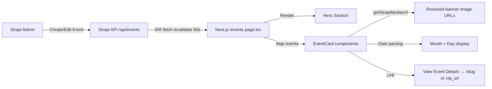

# PRD: Halaman Events — OSIS SMAIT Fithrah Insani

## 1. Ringkasan

Membuat halaman `/events` yang menampilkan daftar semua event OSIS, dikelola melalui Strapi CMS. Halaman ini menggunakan desain dari mockup Figma yang diberikan pengguna. Link "EVENTS" ditambahkan ke Navbar (desktop & mobile).

---

## 2. Kondisi Saat Ini (Existing State)

### Strapi CMS — Content Type `event` sudah ada
Schema di [`strapi-cms/src/api/event/content-types/event/schema.json`](strapi-cms/src/api/event/content-types/event/schema.json:1):
- `nama` (string, required) — judul event
- `slug` (uid, required) — auto-generated dari nama
- `tanggal` (datetime) — tanggal tunggal
- `tanggal_mulai` / `tanggal_selesai` (datetime) — range tanggal
- `lokasi` (string)
- `deskripsi` (richtext)
- `banner` (media, single) — gambar utama
- `highlights` (media, multiple) — galeri foto
- `kategori` (enum: internal / eksternal)
- `status` (enum: draft / published / archived)
- `tema`, `tagline`, `ringkasan`, `sub_judul` (string/text)
- `cta_url`, `youtube_url` (string)
- Relasi: `artikel_madings` (oneToMany)

### Frontend — Sudah ada komponen terkait
- [`osis-smait-fi/src/components/home/LatestEvent.tsx`](osis-smait-fi/src/components/home/LatestEvent.tsx:1) — menampilkan 1 event terbaru di homepage
- [`fetchEventsFromStrapi()`](osis-smait-fi/src/lib/strapi.ts:299) — sudah ada helper fetch events

### Navbar — Tidak ada link Events
[`simpleNavItems`](osis-smait-fi/src/components/Navbar.tsx:31) saat ini: HOME, ABOUT, MEDIA SOSIAL, ANGGOTA. Perlu ditambahkan EVENTS.

---

## 3. Desain UI (Dari Mockup)

### Layout Halaman `/events`

```
┌──────────────────────────────────────────────────┐
│                 HERO SECTION                      │
│  Background: gelap semi-transparan (#0F0F0F CC)   │
│  Judul: "EVENTS" (font serif besar, letter-spacing│
│  Deskripsi: teks putih di bawah judul             │
│  Tinggi: ~504px                                   │
└──────────────────────────────────────────────────┘

┌──────────────────────────────────────────────────┐
│  Background: #FFF7D9 (krem/kuning muda)           │
│                                                    │
│  Label: "UPCOMING EVENT"                          │
│                                                    │
│  ┌─ Event Card ────────────────────────────────┐  │
│  │                                              │  │
│  │  [BULAN]     [GAMBAR EVENT]    ┌──────────┐ │  │
│  │  [TANGGAL]                     │ Judul    │ │  │
│  │   (besar)                      │ Deskripsi│ │  │
│  │                                │ Ringkasan│ │  │
│  │                                └──────────┘ │  │
│  │                       View Event Details →   │  │
│  └──────────────────────────────────────────────┘  │
│                                                    │
│  (Repeat per event...)                             │
│                                                    │
└──────────────────────────────────────────────────┘
```

### Anatomi Satu Event Card
- **Kiri**: Bulan (3 huruf, misal "JUN") + Tanggal (angka besar, misal "23")
- **Tengah**: Gambar banner event (rounded, ~454x340)
- **Kanan**: Card info dengan border rounded-[40px], outline `#E1DDCC`:
  - Judul event (font bold, 32px, Plus Jakarta Sans)
  - Deskripsi singkat (14px, bold)
  - Ringkasan/detail (14px, regular Poppins)
- **Bawah kanan**: "View Event Details" link + arrow icon

### Warna & Tipografi
- Page background: `#FFF7D9`
- Hero overlay: `rgba(15, 15, 15, 0.80)`
- Judul hero: font serif (Plantagenet Cherokee → fallback Playfair Display), 90px, letter-spacing 36px
- Deskripsi hero: font Playpen Sans / fallback ke system sans
- Card text: `#5B5B5B` untuk judul, `#797979` untuk body
- Card outline: `#E1DDCC`, border-radius 40px
- Label "UPCOMING EVENT": `#5F5C4F`, Plus Jakarta Sans, bold, letter-spacing 2.64px

---

## 4. Scope Implementasi

### 4.1 Strapi CMS (Tidak perlu perubahan schema)
Content type `event` sudah lengkap. Tidak ada field baru yang dibutuhkan oleh desain ini. Cukup pastikan data sudah terisi dan permission API `find` terbuka untuk public.

### 4.2 Frontend — File Baru & Modifikasi

#### File Baru:
1. **`osis-smait-fi/src/app/events/page.tsx`** — Halaman utama `/events`
   - ISR revalidate 60s (konsisten dengan strategi beranda)
   - Server component, fetch semua events dari Strapi
   - Render Hero + daftar Event Cards

2. **`osis-smait-fi/src/components/events/EventCard.tsx`** — Komponen card per event
   - Props: nama, tanggal, banner, deskripsi, ringkasan, slug
   - Layout 3 kolom: tanggal | gambar | info card
   - Responsive: stack vertikal di mobile

#### File Dimodifikasi:
3. **[`osis-smait-fi/src/components/Navbar.tsx`](osis-smait-fi/src/components/Navbar.tsx:31)** — Tambahkan `EVENTS` ke `simpleNavItems`
   ```ts
   { name: 'EVENTS', path: '/events' },
   ```

4. **[`osis-smait-fi/src/lib/strapi.ts`](osis-smait-fi/src/lib/strapi.ts:299)** — Tambah helper `fetchAllEventsForPage()` yang fetch semua events (bukan limit 5) dengan field yang sesuai kebutuhan halaman events

---

## 5. Data Flow



---

## 6. Pertanyaan Sebelum Implementasi

1. **Halaman Detail Event**: Desain mockup hanya menampilkan listing. Apakah "View Event Details" mengarah ke halaman detail `/events/[slug]` baru, atau cukup ke `cta_url` yang sudah ada di Strapi?

2. **Filter/Kategori**: Apakah perlu ada filter berdasarkan `kategori` (internal/eksternal) atau `status`?

3. **Dark Mode**: Halaman ini menggunakan background `#FFF7D9` (krem). Apakah perlu dukungan dark mode, atau tetap light-only untuk halaman ini?

4. **Pagination**: Jika event sangat banyak, apakah perlu pagination atau infinite scroll, atau cukup tampilkan semua?

---

## 7. Implementation Plan (Todo List)

1. Pastikan Strapi API permission `find` untuk `event` terbuka untuk public role
2. Tambah helper `fetchAllEventsForPage()` di [`strapi.ts`](osis-smait-fi/src/lib/strapi.ts)
3. Buat komponen `EventCard.tsx` sesuai desain mockup (responsive)
4. Buat halaman `osis-smait-fi/src/app/events/page.tsx` dengan Hero + listing
5. Tambahkan item `EVENTS` di [`simpleNavItems`](osis-smait-fi/src/components/Navbar.tsx:31) di Navbar
6. Tambahkan dark mode support di [`globals.css`](osis-smait-fi/src/app/globals.css) untuk warna krem (#FFF7D9)
7. Test end-to-end: navigasi, rendering data dari Strapi, responsive mobile
