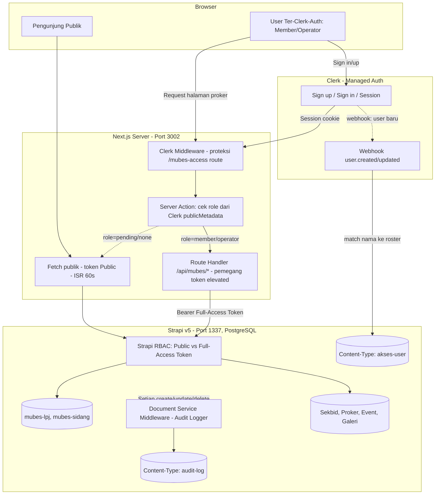
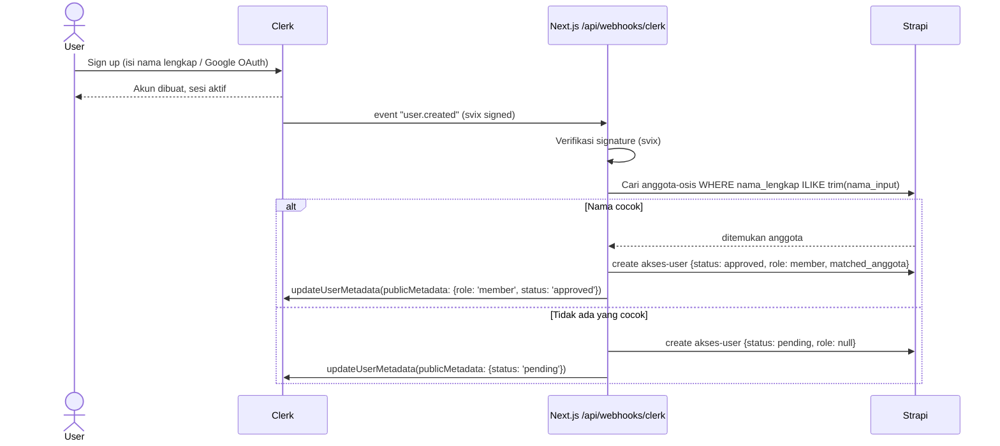

# Rencana Implementasi: Sistem Dual-Layer Mubes OSIS (v2 — Clerk + PostgreSQL)

**Project:** `osis-smait-fi` (Next.js 16) + `strapi-cms` (Strapi v5)
**Status:** Revisi final pasca-keputusan biezz — dokumen ini menggantikan bagian auth/database/audit di PRD sebelumnya.
**Untuk:** AI coding agent yang akan mengerjakan implementasi. Semua keputusan produk sudah dikunci — agent tidak perlu bertanya ulang soal pilihan tech stack, hanya perlu klarifikasi di bagian §12 jika ada ambiguitas saat coding.

---

## 0. Ringkasan Keputusan (Decision Log)

| # | Topik | Keputusan Final |
|---|---|---|
| 1 | Autentikasi | **Clerk** menggantikan custom JWT+cookie Strapi. Allowlist berbasis pencocokan nama lengkap ke roster anggota. |
| 2 | Identifier login | Username, nama lengkap, atau Google OAuth — semua diaktifkan via Clerk. |
| 3 | Model akun | Satu akun per orang (tidak ada akun bersama). |
| 4 | Database | Migrasi SQLite → **PostgreSQL** (dilakukan di awal, sebelum fitur Mubes dibangun). |
| 5 | Scope | Tetap fokus OSIS + Mubes. Modul SIS/SPP sekolah **tidak** masuk. |
| 6 | Aktivasi mode akses | Shortcut `Ctrl+Shift+M` **dan** rute langsung (dua-duanya jalan bersamaan). |
| 7 | Tampilan LPJ | Satu mekanisme saja: in-place overlay di halaman `program-kerja/[slug]` masing-masing. Tidak ada rute `/mubes/sidang` terpisah untuk LPJ. |
| 8 | Storage media | Tetap di VPS lokal (`/uploads` Strapi) untuk saat ini, tidak ada budget cloud storage. |
| 9 | Sesi & rate limit | **Persisten** di database (bukan in-memory) — dipakai juga untuk analitik pengguna ke depannya, dan supaya user tidak perlu login berulang. |
| 10 | Audit trail | **Wajib**, mencakup semua content type, mencatat siapa mengubah apa, dilakukan lewat Strapi (karena editor bukan cuma biezz). |

---

## 1. Peringatan Kritis Sebelum Mulai

Tiga hal di bawah ini **mengubah cara implementasi**, bukan cuma detail — agent wajib baca ini dulu sebelum coding:

### 1.1 Clerk "Allowlist" bawaan itu fitur berbayar untuk production
Fitur *Allowlist* resmi di Clerk Dashboard (Restrictions → Allowlist) **hanya gratis di mode development**; untuk production butuh paid plan. Karena tidak ada budget tambahan, **jangan pakai fitur Allowlist bawaan Clerk**.

**Solusi**: set Access Mode Clerk ke **"Open"** (gratis, tanpa batas), lalu bangun gating akses sendiri di level aplikasi — persis seperti yang sebenarnya sudah biezz maksud di keputusan #1 (cocokkan nama lengkap ke roster). Detail lengkap ada di §4.

### 1.2 Strapi "Audit Logs" dan "Content History" bawaan juga fitur berbayar
Audit Logs (Enterprise) dan Content History (Growth/Enterprise) **tidak tersedia di Community Edition** yang dipakai sekarang. Karena biezz mewajibkan audit trail gratis dan mencakup semua content type, **kita bangun sendiri** pakai Document Service Middleware Strapi v5 (built-in di Community Edition, gratis) yang menulis ke content-type `audit-log` custom. Detail di §5.

### 1.3 Pencocokan nama lengkap itu rawan gagal-cocok (fragile)
Nama bisa beda kapitalisasi, spasi ganda, gelar, nama panggilan vs nama lengkap di KTP, dsb. **Jangan buat sistem yang diam-diam menolak akses kalau nama tidak 100% cocok.** Desain di §4 memakai status `pending` + halaman review manual, bukan block otomatis — supaya anggota yang namanya sedikit beda tetap bisa diloloskan manual oleh biezz/BPH tanpa mereka perlu daftar ulang.

---

## 2. Arsitektur Baru (Revised)

Pola yang dipakai: **Backend-for-Frontend (BFF)**. Browser tidak pernah bicara langsung ke Strapi untuk data Mubes — semua lewat Next.js server, yang jadi satu-satunya pihak yang tahu:
- Siapa yang login (via Clerk session, server-side)
- Apa role-nya (member / operator / pending / ditolak)
- Token Strapi mana yang boleh dipakai untuk fetch data itu

Strapi sendiri **tidak perlu tahu soal Clerk sama sekali** — dia cukup punya dua token API: satu untuk data publik (role Public, sudah ada), satu token khusus ("Full Access" / custom role) yang **hanya pernah dipegang oleh server Next.js**, tidak pernah dikirim ke browser.



**Kenapa pola ini lebih baik dari draf lama:**
- Tidak perlu bikin custom policy Strapi untuk verifikasi JWT Clerk (Clerk dan Strapi tidak perlu saling kenal).
- Token elevated Strapi tidak pernah menyentuh browser sama sekali → permukaan serangan jauh lebih kecil dibanding cookie httpOnly buatan sendiri.
- Rate limiting, session, dan "siapa login" semuanya sudah ditangani Clerk (infrastruktur mereka), bukan kode buatan sendiri yang rawan bug.

---

## 3. Model Data & Skema

### 3.1 Content-Type baru: `akses-user` (jembatan Clerk ↔ role)
```
Collection Type: akses-user
- clerk_user_id      : String, unique, required   (dari Clerk, format "user_xxxxx")
- nama_lengkap_input : String, required            (nama yang diinput/didapat saat signup)
- email              : String
- role               : Enumeration ['member', 'operator', 'admin_pembina']
- status             : Enumeration ['pending', 'approved', 'ditolak'], default: 'pending'
- matched_anggota    : Relation (One-to-One) -> anggota-osis (nullable, diisi kalau nama cocok otomatis)
- catatan_review     : Text (nullable, diisi BPH kalau approve manual)
- approved_by        : String (nullable, nama/username admin yang approve)
- createdAt / updatedAt : bawaan Strapi
```

### 3.2 Content-Type baru: `audit-log` (custom, gratis, gantinya Strapi Enterprise Audit Log)
```
Collection Type: audit-log
- content_type   : String   (mis. "api::mubes-lpj.mubes-lpj")
- document_id    : String
- action         : Enumeration ['create', 'update', 'delete', 'publish', 'unpublish']
- actor_id       : String   (Strapi admin user id ATAU clerk_user_id kalau dari sisi Next.js)
- actor_name     : String
- before_data    : JSON (nullable)
- after_data     : JSON (nullable)
- created_at     : Datetime, default now
```
Field `before_data`/`after_data` disimpan sebagai JSON mentah (bukan diff string) supaya sederhana dan tetap bisa dianalisis/dibandingkan belakangan. Diterapkan **global**, bukan cuma untuk `mubes-lpj`/`mubes-sidang` — juga untuk `program-kerja`, `sekbid`, `event`, dll, sesuai permintaan biezz ("berlaku untuk semua halaman").

### 3.3 Content-Type baru: `login-event` (persistent rate limit + analitik)
```
Collection Type: login-event
- identifier   : String (email/username yang dipakai coba login)
- clerk_user_id: String (nullable, kalau berhasil)
- ip_address   : String
- success      : Boolean
- user_agent   : String
- created_at   : Datetime, default now
```
Dipakai untuk: (a) rate limiting berbasis query count dalam window waktu tertentu, (b) data mentah kalau nanti mau dianalisis pola akses.

> Catatan: sebagian besar kebutuhan "sesi persisten supaya user tidak perlu login ulang" **sudah otomatis ditangani Clerk** (mereka simpan refresh token, session panjang secara default). `login-event` di atas murni untuk rate-limit + analitik tambahan, bukan pengganti session Clerk.

### 3.4 Content-Type existing yang perlu disesuaikan
- `program-kerja`: tidak berubah strukturnya, hanya relasinya ke `mubes-lpj` (1:1) tetap seperti draf lama.
- `mubes-lpj`, `mubes-sidang`: skema field tetap seperti draf lama (lihat dokumen asli), **kecuali** RBAC-nya sekarang dikunci ke role custom `Full-Access-Server` (dipegang token, bukan role `Authenticated` biasa) — role Public tetap 403.
- `anggota-osis` (kalau belum ada, buat baru): perlu ada supaya proses pencocokan nama di §4 punya sumber data.
  ```
  - nama_lengkap : String, required
  - kategori     : Enumeration ['Anggota OSIS', 'MPK', 'Emisioner/Alumni']
  - angkatan     : String (nullable)
  - status_aktif : Boolean, default true
  ```

---

## 4. Alur Autentikasi & Otorisasi Lengkap

### 4.1 Setup Clerk
1. Buat aplikasi Clerk baru, set **Access Mode = Open** (bukan Allowlist/Invite-only, biar gratis).
2. Di **User & Authentication → Personal Information**: aktifkan & **wajibkan** field First Name + Last Name (dipakai sebagai "nama lengkap" untuk matching).
3. Aktifkan strategi login: Username, Email, **Google OAuth**.
4. (Opsional tapi disarankan) Aktifkan **Bot protection**/CAPTCHA bawaan Clerk untuk sign-up — ini gratis dan menggantikan kebutuhan rate-limiting custom yang rumit.

### 4.2 Flow saat user baru sign up


### 4.3 Halaman review manual untuk BPH/admin
- Karena `akses-user` cuma content-type Strapi biasa, admin (biezz/pembina) **bisa langsung approve/reject lewat Strapi Content Manager** tanpa butuh UI custom di awal — cukup ubah field `status` jadi `approved` dan pilih `role` (`operator` untuk BPH/presidium yang ditambah manual, `member` untuk MPK/emisioner yang di-approve manual).
- Setiap kali `akses-user` di-update lewat Strapi, sebuah **lifecycle hook** (`afterUpdate`) otomatis memanggil Clerk Backend API untuk sync ulang `publicMetadata` user terkait — jadi begitu admin approve di Strapi, user itu langsung dapat akses tanpa perlu logout/login ulang (Next.js baca ulang metadata di request berikutnya).

### 4.4 Cek akses di Next.js
```ts
// src/lib/mubes-access.ts
import { auth } from '@clerk/nextjs/server';

export async function getMubesAccess() {
  const { userId, sessionClaims } = await auth();
  if (!userId) return { allowed: false, role: null };

  const status = sessionClaims?.publicMetadata?.status as string | undefined;
  const role = sessionClaims?.publicMetadata?.role as string | undefined;

  if (status === 'approved' && (role === 'member' || role === 'operator' || role === 'admin_pembina')) {
    return { allowed: true, role };
  }
  return { allowed: false, role: null };
}
```
Dipakai di server component/route handler manapun yang butuh tahu apakah user boleh lihat overlay Mubes.

### 4.5 Aktivasi: shortcut + rute (dua-duanya, sesuai keputusan #6)
- **Shortcut** `Ctrl+Shift+M`: listener client-side ringan (`useEffect` + `window.addEventListener('keydown', ...)`) yang memanggil `openSignIn()` dari `useClerk()` — membuka modal sign-in Clerk bawaan, tanpa perlu bikin modal custom sendiri.
- **Rute langsung**: halaman `/portal-mubes` (nama tidak terlalu jelas dari luar, tapi tidak disembunyikan-sembunyikan sungguhan — ini bukan lapisan keamanan, cuma jalur akses) yang me-render `<SignIn/>` Clerk secara embedded. Berguna untuk device yang shortcut-nya tidak jalan (mobile, keyboard non-standar) atau user yang lupa kombinasi tombol.
- Middleware Next.js (`clerkMiddleware()` di `src/middleware.ts`) cukup memastikan halaman `/portal-mubes` publicly accessible (untuk sign-in), sedangkan proteksi *data* Mubes terjadi di level route handler (§4.4), bukan di level rute halaman — karena halaman proker publik ID-nya sama untuk semua orang (sesuai prinsip UI identik), yang beda cuma datanya.

---

## 5. Sistem Audit Trail Custom

### 5.1 Kenapa custom, bukan plugin/fitur bawaan
Sudah dijelaskan di §1.2 — Audit Logs & Content History Strapi adalah fitur berbayar (Growth/Enterprise). Community Edition **tidak** menyediakan ini secara gratis.

### 5.2 Implementasi: Document Service Middleware (global, gratis, tersedia di CE)
```ts
// strapi-cms/src/index.ts
export default {
  register({ strapi }: { strapi: any }) {
    strapi.documents.use(async (context: any, next: any) => {
      const { action, uid, params } = context;
      const trackedActions = ['create', 'update', 'delete', 'publish', 'unpublish'];

      if (!trackedActions.includes(action) || uid === 'api::audit-log.audit-log') {
        return next();
      }

      let beforeData = null;
      if (['update', 'delete', 'publish', 'unpublish'].includes(action) && params?.documentId) {
        beforeData = await strapi.documents(uid).findOne({ documentId: params.documentId }).catch(() => null);
      }

      const result = await next();

      const actor = context.state?.user; // diisi Strapi kalau request lewat Admin Panel
      await strapi.documents('api::audit-log.audit-log').create({
        data: {
          content_type: uid,
          document_id: params?.documentId || result?.documentId || 'unknown',
          action,
          actor_id: actor?.id?.toString() || 'system',
          actor_name: actor ? `${actor.firstname} ${actor.lastname}` : 'system',
          before_data: beforeData,
          after_data: result,
          created_at: new Date(),
        },
      });

      return result;
    });
  },
};
```
Middleware ini berjalan di level **Document Service**, artinya otomatis mencakup semua content-type (sesuai permintaan "berlaku untuk semua halaman") tanpa perlu ditulis ulang per content-type. Cukup exclude `audit-log` itu sendiri supaya tidak infinite loop.

### 5.3 Menampilkan histori
Untuk versi awal, cukup lihat lewat Strapi Content Manager (`audit-log` sebagai collection biasa, bisa difilter by `content_type`/`document_id`). Kalau nanti butuh tampilan lebih enak dibaca (diff visual), bisa dibuat halaman admin custom di Next.js belakangan — **tidak masuk scope wajib sekarang**, cukup dicatat sebagai item "Could Have".

---

## 6. Rencana Migrasi Database: SQLite → PostgreSQL

Lakukan ini **di awal**, sebelum content-type baru (`akses-user`, `audit-log`, `login-event`) dibuat — supaya tidak perlu migrasi dua kali.

1. **Provision PostgreSQL** di VPS yang sama (via `apt install postgresql` atau container Docker terpisah), buat database `strapi_osis` + user dedicated dengan password kuat.
2. **Backup dulu**: jalankan `strapi export --no-encrypt -f backup-sebelum-migrasi` di direktori `strapi-cms` (Strapi CLI export ini format-agnostic, jadi valid dipakai untuk pindah SQLite → Postgres, tidak seperti dump SQL biasa).
3. Update `strapi-cms/config/database.ts`:
   ```ts
   export default ({ env }) => ({
     connection: {
       client: 'postgres',
       connection: {
         host: env('DATABASE_HOST', '127.0.0.1'),
         port: env.int('DATABASE_PORT', 5432),
         database: env('DATABASE_NAME', 'strapi_osis'),
         user: env('DATABASE_USERNAME', 'strapi'),
         password: env('DATABASE_PASSWORD'),
         ssl: env.bool('DATABASE_SSL', false),
       },
     },
   });
   ```
4. Install driver: `npm install pg` di `strapi-cms`.
5. Jalankan Strapi sekali di environment baru supaya skema tabel Postgres ter-generate otomatis (`npm run develop`), lalu **stop**.
6. **Import**: `strapi import -f backup-sebelum-migrasi.tar.gz.enc` (atau `--no-encrypt` sesuai flag export) ke instance yang sekarang sudah nyambung ke Postgres.
7. Verifikasi jumlah entri tiap content-type sama dengan sebelum migrasi (spot check beberapa `program-kerja` dan cek relasi `sekbid` masih nyambung).
8. Simpan file SQLite lama (`*.db`) sebagai backup off-site, jangan langsung dihapus.
9. Update PM2 env var, restart service Strapi.

Estimasi waktu: untuk data sekolah OSIS skala ini (bukan ribuan record), proses ini biasanya bisa selesai dalam hitungan jam kerja, bukan hari — sesuai syarat biezz "kalau tidak terlalu lama".

---

## 7. Milestone & Urutan Pengerjaan

| Milestone | Isi | Kenapa urutannya begini |
|---|---|---|
| **M0** | Migrasi database SQLite → PostgreSQL (§6) | Semua content-type baru di bawah ini sebaiknya langsung dibuat di atas Postgres, bukan SQLite lalu migrasi lagi. |
| **M1** | Setup project Clerk + integrasi dasar Next.js (`ClerkProvider`, `clerkMiddleware`, halaman `/portal-mubes`) | Fondasi auth harus ada sebelum bangun role/access logic. |
| **M2** | Content-type `anggota-osis` (kalau belum ada) diisi rosternya, content-type `akses-user`, webhook `user.created`, lifecycle hook sync balik ke Clerk | Ini "jantung" sistem allowlist gratis pengganti fitur berbayar Clerk. |
| **M3** | Content-type `mubes-lpj`, `mubes-sidang` + RBAC lock (role Public = 403, token elevated khusus server) | Data inti Mubes. |
| **M4** | Content-type `audit-log` + Document Service Middleware global (§5) | Pasang sebelum banyak orang mulai edit data, supaya histori dari awal tercatat. |
| **M5** | Content-type `login-event` + rate limiting persisten sederhana di route handler webhook/sign-in | Nice-to-have tapi murah untuk dipasang sekalian saat M2. |
| **M6** | BFF route handler Next.js (`/api/mubes/lpj/[slug]`, dst) yang cek role via `getMubesAccess()` lalu fetch Strapi pakai token elevated | Menyambungkan auth ke data. |
| **M7** | In-place UI: `ProgramKerjaDetailPage.tsx` render overlay LPJ kondisional, shortcut `Ctrl+Shift+M` + halaman `/portal-mubes` | Bagian yang kelihatan user. |
| **M8** | Testing & audit: penetrasi endpoint tanpa token, cek 403, cek audit-log tercatat benar, cek zero layout shift | Sebelum go-live, terutama sebelum tanggal sidang Mubes sungguhan. |

---

## 8. Walkthrough Detail per Langkah (untuk AI agent)

### Langkah 1 — Migrasi DB (M0)
File yang disentuh: `strapi-cms/config/database.ts`, `strapi-cms/.env`, `strapi-cms/package.json` (tambah `pg`).
Lihat §6 untuk perintah lengkap.

### Langkah 2 — Setup Clerk di Next.js (M1)
```bash
npm install @clerk/nextjs
```
```tsx
// src/app/layout.tsx
import { ClerkProvider } from '@clerk/nextjs';

export default function RootLayout({ children }: { children: React.ReactNode }) {
  return (
    <ClerkProvider>
      <html lang="id"><body>{children}</body></html>
    </ClerkProvider>
  );
}
```
```ts
// src/middleware.ts
import { clerkMiddleware } from '@clerk/nextjs/server';
export default clerkMiddleware();
export const config = { matcher: ['/((?!_next|.*\\..*).*)', '/(api|trpc)(.*)'] };
```
Buat halaman `src/app/portal-mubes/page.tsx` yang render `<SignIn routing="hash" />` dari `@clerk/nextjs`.

### Langkah 3 — Webhook & role sync (M2)
```bash
npm install svix
```
```ts
// src/app/api/webhooks/clerk/route.ts
import { Webhook } from 'svix';
import { headers } from 'next/headers';

export async function POST(req: Request) {
  const payload = await req.text();
  const headerList = await headers();
  const wh = new Webhook(process.env.CLERK_WEBHOOK_SECRET!);
  let event: any;
  try {
    event = wh.verify(payload, {
      'svix-id': headerList.get('svix-id')!,
      'svix-timestamp': headerList.get('svix-timestamp')!,
      'svix-signature': headerList.get('svix-signature')!,
    });
  } catch {
    return new Response('Invalid signature', { status: 400 });
  }

  if (event.type === 'user.created') {
    const { id, first_name, last_name } = event.data;
    const namaLengkap = `${first_name ?? ''} ${last_name ?? ''}`.trim();
    // panggil Strapi (token elevated) untuk cari kecocokan & buat akses-user
    // lalu updateUserMetadata via Clerk Backend SDK
  }
  return new Response('ok', { status: 200 });
}
```
Daftarkan endpoint ini di Clerk Dashboard → Webhooks, subscribe ke `user.created` (dan `user.updated` kalau perlu re-match saat user ganti nama).

### Langkah 4 — Content-types Strapi (M2–M5)
Buat via Strapi Content-Type Builder (atau langsung tulis `schema.json`) untuk: `anggota-osis`, `akses-user`, `mubes-lpj`, `mubes-sidang`, `audit-log`, `login-event` sesuai §3. Kunci role Public ke **unchecked** untuk `akses-user`, `mubes-lpj`, `mubes-sidang`, `audit-log`, `login-event`. Buat API Token baru bertipe **Full Access**, simpan sebagai `STRAPI_ELEVATED_TOKEN` — **hanya** di `.env` server Next.js, jangan pernah di `NEXT_PUBLIC_*`.

### Langkah 5 — Audit middleware (M4)
Tempatkan kode §5.2 di `strapi-cms/src/index.ts` fungsi `register`.

### Langkah 6 — BFF route handlers (M6)
```ts
// src/app/api/mubes/lpj/[slug]/route.ts
import { getMubesAccess } from '@/lib/mubes-access';

export async function GET(req: Request, { params }: { params: { slug: string } }) {
  const access = await getMubesAccess();
  if (!access.allowed) return new Response(null, { status: 403 });

  const res = await fetch(
    `${process.env.STRAPI_INTERNAL_URL}/api/mubes-lpjs?filters[program_kerja][slug][$eq]=${params.slug}&populate=*`,
    { headers: { Authorization: `Bearer ${process.env.STRAPI_ELEVATED_TOKEN}` }, cache: 'no-store' }
  );
  return Response.json(await res.json());
}
```

### Langkah 7 — In-place UI (M7)
`ProgramKerjaDetailPage.tsx` (client component) memanggil `/api/mubes/lpj/[slug]` lewat `fetch` biasa (bukan langsung ke Strapi) saat mount — kalau responnya 403, cukup tidak render overlay-nya sama sekali (tidak perlu tampilkan pesan error ke publik). Tambahkan listener shortcut `Ctrl+Shift+M` yang memanggil `openSignIn()` dari `useClerk()`.

### Langkah 8 — Testing (M8)
Lihat checklist §11.

---

## 9. Environment Variables Baru

```env
# Next.js (.env.local)
NEXT_PUBLIC_CLERK_PUBLISHABLE_KEY=pk_xxx
CLERK_SECRET_KEY=sk_xxx
CLERK_WEBHOOK_SECRET=whsec_xxx
STRAPI_ELEVATED_TOKEN=<Strapi Full Access API token>
STRAPI_INTERNAL_URL=http://127.0.0.1:1337
NEXT_PUBLIC_STRAPI_URL=https://osisstrapi.biezz.my.id

# Strapi (.env)
DATABASE_CLIENT=postgres
DATABASE_HOST=127.0.0.1
DATABASE_PORT=5432
DATABASE_NAME=strapi_osis
DATABASE_USERNAME=strapi
DATABASE_PASSWORD=<generate kuat>
DATABASE_SSL=false
```

---

## 10. Daftar Lengkap File Target

**Baru:**
1. `strapi-cms/src/api/anggota-osis/content-types/anggota-osis/schema.json`
2. `strapi-cms/src/api/akses-user/content-types/akses-user/schema.json`
3. `strapi-cms/src/api/mubes-lpj/content-types/mubes-lpj/schema.json`
4. `strapi-cms/src/api/mubes-sidang/content-types/mubes-sidang/schema.json`
5. `strapi-cms/src/api/audit-log/content-types/audit-log/schema.json`
6. `strapi-cms/src/api/login-event/content-types/login-event/schema.json`
7. `strapi-cms/src/index.ts` (register Document Service Middleware audit)
8. `osis-smait-fi/src/middleware.ts`
9. `osis-smait-fi/src/app/portal-mubes/page.tsx`
10. `osis-smait-fi/src/app/api/webhooks/clerk/route.ts`
11. `osis-smait-fi/src/app/api/mubes/lpj/[slug]/route.ts`
12. `osis-smait-fi/src/lib/mubes-access.ts`

**Dimodifikasi:**
13. `strapi-cms/config/database.ts`
14. `osis-smait-fi/src/app/layout.tsx` (bungkus `<ClerkProvider>`)
15. `osis-smait-fi/src/components/program-kerja/ProgramKerjaDetailPage.tsx` (fetch + overlay + shortcut)
16. `osis-smait-fi/.env.local`, `strapi-cms/.env`

**Dihapus dari rencana lama** (tidak jadi dibuat karena digantikan Clerk):
- `src/context/MubesAuthContext.tsx`
- `src/components/mubes/MubesLoginModal.tsx`
- `src/app/api/mubes/login/route.ts`, `logout/route.ts`, `me/route.ts` (fungsinya diambil alih Clerk + `getMubesAccess()`)

---

## 11. Checklist Pengujian & Verifikasi

- [ ] `GET /api/mubes-lpjs` langsung ke Strapi tanpa token → `403 Forbidden`.
- [ ] `GET /api/mubes/lpj/[slug]` ke Next.js tanpa login Clerk → `403`.
- [ ] User baru sign up dengan nama yang **cocok** roster → `akses-user.status` otomatis `approved`, bisa lihat overlay tanpa perlu approve manual.
- [ ] User baru sign up dengan nama **tidak cocok** → status `pending`, tidak lihat overlay, admin bisa approve manual lewat Strapi dan user langsung dapat akses di request berikutnya (tanpa perlu logout/login).
- [ ] Setiap create/update/delete di `program-kerja` maupun `mubes-lpj` menghasilkan satu entri baru di `audit-log` dengan `before_data`/`after_data` yang benar.
- [ ] Zero layout shift: screenshot halaman proker sebagai publik vs sebagai member/operator — struktur DOM di luar bagian overlay harus identik.
- [ ] Shortcut `Ctrl+Shift+M` dan rute `/portal-mubes` sama-sama berhasil membuka form Clerk.
- [ ] Migrasi Postgres: jumlah record tiap content-type sebelum & sesudah migrasi sama persis.

---

## 12. Item yang Masih Perlu Konfirmasi biezz

Dokumen ini sudah mengunci sebagian besar keputusan, tapi ada beberapa asumsi yang saya buat demi bisa lanjut — tolong dikoreksi kalau salah:

1. **Beda hak antara "member" dan "operator"** — dari jawaban biezz, sepertinya keduanya sama-sama bisa *melihat* overlay LPJ. Saya asumsikan operator itu cuma label untuk BPH/presidium yang ditambahkan manual (bukan lewat pencocokan nama), sementara secara hak akses ke data, member dan operator **sama**. Kalau ternyata operator butuh kemampuan tambahan (misalnya bisa edit LPJ langsung dari halaman publik, bukan cuma lihat), itu perlu dirancang ulang di bagian route handler §8 Langkah 6.
2. **Tata tertib & konsideran sidang pleno** (yang di dokumen lama diusulkan pakai rute terpisah `/mubes/sidang`) — karena biezz bilang "mungkin satu saja" untuk mekanisme LPJ per-proker, saya asumsikan data `mubes-sidang` (tata tertib, komisi, draft konsideran) **belum masuk scope wajib** dulu, atau nanti ditampilkan di halaman "Tentang OSIS"/beranda dengan pola in-place yang sama. Perlu dikonfirmasi ke halaman publik mana `mubes-sidang` akan ditempel.
3. **Siapa yang mengisi roster `anggota-osis`** — apakah biezz yang input manual semua nama anggota/MPK/emisioner di awal, atau ada sumber data lain (spreadsheet existing) yang perlu di-import?
