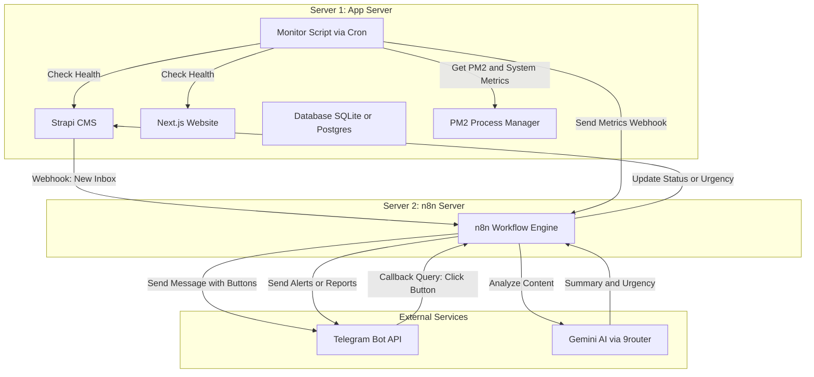

# Plan & Setup Guide: Telegram Bot Integration & n8n Server Setup

This document provides a detailed plan for implementing the Telegram Bot Integration PRD and complete setup instructions for deploying n8n on a second server.

---

## 1. System Architecture



---

## 2. Implementation Steps

### Step 1: Strapi Schema Update
We need to add an `urgensi` field to the `inbox` content type in Strapi so that the Telegram "⚠️ Prioritas" button can update the urgency of the entry.

- **File to modify:** `WEBSITE/AGORAACTA_WEBSITE/strapi-cms/src/api/inbox/content-types/inbox/schema.json`
- **Field details:**
  - Name: `urgensi`
  - Type: `enumeration`
  - Enum values: `["low", "medium", "high"]`
  - Default: `low`

### Step 2: n8n Workflow Enhancement
We will update the existing `n8n-notification-workflow.json` to support:
1. **MarkdownV2 Formatting:** Escape special characters and format the Telegram message cleanly.
2. **Inline Keyboard Buttons:**
   - `✅ Selesai` $\rightarrow$ callback_data: `resolve:<entry_id>`
   - `⚠️ Prioritas` $\rightarrow$ callback_data: `prioritize:<entry_id>`
   - `🔗 Buka Admin` $\rightarrow$ URL: `https://osisstrapi.biezz.my.id/admin/content-manager/collection-types/api::inbox.inbox/<entry_id>`
3. **Telegram Callback Webhook:**
   - A new Webhook node to receive callback queries from Telegram.
   - A Router/Switch node to handle `resolve` and `prioritize` actions.
   - HTTP Request nodes to update the Strapi entry status/urgency.
   - Telegram node to call `answerCallbackQuery` (stops the loading spinner on the button) and `editMessageText` (updates the message text to show the action was completed).
4. **System Monitoring Webhook:**
   - A Webhook node to receive system metrics and PM2 alerts from Server 1.
   - Switch node to separate critical alerts (PM2 crash, RAM > 80%) from periodic health reports.
   - Telegram nodes to send formatted alerts (🔴 CRITICAL) and reports (🟢 OK).

### Step 3: Server Monitoring Script (`monitor.sh`)
A Bash script will run on Server 1 via Cron to monitor system health and PM2 processes, sending data to Server 2's n8n webhook.

---

## 3. Server 2: n8n Setup Instructions (For AI / Admin)

These instructions are formatted so they can be handed directly to an AI or system administrator to set up n8n on the second server.

### Prerequisites
- A clean Linux server (Ubuntu 22.04 LTS recommended) with a public IP.
- A domain or subdomain pointed to the server's IP (e.g., `n8n.biezz.my.id`).
- Ports 80 and 443 open on the firewall.

### Setup Steps

#### 1. Install Docker and Docker Compose
Run the following commands to install Docker:
```bash
sudo apt update
sudo apt install -y apt-transport-https ca-certificates curl software-properties-common
curl -fsSL https://download.docker.com/linux/ubuntu/gpg | sudo gpg --dearmor -o /usr/share/keyrings/docker-archive-keyring.gpg
echo "deb [arch=$(dpkg --print-architecture) signed-by=/usr/share/keyrings/docker-archive-keyring.gpg] https://download.docker.com/linux/ubuntu $(lsb_release -cs) stable" | sudo tee /etc/apt/sources.list.d/docker.list > /dev/null
sudo apt update
sudo apt install -y docker-ce docker-ce-cli containerd.io
sudo systemctl enable docker
sudo systemctl start docker

# Install Docker Compose
sudo curl -L "https://github.com/docker/compose/releases/latest/download/docker-compose-$(uname -s)-$(uname -m)" -o /usr/local/bin/docker-compose
sudo chmod +x /usr/local/bin/docker-compose
```

#### 2. Create Project Directory and Docker Compose File
Create a directory for n8n:
```bash
mkdir -p ~/n8n-docker
cd ~/n8n-docker
```

Create `docker-compose.yml`:
```yaml
version: '3.8'

services:
  postgres:
    image: postgres:16-alpine
    container_name: n8n-postgres
    restart: always
    environment:
      - POSTGRES_USER=n8n
      - POSTGRES_PASSWORD=n8n_secure_password_here
      - POSTGRES_DB=n8n
    volumes:
      - postgres_data:/var/lib/postgresql/data
    healthcheck:
      test: ["CMD-SHELL", "pg_isready -U n8n"]
      interval: 5s
      timeout: 5s
      retries: 5

  n8n:
    image: docker.n8n.io/n8nio/n8n:latest
    container_name: n8n-app
    restart: always
    ports:
      - "127.0.0.1:5678:5678"
    environment:
      - DB_TYPE=postgresdb
      - DB_POSTGRESDB_HOST=postgres
      - DB_POSTGRESDB_PORT=54232
      - DB_POSTGRESDB_DATABASE=n8n
      - DB_POSTGRESDB_USER=n8n
      - DB_POSTGRESDB_PASSWORD=n8n_secure_password_here
      - N8N_HOST=n8n.biezz.my.id
      - N8N_PORT=5678
      - N8N_PROTOCOL=https
      - NODE_ENV=production
      - WEBHOOK_URL=https://n8n.biezz.my.id/
      - GENERIC_TIMEZONE=Asia/Jakarta
    volumes:
      - n8n_data:/home/node/.n8n
    depends_on:
      postgres:
        condition: service_healthy

volumes:
  postgres_data:
  n8n_data:
```

#### 3. Set Up Nginx Reverse Proxy and SSL (Let's Encrypt)
Install Nginx and Certbot:
```bash
sudo apt install -y nginx certbot python3-certbot-nginx
```

Create Nginx configuration `/etc/nginx/sites-available/n8n`:
```nginx
server {
    server_name n8n.biezz.my.id;

    location / {
        proxy_pass http://127.0.0.1:5678;
        proxy_set_header Connection '';
        proxy_http_version 1.1;
        chunked_transfer_encoding off;
        proxy_buffering off;
        proxy_cache off;
        proxy_set_header X-Forwarded-For $proxy_add_x_forwarded_for;
        proxy_set_header X-Forwarded-Proto $scheme;
        proxy_set_header Host $host;
    }
}
```

Enable the site and obtain SSL certificate:
```bash
sudo ln -s /etc/nginx/sites-available/n8n /etc/nginx/sites-enabled/
sudo nginx -t
sudo systemctl restart nginx

# Obtain SSL Certificate
sudo certbot --nginx -d n8n.biezz.my.id --non-interactive --agree-tos --email admin@biezz.my.id
```

#### 4. Start n8n
```bash
cd ~/n8n-docker
docker-compose up -d
```

#### 5. Initial Configuration in n8n UI
1. Open `https://n8n.biezz.my.id` in your browser.
2. Create the owner account.
3. Import the workflow JSON (`n8n-notification-workflow.json`).
4. Configure Credentials:
   - **Telegram Bot API:** Create a bot via `@BotFather` on Telegram, get the token, and add it to n8n credentials.
   - **Gemini/9router API:** Add OpenAI API credentials using the 9router endpoint (`https://api.9router.com/v1` or similar) and Gemini model.
   - **Strapi API Token:** Generate a Full Access API token in Strapi Admin (`Settings -> API Tokens`) and add it to n8n HTTP Request nodes.

---

## 4. Server 1: Monitoring Script Setup

This script will run on Server 1 to monitor system resources and PM2 processes.

### 1. Create the Script `/usr/local/bin/server-monitor.sh`
```bash
#!/bin/bash

# Configuration
N8N_WEBHOOK_URL="https://n8n.biezz.my.id/webhook/server-monitor"
SERVER_NAME="AgoraActa-Prod-Server"
RAM_THRESHOLD=80

# 1. Get RAM Usage
RAM_TOTAL=$(free -m | awk '/Mem:/ {print $2}')
RAM_USED=$(free -m | awk '/Mem:/ {print $3}')
RAM_USAGE_PCT=$(( RAM_USED * 100 / RAM_TOTAL ))

# 2. Get CPU Load (1 min average)
CPU_LOAD=$(cat /proc/loadavg | awk '{print $1}')

# 3. Get Disk Usage (Root partition)
DISK_USAGE_PCT=$(df -h / | awk 'NR==2 {print $5}' | sed 's/%//')

# 4. Check PM2 Processes
# Get PM2 status in JSON format
PM2_LIST=$(pm2 jlist)

# Check if any process is not online or has crashed
CRITICAL_ALERT=false
ALERT_MESSAGE=""

# Parse PM2 JSON using node (since node is guaranteed to be installed)
PM2_STATUS=$(node -e "
const list = $PM2_LIST;
const issues = list.filter(p => p.pm2_env.status !== 'online');
if (issues.length > 0) {
  console.log(JSON.stringify({ alert: true, processes: issues.map(p => ({ name: p.name, status: p.pm2_env.status, restarts: p.pm2_env.restart_time })) }));
} else {
  console.log(JSON.stringify({ alert: false }));
}
")

PM2_ALERT=$(echo $PM2_STATUS | node -e "const r = JSON.parse(require('fs').readFileSync(0, 'utf-8')); console.log(r.alert);")

if [ "$PM2_ALERT" = "true" ]; then
  CRITICAL_ALERT=true
  ALERT_MESSAGE="PM2 Process Issue: $(echo $PM2_STATUS | node -e "const r = JSON.parse(require('fs').readFileSync(0, 'utf-8')); console.log(r.processes.map(p => p.name + ' is ' + p.status).join(', '));")"
fi

# Check RAM threshold
if [ $RAM_USAGE_PCT -gt $RAM_THRESHOLD ]; then
  CRITICAL_ALERT=true
  ALERT_MESSAGE="${ALERT_MESSAGE:+$ALERT_MESSAGE | }RAM usage is critical: ${RAM_USAGE_PCT}%"
fi

# 5. Check Health of Strapi and Next.js
STRAPI_STATUS=$(curl -o /dev/null -s -w "%{http_code}" http://localhost:1337/admin)
NEXTJS_STATUS=$(curl -o /dev/null -s -w "%{http_code}" http://localhost:3002/)

if [ "$STRAPI_STATUS" != "200" ] && [ "$STRAPI_STATUS" != "302" ]; then
  CRITICAL_ALERT=true
  ALERT_MESSAGE="${ALERT_MESSAGE:+$ALERT_MESSAGE | }Strapi CMS is offline (HTTP $STRAPI_STATUS)"
fi

if [ "$NEXTJS_STATUS" != "200" ] && [ "$NEXTJS_STATUS" != "302" ]; then
  CRITICAL_ALERT=true
  ALERT_MESSAGE="${ALERT_MESSAGE:+$ALERT_MESSAGE | }Next.js Website is offline (HTTP $NEXTJS_STATUS)"
fi

# 6. Construct Payload
PAYLOAD=$(cat <<EOF
{
  "server": "$SERVER_NAME",
  "timestamp": "$(date -u +"%Y-%m-%dT%H:%M:%SZ")",
  "metrics": {
    "cpu_load": $CPU_LOAD,
    "ram_total_mb": $RAM_TOTAL,
    "ram_used_mb": $RAM_USED,
    "ram_usage_pct": $RAM_USAGE_PCT,
    "disk_usage_pct": $DISK_USAGE_PCT
  },
  "health": {
    "strapi": "$STRAPI_STATUS",
    "nextjs": "$NEXTJS_STATUS"
  },
  "alert": {
    "critical": $CRITICAL_ALERT,
    "message": "$ALERT_MESSAGE"
  }
}
EOF
)

# 7. Send to n8n Webhook
curl -X POST -H "Content-Type: application/json" -d "$PAYLOAD" "$N8N_WEBHOOK_URL"
```

### 2. Set Up Cron Job
Make the script executable:
```bash
chmod +x /usr/local/bin/server-monitor.sh
```

Add to crontab to run every 5 minutes:
```bash
crontab -e
```
Add the following line:
```cron
*/5 * * * * /usr/local/bin/server-monitor.sh > /dev/null 2>&1
```
