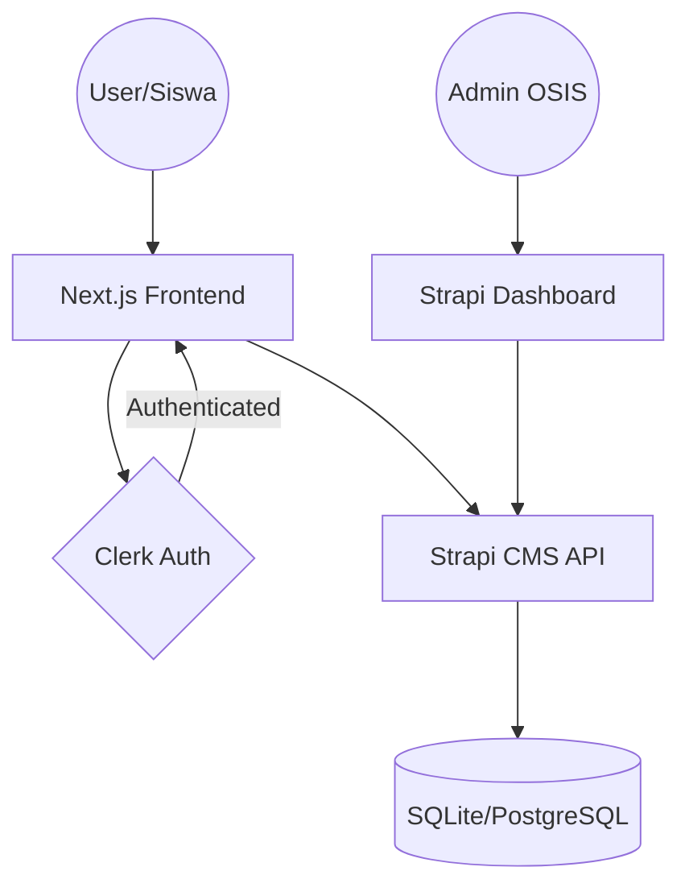
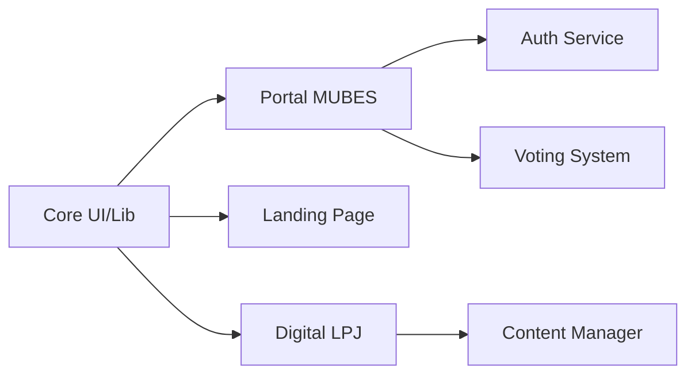
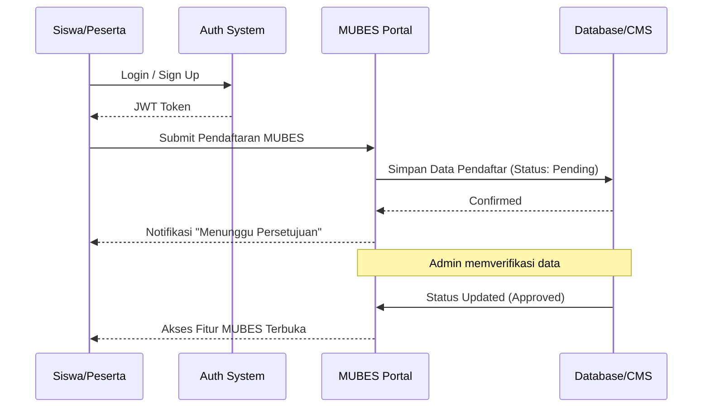

# 🏛️ Agora Acta: Digital Ecosystem OSIS SMAIT Fithrah Insani

**Menjembatani Aspirasi, Mengakselerasi Aksi.**

Agora Acta bukan sekadar website organisasi; ia adalah infrastruktur digital yang dirancang untuk mentransformasi tata kelola OSIS SMAIT Fithrah Insani. Dengan mengintegrasikan transparansi informasi, efisiensi administrasi, dan digitalisasi musyawarah (MUBES), Agora Acta memastikan setiap aspirasi terdokumentasi dan setiap program kerja terukur.

---

## 🚀 Value Proposition

| Dari Tradisional... | Menjadi Digital dengan Agora Acta | Manfaat Utama |
| :--- | :--- | :--- |
| Administrasi kertas & manual | Workflow digital terpusat | **Efisiensi Waktu** |
| Informasi tersebar & tidak update | Single Source of Truth (CMS) | **Transparansi Total** |
| Musyawarah fisik yang kompleks | Portal MUBES Terintegrasi | **Aksesibilitas Inklusif** |
| Pelaporan LPJ yang tidak terstruktur | Dokumentasi Digital Dinamis | **Akuntabilitas Tinggi** |

---

## 🛠️ Tech Stack

Kami menggunakan kombinasi teknologi modern untuk memastikan performa tinggi, skalabilitas, dan kemudahan pemeliharaan.


---

## 📐 Arsitektur Sistem

### High-Level Architecture
Sistem ini mengadopsi pola *Decoupled Architecture* di mana Frontend dan Backend berkomunikasi via REST API, memungkinkan update konten secara real-time tanpa perlu deploy ulang aplikasi.



### Module Dependency Map
Struktur modul dirancang secara modular untuk memudahkan pengembangan fitur baru tanpa mengganggu fungsi utama.



### MUBES Data Flow
Alur data khusus untuk modul Musyawarah Besar (MUBES), memastikan proses registrasi hingga persetujuan berjalan aman dan valid.



---

## ⚡ Quick Start

Dapatkan lingkungan pengembangan berjalan dalam kurang dari 5 menit.

### 1. Clone Repositori
```bash
git clone https://github.com/your-repo/agora-acta.git
cd agora-acta
```

### 2. Setup Frontend
```bash
cd osis-smait-fi
npm install
cp .env.example .env.local # Isi API Key Clerk & Strapi
npm run dev
```

### 3. Setup Backend (Strapi)
```bash
cd strapi-cms
npm install
npm run develop
```

Aplikasi kini berjalan di `http://localhost:3000` (Frontend) dan `http://localhost:1337` (Backend).

---

## 🤝 Contribution Guide

Kami terbuka bagi kontributor yang ingin meningkatkan ekosistem digital OSIS.

**Aturan Main:**
1. **Fork & Branch**: Lakukan fork repo dan buat branch baru (`feat/nama-fitur` atau `fix/nama-bug`).
2. **Atomic Commits**: Lakukan commit kecil dan deskriptif.
3. **Documentation**: Setiap fitur baru wajib disertai pembaruan pada `docs/`.
4. **Pull Request**: Sertakan screenshot/video demo dan jelaskan perubahan yang dilakukan.

---

## 🗺️ Roadmap

- [ ] **Phase 1**: Stabilisasi Portal MUBES & Auth (Current)
- [ ] **Phase 2**: Implementasi Digital Voting & E-Voting Real-time
- [ ] **Phase 3**: Integrasi Notifikasi WhatsApp/Email untuk Update Agenda
- [ ] **Phase 4**: Pengembangan Dashboard Analitik Program Kerja (KPI Tracker)

---

<p align="center">
  Built with ❤️ by <b>OSIS SMAIT Fithrah Insani</b>
</p>
