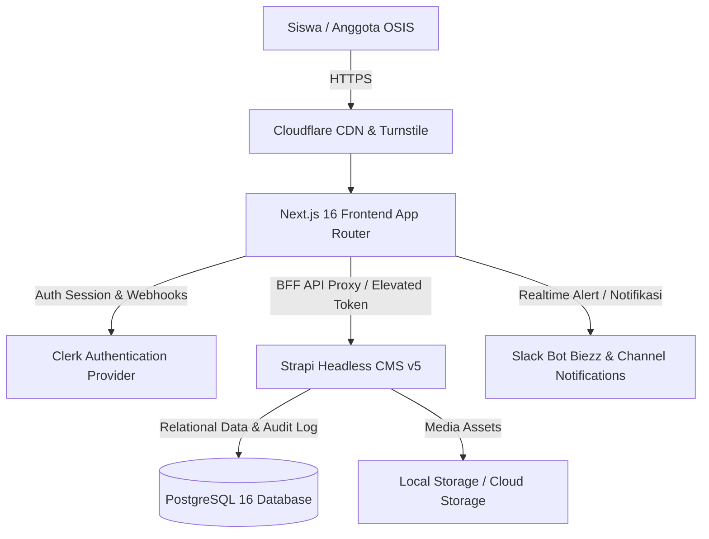

# 🏛️ MASTER PLAN STRATEGIS & KOMPREHENSIF: WEBSITE OSIS SMAIT FITHRAH INSANI (AGORA ACTA)

Dokumen ini merangkum status saat ini, audit arsitektur, peta kerentanan (vulnerability roadmap), serta rencana strategis implementasi fitur-fitur baru (E-Voting, Portal Siswa, Hardening MUBES, dan Integrasi CMS).

---

## 1. Executive Summary & Status Terkini Proyek
- **Frontend Stack**: Next.js 16 (App Router), React 19, Tailwind CSS v4, Lucide Icons, Clerk Auth, Framer Motion.
- **Backend Stack**: Strapi v5 Headless CMS, PostgreSQL 16 (`mubes-postgres` port `5433`), Dokumen Service Middleware untuk Global Audit Trail.
- **Versi Terkini**: v2.1.1 (Pembaruan detail event layout, penguatan CSP Clerk, perbaikan glassmorphism medieval portal MUBES).
- **Infrastruktur Produksi**: PM2 Process Manager (`osis-next-frontend` PID 974437, `osis-strapi-backend` PID 1750061, `slack-bot-biezz` PID 1748842).

---

## 2. Peta Prioritas Pengembangan (Strategic Roadmap)

### 📌 Fase 1: Keamanan & Hardening (Critical / Immediate)
1. **Remediasi SSRF pada Audio Proxy (`/api/audio-proxy`)**:
   - Terapkan whitelist domain ketat (hanya domain Anchor.fm / Spotify CDN resmi).
   - Blokir akses ke private/internal IP (127.0.0.1, 10.0.0.0/8, 192.168.0.0/16, metadata cloud).
2. **Validasi File & Rate Limiting pada Kompresi Gambar (`/api/compress-image`)**:
   - Validasi Magic Bytes (bukan hanya MIME type string) untuk mencegah upload script/polyglot.
   - Pasang batasan ukuran maksimal upload (max 5MB) dan in-memory processing limit (DoS prevention).
3. **Penyempurnaan Auth & Rate Limiting Endpoint Publik**:
   - Integrasi Upstash Redis / In-Memory Rate Limiting pada `/api/inbox` dan form saran agar terhindar dari spam/abuse.

### 📌 Fase 2: Finalisasi Modul MUBES & Performa (High Priority)
1. **Manajemen Dokumen Sidang & LPJ**:
   - Pemisahan hak akses BPH, Presidium, dan Anggota Umum berbasis role Strapi yang diverifikasi via token Clerk di BFF.
   - Validasi token JWT Clerk secara server-side pada setiap fetch dokumen privat LPJ (`/api/mubes/lpj/[slug]`).
2. **Optimasi Asset & Core Web Vitals**:
   - Integrasi Next.js Image Optimization untuk hero banner dan medieval background.
   - PWA Service Worker caching policy untuk halaman dokumentasi statis dan offline resilience.

### 📌 Fase 3: Modul E-Voting (Pemilihan Ketua & Wakil OSIS) (Next Milestone)
1. **Blind Token Strategy**:
   - Pemisahan tabel pemilih (`election_voters`) dan kotak suara anonim (`ballots`).
   - Token kriptografi single-use (TTL 5 menit) untuk menjamin asas LUBER JURDIL tanpa bisa dilacak ke identitas siswa.
2. **Audit Trail Hash Chain**:
   - Rantai hash tamper-proof `hash(prev_hash + candidate_id + timestamp)` untuk verifikasi integritas hasil suara.
3. **Anti-Bot & Concurrency Control**:
   - Cloudflare Turnstile CAPTCHA saat submit bilik suara digital.
   - Database isolation `SERIALIZABLE` / Redis mutex lock untuk mencegah double-voting.

### 📌 Fase 4: Portal Siswa & Student Hub (Medium Priority)
1. **Integrasi Akun Siswa (SSO / NISN)**:
   - Login terpadu via Google Workspace sekolah (`@sch.id`) atau integrasi database siswa.
2. **Ticketing Aspirasi & Pengaduan**:
   - Pelacakan status aspirasi siswa (Submitted -> In-Review -> Resolved).
   - Fitur kirim aduan anonim terverifikasi status siswa aktif.

---

## 3. Matriks Arsitektur Sistem & Data Flow

---

## 4. Timelines & Target Deliverables
- **Minggu 1**: Security Patching (Audio Proxy SSRF, Image Compress validation, Rate Limiter).
- **Minggu 2**: Finalisasi Dokumen MUBES & Testing role-based access.
- **Minggu 3-4**: Implementasi skema Database E-Voting & Wireframe Bilik Suara.
- **Minggu 5**: Integrasi End-to-End E-Voting, Stress Test, dan Simulasi Pemilu.
