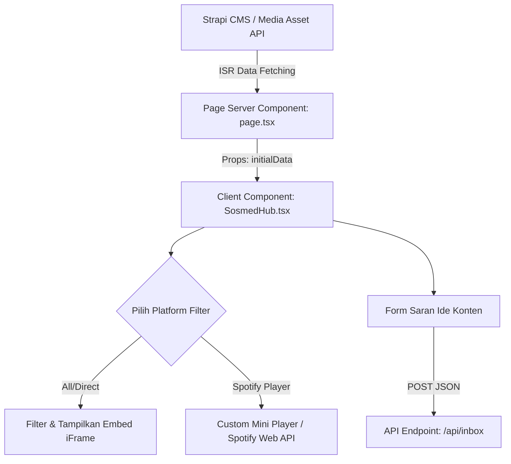

# Dokumen Analisis & Rencana Optimasi Halaman Media Sosial

Dokumen ini berisi analisis mendalam tentang halaman Media Sosial (`/media-sosial`) OSIS SMAIT Fithrah Insani yang dikelola oleh komponen [`SosmedHub.tsx`](osis-smait-fi/src/components/sosmed/SosmedHub.tsx:1) dan disajikan oleh [`MediaSosialPage`](osis-smait-fi/src/app/media-sosial/page.tsx:15).

---

## 1. Analisis Arsitektur & Platform Media Sosial Saat Ini

### A. Komponen Utama
- **Page Server Component**: [`osis-smait-fi/src/app/media-sosial/page.tsx`](osis-smait-fi/src/app/media-sosial/page.tsx:15)
  - Melakukan SSR / ISR (`revalidate = 60`) dengan mengambil data dari Strapi melalui `fetchHalamanFromStrapi('media-sosial')`.
- **Interactive Client Component**: [`osis-smait-fi/src/components/sosmed/SosmedHub.tsx`](osis-smait-fi/src/components/sosmed/SosmedHub.tsx:56)
  - Menangani filter platform (*All, Instagram, TikTok, YouTube, Spotify*).
  - Menyediakan Mini Player Spotify interaktif berbasis *state* React.
  - Memproses penterjemahan URL / embed code menjadi iFrame HTML lewat fungsi helper `getEmbedHtml`.
  - Menyediakan form **Saran Ide Konten** yang terhubung ke endpoint `/api/inbox`.

### B. Analisis Fitur Per Platform

| Platform | Statik & Dynamic Link saat ini | Fitur Tampilan & Embed | Area Evaluasi / Potensi Issues |
|---|---|---|---|
| **Spotify** | `@osissmaitfi` / Agora Talk (`436` pendengar) | Custom Mini Player interaktif & iframe playlist/episode embed | Mini player saat ini merupakan audio visualizer *simulation* lokal, belum *connect* ke Web Playback API resmi. |
| **YouTube** | `@osissmaitfithrahinsani9481` (`267` subscriber) | Card video dengan duration/views badge + Youtube Embed | Dynamic URL parser mendukung `watch?v=`, `youtu.be/`, `shorts/`, dan `embed/`. |
| **Instagram** | `@osissmaitfi` (`1,203` followers) | Card post dengan preview & statistik like + Instagram Embed | Instagram embed dari URL publik sering dibatasi CORS/X-Frame-Options oleh Meta jika tanpa Access Token resmi. |
| **TikTok** | `@osissmaitfi` (`144` followers) | Card 9:16 aspect ratio + TikTok v2 Embed | Embed TikTok membutuhkan sanitasi iframe yang tepat agar responsif di layar mobile. |

---

## 2. Rencana Optimasi & Integrasi Strapi CMS

### Poin 1: Optimasi Embed iFrame & Responsivitas
- **Lazy Loading & Aspect Ratio**: Tambahkan `loading="lazy"` dan wrapper aspect-ratio otomatis untuk menghindari CLS (*Cumulative Layout Shift*).
- **Fallback State**: Ketika Embed URL tidak valid atau diblokir oleh header browser, tampilkan card fallback berupa tombol direct CTA.

### Poin 2: Integrasi Dinamis Strapi CMS
- Ekstrak seluruh metadata sosial (followers count, handle, embed URLs, custom feeds) dari `initialData` yang dikirim dari Strapi.
- Sediakan nilai *fallback* statik yang konsisten saat Strapi dalam kondisi *offline*.

---

## 3. Workflow Integrasi System (Mermaid Diagram)

---

## 4. Rencana Langkah Kerja (Todo List)

1. [x] Analisis komponen media sosial (`SosmedHub.tsx` & `media-sosial/page.tsx`).
2. [x] Tulis dokumen analisis lengkap di `plans/analisis_media_sosial.md`.
3. [ ] Optimasi rendering Embed iFrame dan dynamic fallback di `SosmedHub.tsx`.
4. [ ] Hubungkan statistik akun sosial dan list feeds secara dinamis dari Strapi metadata.
5. [ ] Pengujian visual dan fungsionalitas form saran konten.
