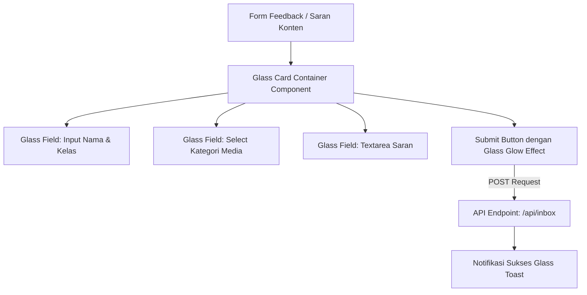

# Rencana Redesain Kolom Feedback Media Sosial (Glass Card Login Style)

Rencana mengadaptasi desain UI login dari `https://21st.dev/r/molecule-lab-rushil/glass-card` untuk kolom feedback pada [`osis-smait-fi/src/components/sosmed/SosmedHub.tsx`](osis-smait-fi/src/components/sosmed/SosmedHub.tsx:507).

---

## 1. Analisis & Konsep Desain

Kolom "Saran Ide Konten" / feedback yang ada saat ini menggunakan tampilan kartu putih standar. Desain referensi (Glass Card Login) mengedepankan estetika **Glassmorphism**:
- Background frosted-glass semi-transparan (`backdrop-blur-md`, `bg-white/10` atau `bg-slate-900/60`).
- Glow & ambient light efek gradient di belakang kartu.
- Input fields dengan border transparan dan backdrop-blur halus.
- Tombol aksi utama dengan efek glossy / vibrant accent.

---

## 2. Dynamic Workflow / Architecture Diagram

---

## 3. Rencana Langkah Implementasi

1. **Komponen UI Glass Card (`glass-card.tsx`)**:
   - Buat komponen `GlassCard` di [`osis-smait-fi/src/components/ui/glass-card.tsx`](osis-smait-fi/src/components/ui/glass-card.tsx) yang mengisolasi styling glassmorphism.
   - Sediakan efek ambient glow di sekeliling container.

2. **Adaptasi Form Feedback di `SosmedHub.tsx`**:
   - Refactor bagian kanan (RIGHT: Saran Konten Form) pada [`osis-smait-fi/src/components/sosmed/SosmedHub.tsx`](osis-smait-fi/src/components/sosmed/SosmedHub.tsx:507).
   - Terapkan struktur form login versi glass card yang disesuaikan dengan input feedback (Nama, Kelas, Kategori, Saran).

3. **Verifikasi Fungsionalitas**:
   - Pastikan integrasi form ke endpoint `/api/inbox` tetap berjalan lancar.
