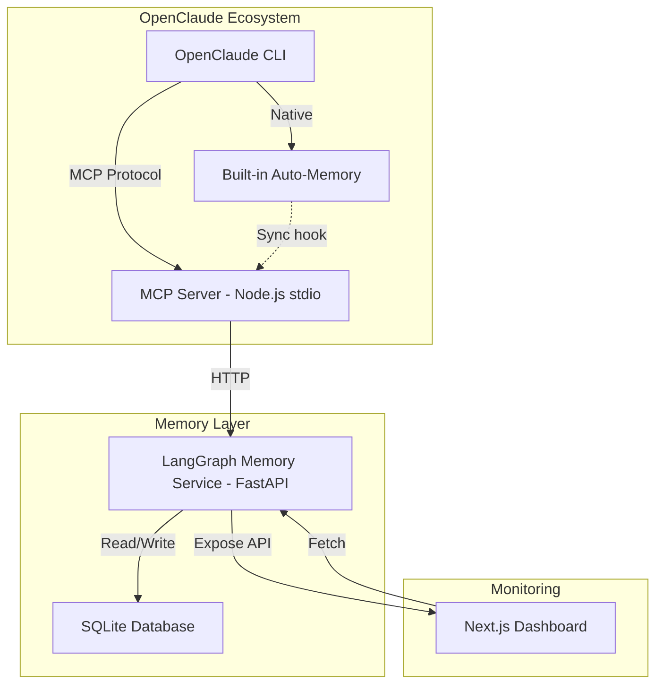
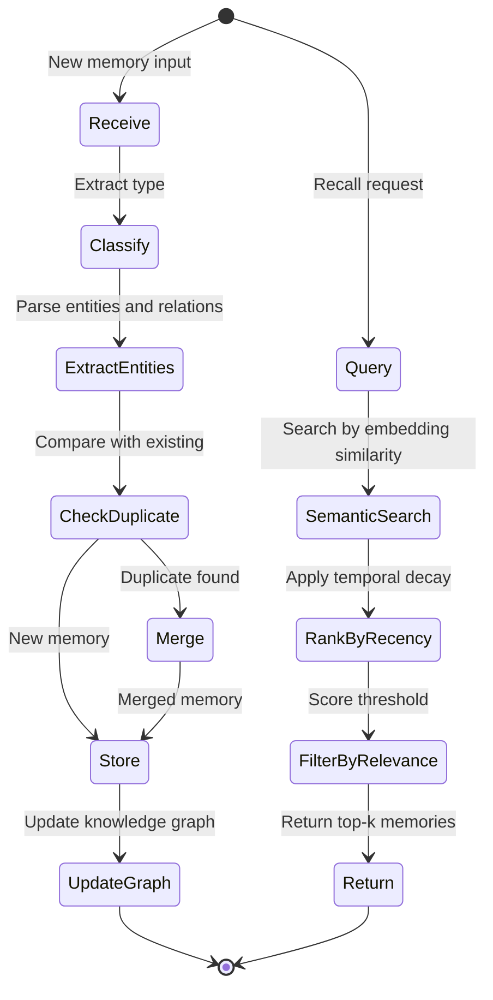

# OpenClaude + LangGraph Long-Term Memory Integration Plan

## 1. Current State Analysis

### OpenClaude v0.29.1 (`@gitlawb/openclaude`)
- **Location**: `/home/attabi/.nvm/versions/node/v22.23.2/lib/node_modules/@gitlawb/openclaude/`
- **Runtime**: Node.js ≥22, TypeScript CLI
- **Config dir**: `~/.openclaude/`
- **Existing memory systems**:
  - **Auto-memory**: `~/.openclaude/projects/<sanitized-cwd>/memory/MEMORY.md` — flat markdown files, one per project
  - **Knowledge graph**: `/knowledge` command — in-session graph with entities, goals, milestones
  - **Agent memory**: `.openclaude/agent-memory/<agentType>/` — per-agent scoped memory
  - **Session transcripts**: JSONL files under `~/.openclaude/projects/<sanitized-cwd>/`
  - **Auto-dream**: Background memory consolidation (feature-gated)

### Limitations of Built-in Memory
- Flat markdown files — no semantic search
- Knowledge graph is session-scoped (lost on restart unless persisted)
- No cross-project memory recall
- No temporal awareness (when was something learned?)
- No memory decay/relevance scoring

## 2. Architecture Overview



### Component Breakdown

| Component | Tech | Port | Role |
|-----------|------|------|------|
| LangGraph Memory Service | Python FastAPI + LangGraph | 8787 | Core memory engine with graph state |
| MCP Server | Node.js stdio transport | N/A | Bridge OpenClaude ↔ Memory Service |
| Dashboard | Next.js 15 | 3787 | Visual monitoring of memory + graph |
| SQLite DB | langgraph-checkpoint-sqlite | File | Persistent storage |

## 3. LangGraph Memory Service (Python)

### Project Structure
```
openclaude-memory/
├── pyproject.toml
├── memory_service/
│   ├── __init__.py
│   ├── main.py              # FastAPI app
│   ├── graph.py              # LangGraph state graph definition
│   ├── models.py             # Pydantic models
│   ├── store.py              # SQLite memory store operations
│   ├── embeddings.py         # Simple embedding for semantic search
│   └── config.py             # Settings
├── data/
│   └── memory.db             # SQLite database
└── tests/
    └── test_memory.py
```

### LangGraph State Graph Design



### Memory Schema (SQLite)

```sql
-- Core memories table
CREATE TABLE memories (
    id TEXT PRIMARY KEY,
    content TEXT NOT NULL,
    memory_type TEXT NOT NULL,  -- 'fact', 'preference', 'decision', 'context', 'error_fix'
    project TEXT,               -- project path or NULL for global
    source TEXT,                -- 'user', 'auto', 'dream'
    embedding BLOB,             -- simple vector for search
    importance REAL DEFAULT 0.5,
    access_count INTEGER DEFAULT 0,
    created_at TIMESTAMP DEFAULT CURRENT_TIMESTAMP,
    updated_at TIMESTAMP DEFAULT CURRENT_TIMESTAMP,
    last_accessed TIMESTAMP,
    metadata JSON
);

-- Knowledge graph edges
CREATE TABLE graph_edges (
    id TEXT PRIMARY KEY,
    source_entity TEXT NOT NULL,
    target_entity TEXT NOT NULL,
    relation TEXT NOT NULL,      -- 'uses', 'depends_on', 'part_of', 'caused_by', etc.
    weight REAL DEFAULT 1.0,
    project TEXT,
    created_at TIMESTAMP DEFAULT CURRENT_TIMESTAMP,
    metadata JSON
);

-- Graph entities
CREATE TABLE graph_entities (
    id TEXT PRIMARY KEY,
    name TEXT NOT NULL UNIQUE,
    entity_type TEXT NOT NULL,   -- 'technology', 'file', 'concept', 'person', 'project'
    properties JSON,
    created_at TIMESTAMP DEFAULT CURRENT_TIMESTAMP,
    updated_at TIMESTAMP DEFAULT CURRENT_TIMESTAMP
);

-- Session checkpoints (LangGraph native)
-- Managed by langgraph-checkpoint-sqlite automatically
```

### API Endpoints

| Method | Endpoint | Description |
|--------|----------|-------------|
| POST | `/memory/store` | Store a new memory |
| POST | `/memory/recall` | Semantic search + recall |
| GET | `/memory/list` | List memories with filters |
| DELETE | `/memory/{id}` | Remove a memory |
| GET | `/graph/entities` | List all entities |
| GET | `/graph/edges` | List all edges |
| GET | `/graph/neighbors/{entity}` | Get entity neighborhood |
| GET | `/graph/stats` | Graph statistics |
| POST | `/graph/query` | Query graph by pattern |
| GET | `/health` | Health check |
| GET | `/stats` | Overall memory statistics |

## 4. MCP Server (Node.js)

Registered in OpenClaude via `openclaude mcp add`. Provides tools:

| Tool Name | Description |
|-----------|-------------|
| `memory_store` | Store a fact, preference, decision, or learned pattern |
| `memory_recall` | Search memories by query — returns relevant past knowledge |
| `memory_list` | List recent memories, optionally filtered by project or type |
| `memory_forget` | Remove a specific memory by ID |
| `graph_query` | Query the knowledge graph for entity relationships |
| `graph_stats` | Get summary of the knowledge graph |

### MCP Server Structure
```
openclaude-memory/
├── mcp-server/
│   ├── package.json
│   ├── tsconfig.json
│   └── src/
│       └── index.ts          # MCP server with stdio transport
```

## 5. Next.js Dashboard

### Features
- **Memory Explorer**: Browse, search, filter all stored memories
- **Knowledge Graph Viewer**: Interactive graph visualization (using d3-force or vis.js)
- **Statistics Panel**: Memory count, types distribution, access patterns
- **Timeline View**: Temporal view of memory creation
- **Project Filter**: Filter by project scope

### Dashboard Structure
```
openclaude-memory/
├── dashboard/
│   ├── package.json
│   ├── next.config.ts
│   ├── tsconfig.json
│   └── src/
│       ├── app/
│       │   ├── layout.tsx
│       │   ├── page.tsx           # Overview dashboard
│       │   ├── memories/
│       │   │   └── page.tsx       # Memory explorer
│       │   ├── graph/
│       │   │   └── page.tsx       # Knowledge graph viewer
│       │   └── api/
│       │       └── proxy/
│       │           └── [...path]/
│       │               └── route.ts  # Proxy to Python API
│       ├── components/
│       │   ├── MemoryCard.tsx
│       │   ├── GraphViewer.tsx
│       │   ├── StatsPanel.tsx
│       │   ├── Sidebar.tsx
│       │   └── Timeline.tsx
│       └── lib/
│           └── api.ts             # API client
```

## 6. Integration with OpenClaude

### Registration
```bash
openclaude mcp add langgraph-memory \
  node /home/attabi/openclaude-memory/mcp-server/dist/index.js \
  --scope user
```

### OpenClaude Settings Enhancement
Add to `~/.openclaude/settings.json`:
```json
{
  "customAgents": {
    "memory-agent": {
      "type": "agent",
      "description": "Agent that manages long-term memory via LangGraph",
      "tools": ["memory_store", "memory_recall", "graph_query"]
    }
  }
}
```

### Hook Integration
Add a PostToolUse hook to auto-capture important information:
- After file edits → store as context memory
- After error fixes → store as error_fix memory  
- After user corrections → store as preference memory

## 7. Final Directory Layout

```
~/openclaude-memory/                  # Single project root
├── README.md
├── docker-compose.yml                # Optional: containerized deploy
├── start.sh                          # Start all services
├── stop.sh                           # Stop all services
│
├── memory_service/                   # Python FastAPI + LangGraph
│   ├── pyproject.toml
│   ├── memory_service/
│   │   ├── __init__.py
│   │   ├── main.py
│   │   ├── graph.py
│   │   ├── models.py
│   │   ├── store.py
│   │   ├── embeddings.py
│   │   └── config.py
│   ├── data/
│   │   └── memory.db
│   └── tests/
│       └── test_memory.py
│
├── mcp-server/                       # Node.js MCP bridge
│   ├── package.json
│   ├── tsconfig.json
│   └── src/
│       └── index.ts
│
└── dashboard/                        # Next.js monitoring UI
    ├── package.json
    ├── next.config.ts
    └── src/
        ├── app/
        └── components/
```

## 8. Execution Order

1. **Python memory service** — core engine, test standalone
2. **MCP server** — bridge layer, test with OpenClaude manually
3. **Register in OpenClaude** — `openclaude mcp add`
4. **Dashboard** — monitoring UI
5. **Hooks** — auto-capture integration
6. **Verification** — end-to-end test

## 9. Dependencies

### Python (memory_service)
- `fastapi` + `uvicorn` — HTTP server
- `langgraph` — state graph engine
- `langgraph-checkpoint-sqlite` — SQLite checkpointing
- `pydantic` — data models
- `sentence-transformers` (optional, for semantic search — can use simpler TF-IDF initially)
- `sqlite3` — stdlib, no extra dep

### Node.js (mcp-server)
- `@modelcontextprotocol/sdk` — MCP protocol
- `node-fetch` or stdlib `fetch` — HTTP to Python service

### Next.js (dashboard)
- `next` 15
- `react` 19
- `d3` or `react-force-graph` — graph visualization
- `tailwindcss` — styling

## 10. Risk Mitigations

| Risk | Mitigation |
|------|-----------|
| Python service crashes | MCP server handles connection errors gracefully, returns fallback |
| SQLite lock contention | Use WAL mode, single-writer design |
| Memory bloat | Implement memory decay — reduce importance score over time |
| Embedding quality | Start with TF-IDF keyword matching; upgrade to sentence-transformers later |
| OpenClaude version update breaks MCP | MCP is a stable protocol; pin `@modelcontextprotocol/sdk` version |
