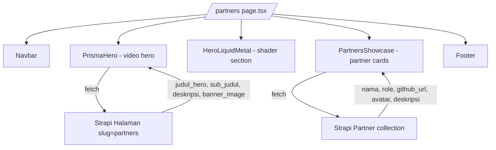

# Partners Page Implementation Plan

## Overview
Add a full-featured Partners page to the OSIS SMAIT FI website with:
- PrismaHero (already done) + HeroLiquidMetal section below it
- Partner showcase cards driven by a new Strapi `partner` collection
- Hero text customizable from Strapi `Halaman Utama` with slug `partners`

## Architecture



## Files to Create/Modify

### New Files
| File | Purpose |
|------|---------|
| `osis-smait-fi/src/components/ui/hero-liquid-metal.tsx` | LiquidMetal shader hero component |
| `osis-smait-fi/src/components/partners/PartnersShowcase.tsx` | Partner cards grid component |
| `strapi-cms/src/api/partner/content-types/partner/schema.json` | Strapi collection schema |
| `strapi-cms/src/api/partner/controllers/partner.ts` | Strapi controller |
| `strapi-cms/src/api/partner/routes/partner.ts` | Strapi routes |
| `strapi-cms/src/api/partner/services/partner.ts` | Strapi service |

### Modified Files
| File | Change |
|------|--------|
| `osis-smait-fi/package.json` | Add `@paper-design/shaders-react` |
| `osis-smait-fi/src/lib/strapi.ts` | Add `fetchPartnersFromStrapi` |
| `osis-smait-fi/src/app/partners/page.tsx` | Wire Strapi data + add sections |

## Strapi Partner Schema
```json
{
  "kind": "collectionType",
  "collectionName": "partners",
  "info": {
    "singularName": "partner",
    "pluralName": "partners",
    "displayName": "Partner"
  },
  "attributes": {
    "nama": { "type": "string", "required": true },
    "role": { "type": "string" },
    "github_url": { "type": "string" },
    "website_url": { "type": "string" },
    "deskripsi": { "type": "text" },
    "avatar": { "type": "media", "multiple": false },
    "urutan": { "type": "integer", "default": 0 },
    "is_active": { "type": "boolean", "default": true }
  }
}
```

## Initial Partner Data
- **biezz-2**: Core developer, website infrastructure and Strapi CMS architect
- **junior-draft**: Developer partner, frontend contribution and collaboration

## Dependencies
- `@paper-design/shaders-react` — WebGL shader for LiquidMetal visual effect
